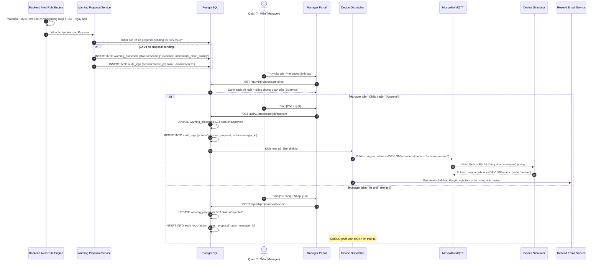

# Kiến trúc Hệ thống AirGuard AI (System Architecture)

> **Tài liệu Kiến trúc Chuẩn hóa** — Mô tả chi tiết cấu trúc hệ thống, phân tầng kiến trúc, luồng dữ liệu thời gian thực, cơ chế AI Agent Grounding, quy trình Human-in-the-Loop (HITL) và mô hình triển khai hạ tầng của AirGuard AI.

---

## 1. Tổng quan hệ thống (System Overview)

**AirGuard AI** là nền tảng quan trắc, phân tích chất lượng môi trường không khí (AQI, PM2.5, CO2, Tiếng ồn, Nhiệt độ) và đề xuất lộ trình hoạt động thể thao ngoài trời an toàn tại khu đô thị **Vinhomes Ocean Park 1**. 

Hệ thống hoạt động theo nguyên tắc:
1. **Grounding First**: AI Agent không bao giờ tự bịa đặt dữ liệu môi trường; 100% dữ liệu phát ngôn phải đến từ kết quả Tool Calling từ hệ thống quan trắc.
2. **System of Record**: PostgreSQL và FastAPI là nguồn chân lý duy nhất (Single Source of Truth). Frontend không kết nối trực tiếp MQTT hay DB.
3. **Human-in-the-Loop (HITL)**: Agent chỉ tạo đề xuất cảnh báo ở trạng thái `pending`; chỉ Quản trị viên (Manager) mới có quyền Phê duyệt (Approve) hoặc Từ chối (Reject) trước khi phát lệnh điều khiển thiết bị mô phỏng.
4. **Data Quality Gate**: Dữ liệu không hợp lệ, mất kết nối (offline) hoặc quá hạn (stale) sẽ bị chặn ngay tại tầng Ingestion.

---

## 2. Sơ đồ kiến trúc tổng thể (High-Level Architecture Diagram)

```mermaid
graph TB
    %% ================= THIẾT BỊ & MÔ PHỎNG IOT =================
    subgraph SENSOR_IOT["1. Tầng Thu Thập & Mô Phỏng IoT"]
        direction TB
        S01["Trạm S01 - VinUni<br/>(PM2.5, CO2, Ồn, Temp)"]
        S02["Trạm S02 - Hồ Ngọc Trai<br/>(PM2.5, CO2, Ồn, Temp)"]
        S03["Trạm S03 - Sapphire 1<br/>(PM2.5, CO2, Ồn, Temp)"]
        S04["Trạm S04 - Ruby Zenpark<br/>(PM2.5, CO2, Ồn, Temp)"]
        S05["Trạm S05 - San Hô<br/>(PM2.5, CO2, Ồn, Temp)"]
        
        SIM_SENSORS["Sensor Simulator Engine<br/>(sensor_simulator.py)"]
        SIM_DEVICES["Device Simulator Engine<br/>(device_simulator.py)"]
        
        S01 & S02 & S03 & S04 & S05 --> SIM_SENSORS
    end

    %% ================= BROKER & INGESTION =================
    subgraph INGESTION["2. Vận Chuyển & Ingestion Pipeline"]
        direction TB
        MQTT_BROKER["Mosquitto MQTT Broker<br/>(Port 1883 / QoS 1)"]
        
        TOPIC_MEASURE["airguard/stations/+/measurements"]
        TOPIC_STATUS["airguard/stations/+/status"]
        TOPIC_CMD["airguard/devices/+/command"]
        
        MQTT_CONSUMER["MQTT Ingestion Consumer<br/>- Pydantic Validation<br/>- EPA AQI Calculator<br/>- Freshness & Gate Check"]
    end

    %% ================= DATABASE & STORAGE =================
    subgraph PERSISTENCE["3. Cơ Sở Dữ Liệu & System of Record"]
        direction TB
        POSTGRES[("PostgreSQL 16 Database<br/>- stations & measurements<br/>- alerts & thresholds<br/>- warning_proposals<br/>- audit_logs (append-only)<br/>- users & rbac_tokens")]
    end

    %% ================= BACKEND CORE SERVICES =================
    subgraph BACKEND_SERVICES["4. FastAPI Core Backend (Port 8000)"]
        direction TB
        API_GATEWAY["FastAPI Gateway (/api/v1)<br/>- Auth & RBAC (Resident / Manager)<br/>- Request Validation & Logging"]
        
        subgraph ENGINES["Core Processing & Domain Engines"]
            direction TB
            TELEMETRY["Telemetry & Alert Engine<br/>(EPA Sub-index, Multi-metric Rules)"]
            ROUTER_ENGINE["OSM Graph & Clean Route Engine<br/>(2-Leg Dijkstra, IDW Exposure, Closed Loops)"]
            FORECAST_ENGINE["Forecast Engine<br/>(1-3h Linear/Prophet Baseline)"]
            HITL_ENGINE["HITL Proposal & Audit Engine<br/>(Pending, Approve, Reject, Expire)"]
            SPATIAL_IDW["Spatial IDW Interpolator<br/>(Heatmap & Air Corridor Grid)"]
        end
    end

    %% ================= AI AGENT ORCHESTRATION =================
    subgraph AI_LAYER["5. AI Agent & LLM Orchestration (Port 8001)"]
        direction TB
        LANGGRAPH["LangGraph Orchestrator<br/>(StateGraph & Node Workflow)"]
        
        subgraph AGENT_PIPELINE["Agent Execution Pipeline"]
            CLASSIFY["Intent Classifier & Scope Resolver"]
            TOOL_EXEC["Tool Calling Node<br/>(get_current_pm25, get_forecast, v.v.)"]
            GROUND_GATE["Strict Grounding Policy Gate<br/>(Fail-Closed on Unverified Data)"]
            COMPOSER["Response Composer / Deterministic Fallback"]
        end
        
        LLM_PROVIDER["LLM API (Gemini / GPT-4o)<br/>(Context Interpretation Only)"]
    end

    %% ================= FRONTEND PRESENTATION =================
    subgraph FRONTEND["6. Frontend Client (React 18 + Leaflet)"]
        direction TB
        MAP_VIEW["Bản đồ GIS & Giám sát<br/>- 5 Trạm quan trắc realtime<br/>- IDW Heatmap không khí<br/>- Tuyến chạy bộ sạch tuần hoàn"]
        METRICS_DRAWER["Dashboard & Phân tích<br/>- AQI, PM2.5, CO2, Ồn, Nhiệt độ<br/>- Biểu đồ lịch sử 24h & Dự báo 1-3h"]
        CHAT_UI["Trợ lý AI AirGuard<br/>- Hỏi đáp ngôn ngữ tự nhiên<br/>- Tương tác bản đồ trực quan"]
        HITL_PORTAL["Cổng Phê Duyệt Manager<br/>- Kiểm tra bằng chứng cảnh báo<br/>- 1-Click Approve / Reject & Audit"]
    end

    %% ================= EXTERNAL SERVICES =================
    subgraph EXT_SERVICES["7. Dịch Vụ Tích Hợp Ngoài"]
        RESEND_API["Resend Email API<br/>(Cảnh báo khẩn cấp tới cư dân)"]
    end

    %% ================= CONNECTIONS =================
    SIM_SENSORS -->|Publish Measurement/Status| MQTT_BROKER
    MQTT_BROKER --> TOPIC_MEASURE & TOPIC_STATUS
    TOPIC_MEASURE & TOPIC_STATUS --> MQTT_CONSUMER
    
    MQTT_CONSUMER -->|Batch Insert & Update| POSTGRES
    
    POSTGRES <-->|SQL Queries / Connection Pool| BACKEND_SERVICES
    
    API_GATEWAY --> TELEMETRY & ROUTER_ENGINE & FORECAST_ENGINE & HITL_ENGINE & SPATIAL_IDW
    
    API_GATEWAY <-->|Internal HTTP / Tools| AI_LAYER
    LANGGRAPH --> CLASSIFY --> TOOL_EXEC --> GROUND_GATE --> COMPOSER
    TOOL_EXEC <-->|Backend Tool Endpoints| API_GATEWAY
    COMPOSER <-->|Contextual Phrasing| LLM_PROVIDER
    
    HITL_ENGINE -->|Publish Approved Command| MQTT_BROKER
    MQTT_BROKER --> TOPIC_CMD --> SIM_DEVICES
    SIM_DEVICES -->|Publish Ack/State| MQTT_BROKER
    
    HITL_ENGINE -.->|Trigger Alert Mail| RESEND_API

    FRONTEND <-->|HTTPS REST API / Polling 30s| API_GATEWAY
```




---

## 3. Kiến trúc phân tầng 5 lớp (5-Tier Layered Architecture)


```mermaid
graph TD
    classDef l1 fill:#1e293b,stroke:#38bdf8,stroke-width:2px,color:#fff;
    classDef l2 fill:#0f172a,stroke:#818cf8,stroke-width:2px,color:#fff;
    classDef l3 fill:#1e1e38,stroke:#a78bfa,stroke-width:2px,color:#fff;
    classDef l4 fill:#172554,stroke:#38bdf8,stroke-width:2px,color:#fff;
    classDef l5 fill:#042f2e,stroke:#2dd4bf,stroke-width:2px,color:#fff;

    subgraph L1["TẦNG 1: TRÌNH DIỄN (PRESENTATION TIER)"]
        UI1["React 18 SPA + Vite + TailwindCSS"]
        UI2["Leaflet Map Engine + GeoJSON Layers"]
        UI3["Interactive AI Assistant Drawer"]
        UI4["Manager HITL Approval Dashboard"]
    end
    class L1,UI1,UI2,UI3,UI4 l1;

    subgraph L2["TẦNG 2: AI AGENT & TRÍ TUỆ NHÂN TẠO (AI ORCHESTRATION TIER)"]
        AG1["LangGraph State Machine (Routing & Nodes)"]
        AG2["Agent Tool Registry (8 Core Tools)"]
        AG3["Grounding Policy Gate (Anti-Hallucination)"]
        AG4["Deterministic Geospatial Fallback Composer"]
    end
    class L2,AG1,AG2,AG3,AG4 l2;

    subgraph L3["TẦNG 3: DỊCH VỤ NGHIỆP VỤ & ĐỊA KHÔNG GIAN (APPLICATION & DOMAIN TIER)"]
        BE1["FastAPI Core REST API Gateway"]
        BE2["OSM Road Graph Router (2-Leg Closed-Loop Dijkstra)"]
        BE3["Clean Running Route Engine (Exposure Integral)"]
        BE4["Telemetry & EPA AQI Calculation Engine"]
        BE5["Spatial IDW Contouring & Heatmap Engine"]
        BE6["HITL Approval & Append-Only Audit Manager"]
    end
    class L3,BE1,BE2,BE3,BE4,BE5,BE6 l3;

    subgraph L4["TẦNG 4: DỮ LIỆU & LƯU TRỮ (PERSISTENCE & BROKER TIER)"]
        DB1["PostgreSQL 16 (Relational & Time-series)"]
        DB2["Mosquitto MQTT Broker (Pub/Sub Messaging)"]
    end
    class L4,DB1,DB2 l4;

    subgraph L5["TẦNG 5: THIẾT BỊ VẬT LÝ & MÔ PHỎNG (IOT & SIMULATION TIER)"]
        IOT1["Sensor Simulator (S01..S05 Telemetry Generator)"]
        IOT2["Device Simulator (Ventilation/Purifier Actuators)"]
    end
    class L5,IOT1,IOT2 l5;

    L1 <==>|HTTPS / JSON REST API| L3
    L3 <==>|Tool Calling REST Interface| L2
    L3 <==>|Asyncpg / SQLAlchemy Connection Pool| L4
    L5 ==>|MQTT Telemetry (TCP 1883)| L4
    L4 ==>|MQTT Consumer Parsing| L3
    L3 ==>|MQTT Approved Commands| L4
    L4 ==>|MQTT Command Dispatch| L5
```

---

## 4. Các luồng dữ liệu chính (Core Data Flows)

### 4.1. Luồng thu thập dữ liệu & Kiểm soát chất lượng (Ingestion & Quality Gates)

```mermaid
sequenceDiagram
    autonumber
    participant Sim as Sensor Simulator
    participant Broker as Mosquitto MQTT
    participant Consumer as MQTT Consumer
    participant DB as PostgreSQL
    participant App as FastAPI Backend
    participant Client as React Dashboard

    Sim->>Broker: Publish: airguard/stations/S01/measurements (pm25, co2, noise, temp)
    Broker->>Consumer: Deliver Message (QoS 1)
    
    rect rgb(20, 30, 40)
        Note over Consumer: Quality Gate Validation
        Consumer->>Consumer: 1. Validate Pydantic Schema & Data Types
        Consumer->>Consumer: 2. Check Freshness & Monotonic Timestamps
        Consumer->>Consumer: 3. Calculate EPA PM2.5 24h Sub-Index (AQI)
    end
    
    alt Payload Hợp Lệ (Fresh & In-bounds)
        Consumer->>DB: INSERT INTO measurements & UPDATE station_status (online/fresh)
        Consumer->>DB: Check Alert Rules (Vượt ngưỡng AQI/PM2.5/CO2)
    else Payload Lỗi / Stale / Outlier
        Consumer->>DB: UPDATE station_status (status=invalid/stale)
        Note over Consumer: Loại bỏ, không lưu vào chuỗi dữ liệu tính toán
    end

    loop Định kỳ mỗi 30 giây
        Client->>App: GET /api/v1/stations/snapshots
        App->>DB: SELECT latest fresh measurements
        DB-->>App: Return records
        App-->>Client: Trả về trạng thái 5 trạm + AQI realtime
        Client->>Client: Render Leaflet Markers & Dynamic Heatmap
    end
```




---

### 4.2. Luồng hội thoại của AI Agent & Grounding Policy Gate

```mermaid
sequenceDiagram
    autonumber
    actor User as Cư Dân / Người Dùng
    participant UI as Chat Drawer (React)
    participant API as FastAPI (/api/v1/agent/chat)
    participant Agent as LangGraph Orchestrator
    participant Tools as Backend Tool Endpoints
    participant LLM as LLM (Gemini / GPT)
    participant Composer as Deterministic Composer

    User->>UI: "Tìm cho tôi đường chạy 3km ít ô nhiễm nhất quanh VinUni"
    UI->>API: POST /api/v1/agent/chat {message, user_id, map_context}
    
    API->>Agent: ainvoke(initial_state)
    Agent->>Agent: Phân loại Intent: recommend_running_route
    
    Agent->>Tools: Gọi Tool: clean_running_route(origin, target_km=3.0, activity="running")
    
    rect rgb(25, 35, 50)
        Note over Tools: Xử lý Đồ thị OSM & IDW Exposure
        Tools->>Tools: 1. Snap tọa độ xuất phát vào OSM Road Graph
        Tools->>Tools: 2. Tìm chu kỳ đa giác khép kín bằng 2-Leg Dijkstra
        Tools->>Tools: 3. Tính tích phân phơi nhiễm PM2.5 & $\mu g$ hít vào
    end
    
    Tools-->>Agent: Trả về Route Geometry, Distance=3.0km, Inhaled Mass, Coordinates
    
    rect rgb(30, 45, 30)
        Note over Agent: Grounding Policy Gate
        Agent->>Agent: Kiểm tra: Mọi thông số (AQI, distance, mass) đều khớp với Tool Output?
    end

    alt Kết nối LLM thành công
        Agent->>LLM: Diễn giải dữ liệu đã grounded sang văn phong tự nhiên tiếng Việt
        LLM-->>Agent: Trả về câu trả lời tự nhiên
    else LLM Mất kết nối / Timeout
        Agent->>Composer: Kích hoạt Deterministic Fallback Composer
        Composer-->>Agent: Tạo phản hồi chuẩn xác theo mẫu an toàn
    end
    
    Agent-->>API: Trả về {answer, intent, route, map_actions: [highlight_route, fit_bounds]}
    API-->>UI: Trả về JSON Response
    UI->>UI: Vẽ đường chạy khép kín lên bản đồ + Hiển thị tin nhắn
```




---

### 4.3. Luồng Cảnh báo Tự động & Phê duyệt Human-in-the-Loop (HITL)




---

## 5. Kiến trúc Thuật toán Tìm đường chạy sạch (Clean Running Route Engine)


```mermaid
graph TD
    START([1. Nhận yêu cầu: Điểm xuất phát S, Cự ly target_km, Loại hình]) --> SNAP[2. Snap Tọa Độ: Tìm node đồ thị $v_0$ gần nhất trong bán kính cho phép]
    
    SNAP --> IDW[3. Xây dựng ma trận trọng số ô nhiễm: Tính PM2.5 / AQI trên từng cạnh đồ thị bằng mô hình IDW từ 5 trạm]
    
    IDW --> DIJKSTRA1[4. Chặng đi Leg 1: Dijkstra tìm đường từ $S$ tới các waypoint ứng viên ở cự ly $\approx \frac{target}{2 \times laps}$]
    
    DIJKSTRA1 --> PENALTY[5. Áp dụng ma trận phạt: Đánh dấu phạt $30\times$ trọng số lên toàn bộ cạnh và node đã đi qua ở Chặng 1]
    
    PENALTY --> DIJKSTRA2[6. Chặng về Leg 2: Dijkstra tìm đường từ waypoint quay về $S$ trên đồ thị đã áp dụng trọng số phạt]
    
    DIJKSTRA2 --> CLOSURE[7. Hợp nhất tuyến đường: $P = P_1 + P_2$<br/>Đảm bảo khép kín hoàn toàn: start == end]
    
    CLOSURE --> EVALUATE[8. Đánh giá đa tiêu chí:<br/>- Tỷ lệ trùng lặp cạnh < 15%<br/>- Độ lệch cự ly < 20%<br/>- Tích phân phơi nhiễm hít thở PM2.5 ít nhất]
    
    EVALUATE --> OUTPUT([9. Tuyến đường tối ưu + Tọa độ đa giác + Khối lượng $\mu g$ PM2.5 hít vào])
```

---

## 6. Bảng phân tích thành phần & Ranh giới bảo mật (Trust Boundaries)

| Thành phần | Công nghệ chính | Trách nhiệm chính | Ranh giới cấm (Boundary Rules) |
|---|---|---|---|
| **React Dashboard** | React 18, Vite, Leaflet, TailwindCSS | Hiển thị bản đồ GIS, vẽ Heatmap, Chatbot Drawer, giao diện duyệt HITL. Polling 30s. | **KHÔNG** kết nối MQTT trực tiếp; **KHÔNG** truy cập Database; **KHÔNG** tự tính toán cảnh báo. |
| **FastAPI Backend** | Python 3.12, FastAPI, Pydantic, SQLAlchemy | Cổng API duy nhất, xác thực RBAC, tính toán AQI/Alert, định tuyến đường chạy, quản lý HITL & Audit. | **KHÔNG** để lộ credential Database cho Client hay Agent. |
| **LangGraph Agent** | Python, LangGraph, Pydantic | Xử lý ngôn ngữ tự nhiên, phân loại intent, gọi Tool theo schema, kiểm tra Grounding Policy. | **KHÔNG** bịa đặt số liệu (Hallucination); **KHÔNG** tự duyệt cảnh báo; **KHÔNG** truy cập trực tiếp DB/MQTT. |
| **MQTT Ingestion Consumer** | Python, Paho-MQTT, Pydantic | Lắng nghe topic cảm biến, kiểm tra Schema, lọc Outlier, tính toán AQI theo chuẩn EPA 2012 và ghi vào DB. | **KHÔNG** tự tạo khuyến nghị hay can thiệp vào quy trình nghiệp vụ khác. |
| **PostgreSQL** | PostgreSQL 16 Alpine | Lưu trữ dữ liệu quan trắc chuỗi thời gian, danh mục trạm, cảnh báo, đề xuất HITL, nhật ký Audit bất biến. | **KHÔNG** mở public port ra ngoài Internet. |
| **Mosquitto Broker** | Eclipse Mosquitto (MQTT) | Điều phối message giữa Simulator, Consumer và Device Simulator qua giao thức MQTT bảo mật. | **KHÔNG** lưu trữ logic nghiệp vụ (Stateless Broker). |
| **Sensor Simulator** | Python, Random Walk Model | Tạo dữ liệu PM2.5, CO2, tiếng ồn, nhiệt độ cho 5 trạm S01-S05 theo kịch bản ngày/đêm và ô nhiễm giả lập. | Luôn đánh dấu nhãn `source=simulator` trong mọi payload. |
| **Device Simulator** | Python, MQTT Client | Tiếp nhận lệnh điều khiển thiết bị (phun sương/quạt thông gió) đã được duyệt và phản hồi trạng thái mô phỏng. | **KHÔNG** điều khiển bất kỳ phần cứng thật nào. |

---

## 7. Sơ đồ Triển khai Hạ tầng (Deployment & Infrastructure Topology)


Hệ thống được đóng gói hoàn toàn dưới dạng **Docker Containers** và triển khai trên máy chủ đám mây **Azure Cloud VM** (Ubuntu Linux):

```mermaid
graph TB
    subgraph INTERNET["Internet & Người Dùng"]
        CLIENT_BROWSER["Trình duyệt Cư dân / Ban Quản lý"]
    end

    subgraph AZURE_VM["Azure VM (airguard-074-app.indonesiacentral.cloudapp.azure.com)"]
        direction TB
        
        subgraph REVERSE_PROXY["Nginx Reverse Proxy & SSL"]
            NGINX["Nginx Server<br/>- HTTPS (Port 443)<br/>- Let's Encrypt SSL/TLS<br/>- Static Files & API Routing"]
        end
        
        subgraph DOCKER_COMPOSE["Docker Compose Multi-Container Network (airguard_net)"]
            FE_CONTAINER["frontend container<br/>Port 5173 (Vite Preview / Nginx)"]
            BE_CONTAINER["backend container<br/>Port 8000 (Uvicorn / FastAPI)"]
            AGENT_CONTAINER["agent container<br/>Port 8001 (LangGraph Service)"]
            CONSUMER_CONTAINER["mqtt-consumer container<br/>(Background Ingestion Worker)"]
            SIM_CONTAINER["sensor-simulator container<br/>(IoT Telemetry Generator)"]
            DEV_SIM_CONTAINER["device-simulator container<br/>(Actuator Emulator)"]
            MQTT_CONTAINER["mqtt-broker container<br/>Port 1883 (Eclipse Mosquitto)"]
            DB_CONTAINER["postgres container<br/>Port 5432 (PostgreSQL 16)"]
        end
    end

    %% Routing
    CLIENT_BROWSER -->|HTTPS :443| NGINX
    NGINX -->|/| FE_CONTAINER
    NGINX -->|/api/ & /health| BE_CONTAINER
    
    %% Internal Docker Network Comms
    BE_CONTAINER <-->|Internal HTTP :8001| AGENT_CONTAINER
    BE_CONTAINER <-->|Asyncpg :5432| DB_CONTAINER
    CONSUMER_CONTAINER <-->|Asyncpg :5432| DB_CONTAINER
    
    SIM_CONTAINER -->|MQTT :1883| MQTT_CONTAINER
    CONSUMER_CONTAINER <--|MQTT :1883| MQTT_CONTAINER
    BE_CONTAINER -->|MQTT :1883| MQTT_CONTAINER
    MQTT_CONTAINER <-->|MQTT :1883| DEV_SIM_CONTAINER
```

---

## 8. Danh mục Hình ảnh Kiến trúc (Published Architecture Diagrams)

- **Hình 1**: [Sơ đồ kiến trúc tổng thể](<image/Sơ đồ kiến thức tổng thể.png>)
- **Hình 2**: [Kiến trúc phân tầng 5 lớp](<image/Kiến trúc phân tầng 5 lớp.png>)
- **Hình 3**: [Luồng thu thập dữ liệu và Kiểm soát chất lượng](<image/Luồng thu thập dữ liệu và Kiểm soát chất lượng.png>)
- **Hình 4**: [Luồng hội thoại của AI Agent & Grounding Policy Gate](<image/Luồng hội thoại của AI Agent & Grounding Policy Gate.png>)
- **Hình 5**: [Luồng cảnh báo tự động & HITL](<image/Luồng cảnh báo tự động & HITL.png>)
- **Hình 6**: [Kiến trúc thuật toán tìm đường chạy sạch](<image/Kiến trúc thuật toán tìm đường chạy sạch.png>)
- **Hình 7**: [Sơ đồ triển khai hạ tầng](<image/Sơ đồ triển khai hạ tầng.png>)
