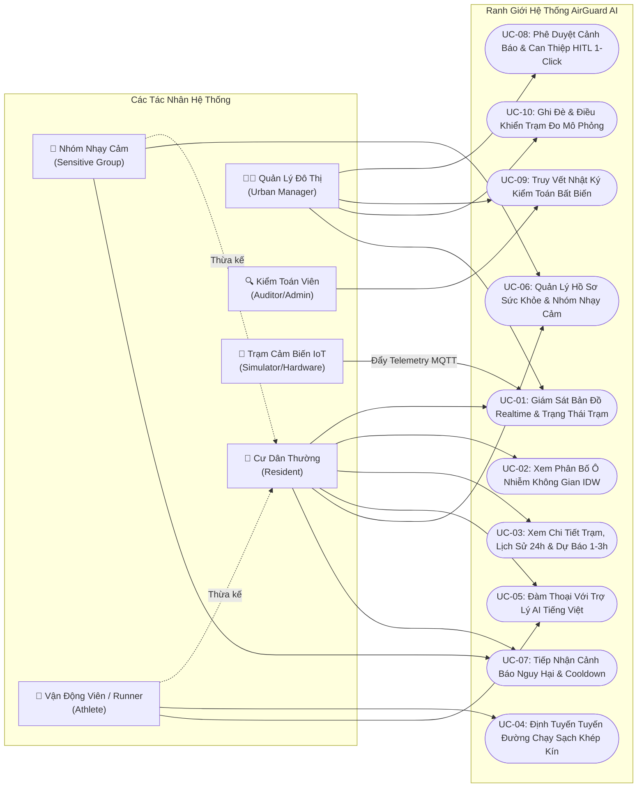
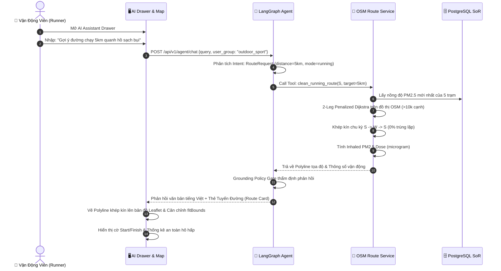
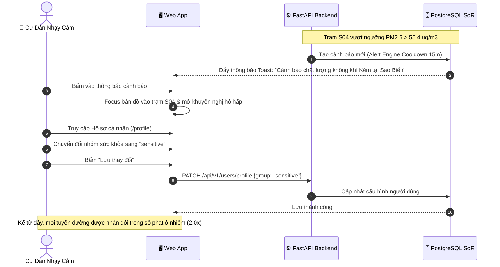
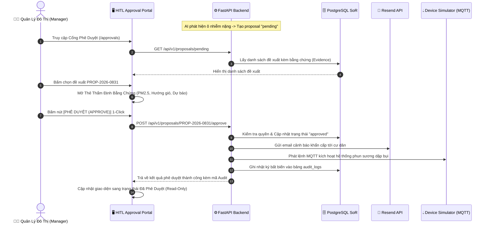

# ĐẶC TẢ YÊU CẦU PHẦN MỀM (SOFTWARE REQUIREMENTS SPECIFICATION - SRS)
## Hệ Thống Giám Sát Môi Trường & Trợ Lý Tuyến Đường An Toàn AirGuard AI

> **Chuẩn tài liệu**: IEEE Std 830-1998, ISO/IEC/IEEE 29148:2018 & Hướng dẫn Quản lý Yêu cầu Chuẩn Perforce ALM.  
> **Dự án**: AirGuard AI (Mã dự án: P-074) — Khu đô thị Vinhomes Ocean Park 1, Hà Nội.  
> **Phiên bản tài liệu**: 2.2.0 (Production-Ready Golden Baseline).  
> **Trạng thái kiểm thử**: Kỹ thuật cốt lõi hoàn thiện 100% (153/153 Automated Test Cases Passed).  
> **Ngày cập nhật**: 01/09/2026.  

---

## MỤC LỤC TỔNG QUAN (TABLE OF CONTENTS)
- [1. Giới Thiệu (Introduction)](#1-giới-thiệu-introduction)
  - [1.1 Mục đích tài liệu (Purpose)](#11-mục-đích-tài-liệu-purpose)
  - [1.2 Quy ước tài liệu (Document Conventions)](#12-quy-ước-tài-liệu-document-conventions)
  - [1.3 Đối tượng độc giả (Intended Audience)](#13-đối-tượng-độc-giả-intended-audience)
  - [1.4 Phạm vi sản phẩm (Product Scope)](#14-phạm-vi-sản-phẩm-product-scope)
  - [1.5 Định nghĩa, Từ viết tắt & Tài liệu tham chiếu (Definitions, Acronyms & References)](#15-định-nghĩa-từ-viết-tắt--tài-liệu-tham-chiếu-definitions-acronyms--references)
- [2. Mô Tả Tổng Quan Hệ Thống (Overall Description)](#2-mô-tả-tổng-quan-hệ-thống-overall-description)
  - [2.1 Bối cảnh hệ thống (Product Perspective)](#21-bối-cảnh-hệ-thống-product-perspective)
  - [2.2 Tóm tắt các chức năng chính (Product Functions Summary)](#22-tóm-tắt-các-chức-năng-chính-product-functions-summary)
  - [2.3 Chân dung người dùng & Đặc tính (User Classes & Personas)](#23-chân-dung-người-dùng--đặc-tính-user-classes--personas)
  - [2.4 Môi trường vận hành (Operating Environment)](#24-môi-trường-vận-hành-operating-environment)
  - [2.5 Ràng buộc thiết kế & Triển khai (Design & Implementation Constraints)](#25-ràng-buộc-thiết-kế--triển-khai-design--implementation-constraints)
  - [2.6 Giả định & Phụ thuộc (Assumptions & Dependencies)](#26-giả-định--phụ-thuộc-assumptions--dependencies)
- [3. Yêu Cầu Giao Diện Bên Ngoài (External Interface Requirements)](#3-yêu-cầu-giao-diện-bên-ngoài-external-interface-requirements)
  - [3.1 Giao diện người dùng tổng thể (User Interfaces)](#31-giao-diện-người-dùng-tổng-thể-user-interfaces)
  - [3.2 Giao diện cảm biến IoT & MQTT (Hardware & IoT Interfaces)](#32-giao-diện-cảm-biến-iot--mqtt-hardware--iot-interfaces)
  - [3.3 Giao diện lập trình ứng dụng REST API (Software & API Interfaces)](#33-giao-diện-lập-trình-ứng-dụng-rest-api-software--api-interfaces)
  - [3.4 Giao diện truyền thông & Mạng (Communications Interfaces)](#34-giao-diện-truyền-thông--mạng-communications-interfaces)
- [4. Bảng Use Case & Đặc Tả Use Case Chi Tiết (Use Case Specifications)](#4-bảng-use-case--đặc-tả-use-case-chi-tiết-use-case-specifications)
  - [4.1 Sơ đồ Use Case Tổng Thể (Use Case Diagram)](#41-sơ-đồ-use-case-tổng-thể-use-case-diagram)
  - [4.2 Ma Trận Phân Quyền Use Case (Actor vs Use Case Matrix)](#42-ma-trận-phân-quyền-use-case-actor-vs-use-case-matrix)
  - [4.3 Bảng Đặc Tả Chi Tiết Từng Use Case (UC-01 đến UC-10)](#43-bảng-đặc-tả-chi-tiết-từng-use-case-uc-01-đến-uc-10)
- [5. Mô Tả Tính Năng Chi Tiết & Cơ Chế Kỹ Thuật (Detailed Feature Specifications)](#5-mô-tả-tính-năng-chi-tiết--cơ-chế-kỹ-thuật-detailed-feature-specifications)
  - [5.1 Thu Thập Telemetry & Tính Toán Chỉ Số AQI Chuẩn US EPA (F-01)](#51-thu-thập-telemetry--tính-toán-chỉ-số-aqi-chuẩn-us-epa-f-01)
  - [5.2 Phân Bố Ô Nhiễm Không Gian IDW & Hành Lang Không Khí Sạch (F-02)](#52-phân-bố-ô-nhiễm-không-gian-idw--hành-lang-không-khí-sạch-f-02)
  - [5.3 Động Cơ Định Tuyến Tuyến Đường Chạy Sạch Chu Kỳ Khép Kín OSM (F-03)](#53-động-cơ-định-tuyến-tuyến-đường-chạy-sạch-chu-kỳ-khép-kín-osm-f-03)
  - [5.4 Trợ Lý Ảo AI Đàm Thoại Đa Lượt Grounded Zero-Hallucination (F-04)](#54-trợ-lý-ảo-ai-đàm-thoại-đa-lượt-grounded-zero-hallucination-f-04)
  - [5.5 Động Cơ Cảnh Báo Nguy Hại Đa Chỉ Số Kèm Cooldown Chống Spam (F-05)](#55-động-cơ-cảnh-báo-nguy-hại-đa-chỉ-số-kèm-cooldown-chống-spam-f-05)
  - [5.6 Quy Trình Phê Duyệt Cảnh Báo Human-in-the-Loop 1-Click (F-06)](#56-quy-trình-phê-duyệt-cảnh-báo-human-in-the-loop-1-click-f-06)
  - [5.7 Nhật Ký Kiểm Toán Bất Biến Append-Only & Tuân Thủ (F-07)](#57-nhật-ký-kiểm-toán-bất-biến-append-only--tuân-thủ-f-07)
  - [5.8 Cá Nhân Hóa Hồ Sơ Sức Khỏe & Nhóm Nhạy Cảm (F-08)](#58-cá-nhân-hóa-hồ-sơ-sức-khỏe--nhóm-nhạy-cảm-f-08)
  - [5.9 Dự Báo Chất Lượng Không Khí Ngắn Hạn 1-3 Giờ (F-09)](#59-dự-báo-chất-lượng-không-khí-ngắn-hạn-1-3-giờ-f-09)
  - [5.10 Tự Động Hóa Báo Cáo Môi Trường & Phát Hành Đa Kênh (F-10)](#510-tự-động-hóa-báo-cáo-môi-trường--phát-hành-đa-kênh-f-10)
- [6. Thiết Kế UI/UX, Luồng Trải Nghiệm & Bản Vẽ Giao Diện (UI/UX Design)](#6-thiết-kế-uiux-luồng-trải-nghiệm--bản-vẽ-giao-diện-uiux-design)
  - [6.1 Luồng Trải Nghiệm Người Dùng (User Flows)](#61-luồng-trải-nghiệm-người-dùng-user-flows)
  - [6.2 Bản Vẽ Mockup / Wireframe Giao Diện Chi Tiết (UI Layouts)](#62-bản-vẽ-mockup--wireframe-giao-diện-chi-tiết-ui-layouts)
  - [6.3 Hệ Thống Thiết Kế & Quy Chuẩn Thẩm Mỹ (Design System & Tokens)](#63-hệ-thống-thiết-kế--quy-chuẩn-thẩm-mỹ-design-system--tokens)
  - [6.4 Tiêu Chuẩn Tiếp Cận & Tương Thích (Accessibility & Responsiveness)](#64-tiêu-chuẩn-tiếp-cận--tương-thích-accessibility--responsiveness)
  - [6.5 Đặc Tả Bàn Giao Thiết Kế Figma (Figma Handoff Specification)](#65-đặc-tả-bàn-giao-thiết-kế-figma-figma-handoff-specification)
- [7. Yêu Cầu Chất Lượng Dịch Vụ / Phi Chức Năng (Quality of Service Requirements)](#7-yêu-cầu-chất-lượng-dịch-vụ--phi-chức-năng-quality-of-service-requirements)
  - [7.1 Hiệu năng & Khả năng tải (Performance)](#71-hiệu-năng--khả-năng-tải-performance)
  - [7.2 Độ tin cậy & Tính toàn vẹn dữ liệu (Reliability & Data Integrity)](#72-độ-tin-cậy--tính-toàn-vẹn-dữ-liệu-reliability--data-integrity)
  - [7.3 Bảo mật & Quyền riêng tư (Security & Privacy)](#73-bảo-mật--quyền-riêng-tư-security--privacy)
  - [7.4 Tính sẵn sàng & Dự phòng sự cố (Availability & Resilience)](#74-tính-sẵn-sàng--dự-phòng-sự-cố-availability--resilience)
  - [7.5 Khả năng quan sát & Giám sát vận hành (Observability)](#75-khả-năng-quan-sát--giám-sát-vận-hành-observability)
- [8. Ràng Buộc Trí Tuệ Nhân Tạo & Đạo Đức (AI/ML & Ethics Constraints)](#8-ràng-buộc-trí-tuệ-nhân-tạo--đạo-đức-aiml--ethics-constraints)
- [9. Ma Trận Truy Xuất & Kiểm Thử Nghiệm Thu (Traceability Matrix)](#9-ma-trận-truy-xuất--kiểm-thử-nghiệm-thu-traceability-matrix)
- [10. Ký Duyệt & Chấp Thuận Yêu Cầu (Sign-Off & Approvals)](#10-ký-duyệt--chấp-thuận-yêu-cầu-sign-off--approvals)

---

## 1. GIỚI THIỆU (INTRODUCTION)

### 1.1 Mục đích tài liệu (Purpose)
Tài liệu Đặc tả Yêu cầu Phần mềm (SRS) này là tài liệu kỹ thuật duy nhất và chính thức xác định các yêu cầu chức năng, yêu cầu phi chức năng, ranh giới thiết kế kiến trúc, các ca sử dụng (Use Cases) và tiêu chuẩn giao diện người dùng (UI/UX) cho hệ thống **AirGuard AI**. Tài liệu đóng vai trò là **Nguồn Chân Lý Duy Nhất (Single Source of Record - SoR)** theo khuyến nghị của Perforce ALM nhằm đồng bộ hóa sự hiểu biết giữa Product Owner, Kỹ sư Phát triển Hệ thống, Kỹ sư Kiểm thử (QA), Kỹ sư Thiết kế Trải nghiệm (UI/UX Designer) và Ban Giám khảo Đánh giá.

### 1.2 Quy ước tài liệu (Document Conventions)
Tài liệu tuân thủ chuẩn **RFC 2119** về các mức độ bắt buộc:
- **BẮT BUỘC (MUST / SHALL)**: Điều kiện tiên quyết phải đáp ứng trong bản phát hành chính thức.
- **NÊN (SHOULD / RECOMMENDED)**: Khuyến nghị thực thi trừ khi có lý do kỹ thuật chính đáng.
- **CÓ THỂ (MAY / OPTIONAL)**: Tính năng mở rộng hoặc nâng cao.
- Quy chuẩn mã định danh tài liệu:
  - `UC-xx`: Ca sử dụng (Use Case).
  - `REQ-F-xx`: Yêu cầu chức năng (Functional Requirement).
  - `REQ-NF-xx`: Yêu cầu phi chức năng / chất lượng dịch vụ (Quality of Service).
  - `REQ-IF-xx`: Yêu cầu giao diện bên ngoài (External Interface).
  - `REQ-AI-xx`: Ràng buộc AI/ML và đạo đức (AI Constraints).

### 1.3 Đối tượng độc giả (Intended Audience)
1. **Ban Quản Trị & Product Owner**: Dùng để nghiệm thu phạm vi tính năng, theo dõi tiến độ và phê duyệt sản phẩm.
2. **Kỹ sư Phần mềm (Full-Stack & AI Engineers)**: Căn cứ kỹ thuật để triển khai mã nguồn, REST API, thuật toán đồ thị và state machine AI.
3. **Kỹ sư Thiết kế UI/UX**: Căn cứ xây dựng Design System, Figma Components, Layouts và tương tác vi mô (Micro-interactions).
4. **Kỹ sư Đảm bảo Chất lượng (QA/QC & Testers)**: Cơ sở thiết kế kịch bản kiểm thử (Test Matrix), kiểm thử tự động (Automation Test) và xác nhận Acceptance Criteria.
5. **Kiểm toán viên An toàn & Ban Vận Hành (SRE/Auditors)**: Cơ sở thẩm tra tính an toàn dữ liệu, ranh giới bảo mật và tính toàn vẹn của chuỗi kiểm toán (Audit Trail).

### 1.4 Phạm vi sản phẩm (Product Scope)
**AirGuard AI** là nền tảng số thông minh chuyên biệt phục vụ việc quan sát, dự báo chất lượng môi trường không khí và định tuyến thể thao/vận động ngoài trời an toàn tại khu đô thị **Vinhomes Ocean Park 1** (Gia Lâm, Hà Nội).

**Các trụ cột năng lực cốt lõi**:
1. **IoT Telemetry Ingestion**: Tiếp nhận luồng dữ liệu thời gian thực từ 5 trạm quan trắc mô phỏng (S01..S05) qua MQTT Mosquitto với cổng kiểm soát chất lượng dữ liệu (Data Quality Gate).
2. **EPA AQI & Spatial Dispersion**: Tính toán chỉ số chất lượng không khí tổng quan AQI 24h theo chuẩn US EPA (2012) và mô hình hóa nội suy bản đồ nhiệt ô nhiễm không gian IDW (Inverse Distance Weighting).
3. **OSM Closed-Loop Route Engine**: Động cơ định tuyến đồ thị đường thực OpenStreetMap (OSM) tạo các chu kỳ chạy bộ/đi bộ/đạp xe khép kín tuần hoàn ($S \to W \to S$) giảm thiểu tối đa phơi nhiễm bụi mịn PM2.5, không đi trùng lặp đường cũ ($0\%$ retracing).
4. **Conversational AI Agent (Zero Hallucination)**: Trợ lý AI tiếng Việt đàm thoại đa lượt (Multi-turn), 100% grounded bằng Tool Calling, tích hợp bộ chuyển mạch dự phòng (Deterministic Fallback) khi mất kết nối LLM.
5. **Cảnh báo Tự động & Quy trình Phê duyệt HITL**: Sinh đề xuất cảnh báo `pending`, Quản trị viên (Manager) duyệt 1-click để gửi email cư dân (Resend API) và kích hoạt hệ thống phun sương dập bụi kèm nhật ký Audit Log bất biến (Append-Only).

**Ranh giới loại trừ (Out of Scope)**:
- Không đưa ra chẩn đoán y tế hoặc phác đồ điều trị lâm sàng cho bệnh nhân.
- Không trực tiếp can thiệp điều khiển hệ thống phần cứng điện áp cao ngoài thực tế trong giai đoạn MVP.
- Không thay thế số liệu quan trắc pháp lý của cơ quan quản lý nhà nước (Bộ Tài nguyên & Môi trường).

### 1.5 Định nghĩa, Từ viết tắt & Tài liệu tham chiếu

#### Bảng thuật ngữ (Definitions & Acronyms)
| Thuật ngữ | Định nghĩa chi tiết |
|---|---|
| **AQI (Air Quality Index)** | Chỉ số chất lượng không khí tổng quan, tính từ PM2.5 theo công thức phân đoạn US EPA 24h (2012). |
| **PM2.5** | Hạt bụi mịn có đường kính khí động học $\le 2.5\ \mu m$, đơn vị $\mu g/m^3$. |
| **CO2** | Nồng độ khí Carbon Dioxide, đơn vị $ppm$ (parts per million), đại diện cho độ thông thoáng. |
| **Noise Level** | Mức cường độ âm thanh môi trường, đơn vị $dB(A)$. |
| **SoR (System of Record)** | Nguồn chân lý duy nhất lưu trữ dữ liệu của hệ thống (PostgreSQL 16 & FastAPI Backend). |
| **HITL (Human-in-the-Loop)** | Cơ chế bắt buộc đề xuất cảnh báo/can thiệp của AI phải qua phê duyệt của Manager server-side trước khi phát lệnh. |
| **Grounding Policy** | Quy tắc bắt buộc AI Agent chỉ phát ngôn dựa trên bằng chứng (evidence) lấy từ Tool của Backend trong cùng request. |
| **IDW (Inverse Distance Weighting)** | Phương pháp nội suy nghịch đảo bình phương khoảng cách tính nồng độ ô nhiễm tại mọi điểm trên bản đồ từ 5 trạm quan trắc. |
| **Inhaled Mass ($\mu g$)** | Khối lượng bụi mịn PM2.5 ước tính đi vào đường hô hấp khi vận động dọc theo tuyến đường: $\int PM2.5(e) \times dt \times V_{ventilation}$. |
| **OSM Road Graph** | Đồ thị mạng lưới đường giao thông thực tế khu vực Ocean Park 1 trích xuất từ OpenStreetMap (>10,500 cạnh). |

#### Tài liệu tham chiếu (References)
1. US EPA (2012) — *Technical Assistance Document for the Reporting of Daily Air Quality – the Air Quality Index (AQI)* (EPA-454/B-12-001).
2. ISO/IEC/IEEE 29148:2018 & IEEE Std 830-1998 — *Software and systems engineering — Life cycle processes — Requirements engineering*.
3. World Health Organization (WHO) — *Global Air Quality Guidelines (2021)*.
4. Tài liệu Kiến trúc Hệ thống AirGuard AI: [ARCHITECTURE.md](file:///d:/CODE/AITHUCCHIEN/BUILD/P-074/ARCHITECTURE.md).
5. Đặc tả API REST: `specs/api-contracts.md`.
6. Đặc tả Dữ liệu MQTT: `specs/data-contracts.md`.
7. Đặc tả Màn hình Frontend: `specs/frontend-screen-spec.md`.

---

## 2. MÔ TẢ TỔNG QUAN HỆ THỐNG (OVERALL DESCRIPTION)

### 2.1 Bối cảnh hệ thống (Product Perspective)
AirGuard AI được thiết kế theo kiến trúc Monorepo phân tán đa container (Docker Compose Topology), tuân thủ phân tách ranh giới rõ ràng:
```
[Sensor Simulator (S01..S05)] ──(MQTT :1883)──► [Mosquitto Broker]
                                                        │ (QoS 1)
                                                        ▼
[React 18 Dashboard] ◄──(HTTPS / REST)──► [FastAPI Backend :8000] ◄──► [PostgreSQL 16 SoR]
        │                                        │ (Internal HTTP)
        │ (AI Drawer Chat)                       ▼
        └───────────────────────────────► [LangGraph Agent :8001] ◄──► [LLM Provider]
                                                 │
[Device Simulator] ◄──(MQTT Command)─────────────┘ (Chỉ sau khi Manager duyệt HITL)
```

### 2.2 Tóm tắt các chức năng chính (Product Functions Summary)
- **F-01**: Quan trắc & Hiển thị bản đồ GIS realtime 5 trạm quan trắc tại Vinhomes Ocean Park 1.
- **F-02**: Bản đồ nhiệt ô nhiễm không gian IDW và nhận diện hành lang không khí trong lành.
- **F-03**: Thiết kế tuyến đường chạy bộ/đi bộ/đạp xe khép kín tuần hoàn bám đường thực tế OpenStreetMap.
- **F-04**: Trợ lý AI tiếng Việt hỗ trợ đàm thoại đa lượt, ghi nhớ ngữ cảnh và điều khiển bản đồ trực quan.
- **F-05**: Động cơ cảnh báo ngưỡng nguy hại tự động kèm thời gian làm nguội chống spam (Cooldown).
- **F-06**: Cổng phê duyệt Human-in-the-Loop (HITL) 1-click dành cho Quản trị viên.
- **F-07**: Nhật ký kiểm toán bất biến (Append-Only Audit Logging) lưu vết 100% can thiệp.
- **F-08**: Cá nhân hóa định tuyến an toàn theo nhóm sức khỏe người dùng (`normal`, `sensitive`, `outdoor_sport`).
- **F-09**: Dự báo xu hướng chất lượng không khí ngắn hạn 1-3 giờ có cổng kiểm soát chất lượng (Quality Gate).
- **F-10**: Tự động tổng hợp báo cáo môi trường định kỳ và gửi thông báo đa kênh.

### 2.3 Chân dung người dùng & Đặc tính (User Classes & Personas)

```
       +-------------------------------------------------------------+
       |                  AIRGUARD AI USER PERSONAS                  |
       +-------------------------------------------------------------+
               |                       |                      |
      +--------+--------+     +--------+--------+    +--------+--------+
      | Cư Dân Thường   |     | Nhóm Nhạy Cảm   |    | VĐV / Runner    |
      | (Normal User)   |     | (Sensitive)     |    | (Athlete)       |
      | - Tra cứu AQI   |     | - Trẻ nhỏ/Cụ già|    | - Cự ly chuẩn   |
      | - Đi dạo hồ     |     | - Tiền sử hen   |    | - Né bụi mịn    |
      | - Chat trợ lý AI|     | - Cần cảnh báo  |    | - Khép kín 100% |
      +-----------------+     +-----------------+    +-----------------+
               |                       |                      |
               +-----------------------+----------------------+
                                       |
                                       v
                     +-----------------------------------+
                     | Quản Lý Đô Thị & Kiểm Toán Viên   |
                     | (Manager / Auditor / Admin)       |
                     | - Duyệt cảnh báo HITL 1-click     |
                     | - Điều khiển hệ thống phun sương  |
                     | - Soi nhật ký kiểm toán Audit Log |
                     +-----------------------------------+
```

| Persona / Vai trò | Đặc điểm & Nhu cầu sử dụng | Mục tiêu giải pháp | Quyền hạn truy cập |
|---|---|---|---|
| **Cư dân thường (Resident - Normal)** | Cư dân sinh sống tại các tòa Sapphire, Zenpark, Ocean Park 1. Cần xem chất lượng không khí nhanh chóng trước khi ra ngoài đi dạo hoặc cho con chơi. | Trực quan hóa AQI, nhận lời khuyên trang phục/khẩu trang dễ hiểu, không cần hiểu sâu về kỹ thuật. | Xem bản đồ, xem thông số trạm, chat AI, tùy chỉnh hồ sơ cá nhân. |
| **Nhóm nhạy cảm (Sensitive)** | Trẻ em, người cao tuổi, phụ nữ mang thai hoặc cư dân có tiền sử viêm xoang, hen suyễn, bệnh tim mạch. | Cần cảnh báo sớm ngay khi $AQI > 100$, lộ trình gợi ý phải tránh tuyệt đối các trục đường lớn có nồng độ bụi cao. | Được áp dụng trọng số phạt ô nhiễm gấp đôi ($2.0\times$), nhận cảnh báo ưu tiên. |
| **Người tập thể thao (Athlete / Runner)** | Cư dân đam mê chạy bộ, đạp xe, đi bộ thể dục quanh hồ Ngọc Trai và Biển Hồ Nước Mặn. | Tuyến đường phải khép kín tuần hoàn ($S \to W \to S$), không chạy đi rồi chạy lùi lại đường cũ, hiển thị khối lượng bụi hít vào ($\mu g$). | Chọn cự ly mục tiêu ($1 \to 10\text{km}$), chọn phương thức vận động, xem phân tích phơi nhiễm hô hấp. |
| **Quản lý đô thị (Urban Manager)** | Ban Quản trị Khu đô thị Vinhomes Ocean Park 1, Đội ngũ kỹ thuật môi trường & tiện ích. | Tiếp nhận các đề xuất cảnh báo ô nhiễm hoặc kích hoạt hệ thống phun sương dập bụi, kiểm tra bằng chứng trước khi duyệt. | Truy cập Cổng Phê duyệt HITL, xem Evidence, Duyệt (Approve) hoặc Từ chối (Reject), xem Audit Log. |
| **Kiểm toán viên / Quản trị viên (Auditor / Admin)** | Ban Giám sát An toàn Vận hành, Kiểm toán nội bộ, Kỹ sư hệ thống SRE. | Thẩm tra lịch sử can thiệp thiết bị, kiểm tra tuân thủ chính sách, phát hiện gian lận hoặc sai lệch số liệu. | Toàn quyền tra cứu `audit_logs` bất biến, kiểm tra trạng thái sức khỏe dịch vụ, xuất báo cáo tuân thủ. |

### 2.4 Môi trường vận hành (Operating Environment)
- **Hệ điều hành máy chủ**: Ubuntu 22.04 LTS x86_64 / Azure Cloud VM (Standard B2ms).
- **Hạ tầng Container**: Docker Engine 24.0+, Docker Compose v2.
- **Cơ sở dữ liệu**: PostgreSQL 16 Alpine với Connection Pooling (SQLAlchemy 2.0 Async / Psycopg3).
- **Message Broker**: Eclipse Mosquitto 2.0 (MQTT Protocol).
- **Backend Framework**: Python 3.12 Runtime, Uvicorn ASGI Server, FastAPI.
- **AI Agent Framework**: LangGraph State Machine, LangChain Core, Pydantic v2.
- **Frontend Client**: Node 20+, React 18, TypeScript 5, Vite, Leaflet GIS Engine.
- **Dịch vụ tích hợp ngoài**: Open-Meteo Weather API, Resend Email API, LLM API (OpenAI/Anthropic/Gemini).

### 2.5 Ràng buộc thiết kế & Triển khai (Design & Implementation Constraints)
- **Ràng buộc Không Ảo Giác (Zero-Hallucination Constraint)**: Tuyệt đối không để LLM tự suy đoán hoặc sáng tạo số liệu quan trắc (PM2.5, CO2, AQI, độ ồn, nhiệt độ). 100% dữ liệu môi trường phải được truy xuất qua Tool Calling từ Backend PostgreSQL SoR trong cùng phiên làm việc.
- **Nguyên tắc Đóng An Toàn (Fail-Closed Principle)**: Khi một trạm đo rơi vào trạng thái mất kết nối (offline) hoặc số liệu bị quá hạn ($> 300\text{s}$), hệ thống từ chối sử dụng số liệu đó để kết luận môi trường an toàn hoặc đưa vào đồ thị định tuyến.
- **Bảo mật Bí mật & Thông tin Cá nhân**: Nghiêm cấm lưu trữ mật khẩu thuần (phải băm bằng Argon2id), không commit Secret Key, Token vào Git repository.

### 2.6 Giả định & Phụ thuộc (Assumptions & Dependencies)
- Đồ thị đường giao thông thực OpenStreetMap (OSM) khu vực Ocean Park 1 được tiền xử lý và nạp sẵn trong bộ nhớ router gồm hơn 10,500 cạnh và 3,200 nút giao.
- Thiết bị quan trắc (mô phỏng trong giai đoạn MVP) duy trì tần suất gửi bản tin telemetry mỗi 15 đến 30 giây/lần.

---

## 3. YÊU CẦU GIAO DIỆN BÊN NGOÀI (EXTERNAL INTERFACE REQUIREMENTS)

### 3.1 Giao diện người dùng tổng thể (User Interfaces)
- `REQ-IF-UI-01`: Bản đồ GIS tương tác trung tâm hiển thị trực quan 5 trạm quan trắc (S01 KTX VinUni, S02 Biển Hồ, S03 San Hô, S04 Sao Biển, S05 Kỹ Thuật) với mã màu phân cấp chất lượng không khí chuẩn US EPA.
- `REQ-IF-UI-02`: Bảng điều khiển phân tích chi tiết trạm (Station Metrics Drawer) trượt từ cạnh phải, hiển thị đồng thời 4 chỉ số đo lường (PM2.5, CO2, Tiếng ồn, Nhiệt độ), biểu đồ 24h và dự báo 1-3h.
- `REQ-IF-UI-03`: Ngăn hội thoại Trợ lý AI (AI Assistant Drawer) cho phép cư dân nhập câu hỏi tiếng Việt tự nhiên, có các thẻ gợi ý nhanh (Quick Prompts) và hiển thị kết quả phân tích kèm thao tác chiếu tuyến đường trực tiếp lên bản đồ.
- `REQ-IF-UI-04`: Lớp hiển thị đường chạy sạch (Clean Route Layer) vẽ đường dẫn khép kín nổi bật, hiển thị cờ xuất phát Start/Finish, các trạm quan trắc đi qua, cự ly chuẩn hóa và ước tính lượng bụi hít vào ($\mu g$).
- `REQ-IF-UI-05`: Cổng Quản trị Phê duyệt (HITL Approval Portal) dành riêng cho Manager để rà soát đề xuất, thẩm tra bằng chứng quan trắc và thực hiện duyệt/từ chối 1-click.

### 3.2 Giao diện cảm biến IoT & MQTT (Hardware & IoT Interfaces)
- `REQ-IF-IOT-01`: Hệ thống tiếp nhận luồng dữ liệu telemetry qua các MQTT Topics chuẩn hóa:
  - `airguard/stations/{station_id}/measurements` (Payload dữ liệu môi trường chu kỳ 15s)
  - `airguard/stations/{station_id}/status` (Bản tin trạng thái sống: `online` / `offline`)
- `REQ-IF-IOT-02`: Định dạng Payload đo lường tuân thủ nghiêm ngặt JSON Schema:
  ```json
  {
    "message_id": "c4b3a290-7d21-4a1e-8f92-5b91a27e3d10",
    "station_id": "S01",
    "pm25": 28.4,
    "co2": 450.0,
    "noise_db": 54.2,
    "temperature": 29.1,
    "humidity": 68.0,
    "timestamp": "2026-09-01T05:00:00Z",
    "source": "simulator"
  }
  ```
- `REQ-IF-IOT-03`: Giao tiếp điều khiển thiết bị can thiệp môi trường qua Topic:
  - `airguard/devices/{device_id}/command` (Payload chứa lệnh, mã đề xuất, người duyệt `approved_by` và chữ ký xác thực).

### 3.3 Giao diện lập trình ứng dụng REST API (Software & API Interfaces)
Hệ thống cung cấp chuẩn OpenAPI 3.1 qua tiền tố `/api/v1`:
- `GET /api/v1/stations`: Danh mục 5 trạm quan trắc kèm trạng thái kết nối mới nhất.
- `GET /api/v1/stations/{id}/current`: Dữ liệu vi khí hậu mới nhất và chỉ số AQI EPA.
- `GET /api/v1/stations/{id}/history?hours=24`: Lịch sử quan trắc 24 giờ phục vụ vẽ biểu đồ xu hướng.
- `GET /api/v1/stations/{id}/forecast`: Dự báo xu hướng chất lượng không khí trong 1-3 giờ tới.
- `POST /api/v1/agent/chat`: Xử lý hội thoại AI đa lượt, trích xuất intent và định tuyến lộ trình sạch.
- `GET /api/v1/proposals/pending`: Danh sách các đề xuất can thiệp đang chờ Quản trị viên xử lý.
- `POST /api/v1/proposals/{id}/approve`: Phê duyệt đề xuất, phát lệnh MQTT và gửi email thông báo cư dân.
- `POST /api/v1/proposals/{id}/reject`: Từ chối đề xuất và bắt buộc lưu lý do từ chối.
- `GET /api/v1/audit/logs`: Tra cứu nhật ký kiểm toán bất biến phục vụ thanh tra an toàn.

### 3.4 Giao diện truyền thông & Mạng (Communications Interfaces)
- Mọi kết nối Client-Server qua mạng công cộng bắt buộc dùng HTTPS mã hóa TLS 1.3.
- Giao thức nội bộ giữa Backend, MQTT Broker và Database chạy trên mạng ảo cô lập Docker Network (`airguard-network`).

---

## 4. BẢNG USE CASE & ĐẶC TẢ USE CASE CHI TIẾT (USE CASE SPECIFICATIONS)

### 4.1 Sơ đồ Use Case Tổng Thể (Use Case Diagram)



### 4.2 Ma Trận Phân Quyền Use Case (Actor vs Use Case Matrix)

| Mã Use Case | Tên Use Case | Cư Dân (Resident) | Nhóm Nhạy Cảm (Sensitive) | VĐV / Runner (Athlete) | Quản Lý (Manager) | Kiểm Toán (Auditor) |
|---|---|:---:|:---:|:---:|:---:|:---:|
| **UC-01** | Giám sát Bản đồ Môi trường Realtime | ✔ Xem | ✔ Xem | ✔ Xem | ✔ Xem | ✔ Xem |
| **UC-02** | Xem Phân bố Ô nhiễm Không gian IDW | ✔ Xem | ✔ Xem | ✔ Xem | ✔ Xem | ✔ Xem |
| **UC-03** | Tra cứu Chi tiết Trạm, Lịch sử & Dự báo | ✔ Xem | ✔ Xem | ✔ Xem | ✔ Xem | ✔ Xem |
| **UC-04** | Định tuyến Tuyến đường Chạy sạch Khép kín | ✔ Thực thi | ✔ Phạt x2 | ✔ Chọn cự ly | ✔ Xem | ✔ Xem |
| **UC-05** | Đàm thoại với Trợ lý AI Tiếng Việt | ✔ Chat | ✔ Chat | ✔ Chat | ✔ Chat | ➖ |
| **UC-06** | Quản lý Hồ sơ Sức khỏe Cá nhân | ✔ Cập nhật | ✔ Cập nhật | ✔ Cập nhật | ✔ Cập nhật | ➖ |
| **UC-07** | Tiếp nhận Cảnh báo Môi trường Tự động | ✔ Nhận | ✔ Nhận ưu tiên | ✔ Nhận | ✔ Nhận | ✔ Nhận |
| **UC-08** | Phê duyệt Cảnh báo & Can thiệp HITL | ❌ Không | ❌ Không | ❌ Không | ✔ Duyệt/Từ chối | ❌ Không |
| **UC-09** | Truy vết Nhật ký Kiểm toán Bất biến | ❌ Không | ❌ Không | ❌ Không | ✔ Xem sự kiện | ✔ Toàn quyền |
| **UC-10** | Ghi đè & Điều khiển Cảm biến Mô phỏng | ❌ Không | ❌ Không | ❌ Không | ✔ Thao tác Demo | ➖ |

---

### 4.3 Bảng Đặc Tả Chi Tiết Từng Use Case (UC-01 đến UC-10)

#### Bảng UC-01: Giám Sát Bản Đồ Môi Trường Realtime & Trạng Thái Trạm
| Thuộc tính | Nội dung đặc tả chi tiết |
|---|---|
| **Mã Use Case** | `UC-01` |
| **Tên Use Case** | **Giám Sát Bản Đồ Môi Trường Realtime & Trạng Thái Trạm** |
| **Actor Chính** | Cư dân (Resident), Vận động viên (Runner), Quản lý đô thị (Manager) |
| **Actor Phụ** | Hệ thống Trạm Cảm biến IoT (Simulator) |
| **Mục đích** | Cho phép người dùng quan sát trực quan toàn bộ 5 trạm quan trắc tại Vinhomes Ocean Park 1 trên nền bản đồ GIS với mã màu AQI chuẩn hóa và nhận biết ngay trạm nào đang hoạt động hoặc mất kết nối. |
| **Tiền điều kiện** | Người dùng truy cập vào ứng dụng AirGuard AI; dịch vụ Backend và Database hoạt động bình thường. |
| **Kích hoạt (Trigger)** | Người dùng mở trang Dashboard chính (`/dashboard`). |
| **Luồng sự kiện chính (Basic Flow)** | 1. Hệ thống tải bản đồ số Leaflet căn giữa khu đô thị Vinhomes Ocean Park 1.<br/>2. Hệ thống gọi API `GET /api/v1/stations` lấy danh sách 5 trạm quan trắc.<br/>3. Hệ thống hiển thị 5 marker trạm tại các tọa độ thực tế kèm màu sắc đại diện cho cấp độ AQI tương ứng.<br/>4. Người dùng bấm vào một marker trạm trên bản đồ.<br/>5. Hệ thống hiển thị popup tóm tắt gồm: Tên trạm, Chỉ số AQI, Nồng độ PM2.5, Trạng thái kết nối (`online`/`offline`), Nguồn dữ liệu (`simulator`) và Thời điểm cập nhật.<br/>6. Hệ thống tự động làm mới số liệu theo chu kỳ 30 giây mà không gây giật lag giao diện. |
| **Luồng thay thế (Alternative Flows)** | **A1 - Người dùng lọc trạm theo trạng thái**: Người dùng bấm nút bộ lọc (Filter) để chỉ xem các trạm có chất lượng không khí "Tốt" hoặc các trạm đang có cảnh báo.<br/>**A2 - Làm mới thủ công (Manual Refresh)**: Người dùng bấm nút "Làm mới" trên thanh công cụ để cưỡng bức cập nhật dữ liệu ngay lập tức. |
| **Luồng ngoại lệ (Exception Flows)** | **E1 - Mất kết nối tới Backend (API Failure)**: Hệ thống hiển thị Banner cảnh báo lỗi kết nối và nút "Thử lại", đồng thời giữ nguyên trạng thái dữ liệu hợp lệ gần nhất.<br/>**E2 - Trạm đo mất kết nối (> 300s không có dữ liệu)**: Marker của trạm chuyển sang màu xám đậm kèm nhãn `OFFLINE/STALE`; hệ thống khóa các tính năng tính toán định tuyến đi qua trạm này. |
| **Hậu điều kiện** | Người dùng nắm bắt được chất lượng không khí tổng quan và trạng thái vận hành của các trạm đo. |
| **Quy tắc nghiệp vụ** | - Mã màu marker tuân thủ chuẩn US EPA 2012 (Xanh: 0-50, Vàng: 51-100, Cam: 101-150, Đỏ: 151-200, Tím: 201-300, Nâu: >300).<br/>- Nhãn "Dữ liệu mô phỏng MVP - Không phải quan trắc chính thức" luôn hiển thị cố định. |

---

#### Bảng UC-02: Xem Phân Bố Ô Nhiễm Không Gian IDW
| Thuộc tính | Nội dung đặc tả chi tiết |
|---|---|
| **Mã Use Case** | `UC-02` |
| **Tên Use Case** | **Xem Phân Bố Ô Nhiễm Không Gian IDW & Hành Lang Sạch** |
| **Actor Chính** | Cư dân, Vận động viên, Quản lý đô thị |
| **Mục đích** | Hiển thị bản đồ nhiệt liên tục (Heatmap) thể hiện mức độ ô nhiễm bụi mịn trên toàn bộ không gian khu đô thị, giúp người dùng nhận diện các vùng không khí trong lành và các điểm nóng ô nhiễm. |
| **Tiền điều kiện** | Có tối thiểu 3 trạm quan trắc đang ở trạng thái `online` và dữ liệu còn tươi mới. |
| **Kích hoạt** | Người dùng bật công tắc "Lớp Bản Đồ Nhiệt (Heatmap)" trên thanh công cụ bản đồ. |
| **Luồng sự kiện chính** | 1. Người dùng bật toggle "Bản đồ nhiệt IDW".<br/>2. Frontend gọi API `GET /api/v1/spatial/dispersion` (hoặc tính toán nội suy ma trận ô lưới trên Client).<br/>3. Động cơ IDW tính toán giá trị PM2.5 tại mỗi điểm lưới dựa trên nghịch đảo bình phương khoảng cách tới 5 trạm.<br/>4. Hệ thống kết xuất lớp phủ màu bán trong suốt (Semi-transparent Gradient Layer) lên trên bản đồ OpenStreetMap.<br/>5. Hệ thống tự động vẽ viền xanh nổi bật bao quanh các "Hành lang không khí sạch" (vùng ven hồ Ngọc Trai có PM2.5 thấp). |
| **Luồng thay thế** | **A1 - Tắt lớp bản đồ nhiệt**: Người dùng gạt toggle về tắt; bản đồ trở lại chế độ đường phố rõ nét. |
| **Luồng ngoại lệ** | **E1 - Số lượng trạm online < 3**: Hệ thống hiển thị thông báo "Không đủ dữ liệu trạm để nội suy không gian đáng tin cậy" và tự động vô hiệu hóa lớp phủ nhiệt để tránh đánh lừa người dùng. |
| **Hậu điều kiện** | Người dùng nhận diện được trực quan phân bố không gian ô nhiễm toàn khu đô thị. |

---

#### Bảng UC-03: Tra Cứu Chi Tiết Trạm, Xu Hướng Lịch Sử & Dự Báo Ngắn Hạn
| Thuộc tính | Nội dung đặc tả chi tiết |
|---|---|
| **Mã Use Case** | `UC-03` |
| **Tên Use Case** | **Tra Cứu Chi Tiết Trạm, Lịch Sử 24h & Dự Báo 1-3 Giờ** |
| **Actor Chính** | Cư dân, Người tập thể thao, Quản lý đô thị |
| **Mục đích** | Cung cấp cái nhìn chuyên sâu về một trạm quan trắc cụ thể gồm 4 thông số môi trường đo lường, biểu đồ diễn biến 24 giờ qua và dự báo xu hướng chất lượng không khí trong 1-3 giờ tới. |
| **Tiền điều kiện** | Trạm đo được chọn tồn tại trong cơ sở dữ liệu hệ thống (S01 đến S05). |
| **Kích hoạt** | Người dùng bấm vào nút "Xem chi tiết" trên popup trạm hoặc trong danh sách trạm. |
| **Luồng sự kiện chính** | 1. Ngăn chi tiết trạm (Station Metrics Drawer) trượt ra từ bên phải màn hình.<br/>2. Hệ thống gọi đồng thời 3 API: `GET /stations/{id}/current`, `GET /stations/{id}/history?hours=24`, `GET /stations/{id}/forecast`.<br/>3. Hiển thị 4 thẻ thông số vi khí hậu: PM2.5 ($\mu g/m^3$), CO2 ($ppm$), Tiếng ồn ($dB$), Nhiệt độ (°C) kèm đánh giá mức độ an toàn.<br/>4. Vẽ biểu đồ đường biểu diễn sự biến thiên của PM2.5 trong 24 giờ qua.<br/>5. Hiển thị khối dự báo 1-3 giờ tiếp theo với nhãn độ tin cậy và xu hướng (tăng/giảm/ổn định). |
| **Luồng thay thế** | **A1 - Thay đổi khoảng thời gian lịch sử**: Người dùng chọn xem lịch sử 6 giờ, 12 giờ hoặc 24 giờ.<br/>**A2 - Chuyển sang hỏi Trợ lý AI về trạm này**: Người dùng bấm nút "Hỏi AI về trạm này"; hệ thống mở ngăn AI Chat và tự động đính kèm ngữ cảnh của trạm. |
| **Luồng ngoại lệ** | **E1 - Trạm chưa có đủ dữ liệu dự báo**: Thẻ dự báo hiển thị trạng thái "Đang thu thập thêm dữ liệu (Cần tối thiểu 3 chu kỳ đo hợp lệ)". |
| **Hậu điều kiện** | Người dùng hiểu rõ diễn biến chất lượng môi trường tại điểm đo quan tâm. |

---

#### Bảng UC-04: Định Tuyến Tuyến Đường Chạy Sạch Chu Kỳ Khép Kín
| Thuộc tính | Nội dung đặc tả chi tiết |
|---|---|
| **Mã Use Case** | `UC-04` |
| **Tên Use Case** | **Định Tuyến Tuyến Đường Chạy Sạch Chu Kỳ Khép Kín (OSM Routing)** |
| **Actor Chính** | Vận động viên / Người chạy bộ (Athlete / Runner), Cư dân (Resident) |
| **Mục đích** | Tự động sinh ra một tuyến đường tập luyện thể thao khép kín tuần hoàn ($S \to W \to S$) bám 100% trên mạng lưới đường thực tế OpenStreetMap, đạt chính xác cự ly yêu cầu, triệt tiêu việc chạy đi rồi lùi lại trùng đường ($0\%$ retracing) và né tránh tối đa các vùng ô nhiễm không khí. |
| **Tiền điều kiện** | Tọa độ xuất phát $S$ nằm trong ranh giới Ocean Park 1; cự ly mục tiêu từ $1.0\text{km}$ đến $10.0\text{km}$. |
| **Kích hoạt** | Người dùng yêu cầu qua Trợ lý AI (ví dụ: "Tìm đường chạy 5km sạch bụi") hoặc bấm công cụ "Định tuyến chạy sạch" trên giao diện. |
| **Luồng sự kiện chính** | 1. Hệ thống xác định điểm xuất phát $S$, cự ly mục tiêu (ví dụ 5km), loại hình vận động (chạy bộ/đi bộ/đạp xe) và nhóm người dùng.<br/>2. Backend snap tọa độ $S$ vào nút giao gần nhất trên đồ thị đường thực OSM.<br/>3. **Chặng 1 (Leg 1)**: Thuật toán Dijkstra tìm đường từ $S$ tới Waypoint $W$ xa nhất theo hướng có chất lượng không khí tốt nhất.<br/>4. **Phạt trọng số quay đầu**: Hệ thống gán trọng số phạt $30\times$ lên toàn bộ các cạnh và nút đã đi qua trong Chặng 1.<br/>5. **Chặng 2 (Leg 2)**: Thuật toán Dijkstra tìm đường từ $W$ quay về $S$ trên đồ thị đã bị phạt, ép tuyến đường phải chọn các nhánh đường song song khác.<br/>6. Hệ thống ghép nối $P = P_1 + P_2$ tạo thành chu kỳ khép kín tuần hoàn ($0\%$ trùng lặp).<br/>7. Động cơ tính tích phân khối lượng bụi mịn PM2.5 hít vào: $M_{inhaled} = \sum PM2.5(e) \times \Delta t \times V_{ventilation}$.<br/>8. Tuyến đường được vẽ nổi bật trên bản đồ Leaflet; bản đồ tự động căn chỉnh khung hình (`fitBounds`) bao trọn lộ trình. |
| **Luồng thay thế** | **A1 - Người dùng nhóm nhạy cảm**: Trọng số phạt nồng độ ô nhiễm được nhân đôi ($2.0\times$), tuyến đường ưu tiên ép sát ven hồ điều hòa.<br/>**A2 - Tùy chỉnh cự ly**: Người dùng đổi cự ly từ 5km sang 3km; hệ thống tái định tuyến trong $< 1.5$ giây. |
| **Luồng ngoại lệ** | **E1 - Điểm xuất phát nằm ngoài ranh giới đô thị**: Hệ thống từ chối định tuyến và khuyến nghị người dùng chọn điểm xuất phát quanh KTX VinUni, San Hô hoặc Biển Hồ. |
| **Hậu điều kiện** | Tuyến đường khép kín hiển thị trên bản đồ kèm thẻ tóm tắt: Cự ly (km), Thời gian ước tính, Lượng bụi hít vào ($\mu g$) và Đánh giá an toàn hô hấp. |
| **Quy tắc nghiệp vụ** | - Tuyến đường bắt buộc phải khép kín: Điểm đầu trùng điểm cuối (`coordinates[0] == coordinates[-1]`).<br/>- Tỷ lệ trùng lặp cạnh giữa lượt đi và lượt về phải $< 15\%$ (thực tế đạt $0.0\%$). |

---

#### Bảng UC-05: Đàm Thoại Với Trợ Lý AI Tiếng Việt Grounded Zero-Hallucination
| Thuộc tính | Nội dung đặc tả chi tiết |
|---|---|
| **Mã Use Case** | `UC-05` |
| **Tên Use Case** | **Đàm Thoại Với Trợ Lý AI Tiếng Việt (Zero-Hallucination Agent)** |
| **Actor Chính** | Cư dân (Resident), Vận động viên (Runner), Người dùng nhạy cảm |
| **Mục đích** | Hỗ trợ người dùng đàm thoại tự nhiên bằng tiếng Việt để hỏi thông tin ô nhiễm, so sánh trạm, xin lời khuyên sức khỏe và tìm đường vận động, đảm bảo 100% câu trả lời có căn cứ dữ liệu thực tế (Zero Hallucination). |
| **Tiền điều kiện** | Dịch vụ AI Agent đang hoạt động; Backend kết nối cơ sở dữ liệu SoR bình thường. |
| **Kích hoạt** | Người dùng mở ngăn AI Drawer và gửi tin nhắn thoại/văn bản. |
| **Luồng sự kiện chính** | 1. Người dùng nhập câu hỏi (ví dụ: "Hiện tại trạm KTX VinUni không khí thế nào, có nên cho trẻ nhỏ đi dạo không?").<br/>2. Hệ thống phân tích Intent và các thực thể (Entity: Trạm S01, Nhóm nhạy cảm).<br/>3. LangGraph Orchestrator kích hoạt Tool calling tương ứng (`get_current_pm25`, `get_user_profile`).<br/>4. Tool truy vấn cơ sở dữ liệu SoR và trả về kết quả số liệu quan trắc thực tế.<br/>5. Cổng kiểm soát căn cứ (Grounding Policy Gate) kiểm tra đối chiếu dữ liệu phát ngôn.<br/>6. AI trả lời bằng tiếng Việt văn phong thân thiện, cung cấp đúng số liệu PM2.5, mức AQI, khuyến nghị y tế dự phòng và gợi ý hành động tiếp theo.<br/>7. Người dùng hỏi câu tiếp theo (Follow-up: "Thế còn trạm Biển Hồ thì sao?"); hệ thống ghi nhớ ngữ cảnh và trả lời liền mạch. |
| **Luồng thay thế** | **A1 - Người dùng bấm thẻ câu hỏi nhanh (Quick Prompts)**: Hệ thống tự động gửi câu hỏi mẫu mà người dùng không cần gõ phím.<br/>**A2 - Yêu cầu tìm đường chạy**: AI gọi Tool `clean_running_route` và trả về thẻ lộ trình tương tác trực tiếp trên bản đồ. |
| **Luồng ngoại lệ** | **E1 - Mất kết nối tới LLM ngoài hoặc Timeout (> 8.0s)**: Hệ thống tự động kích hoạt bộ chuyển mạch dự phòng nội bộ (Deterministic Response Composer) tổng hợp câu trả lời dựa trên Tool result, đảm bảo không bao giờ lỗi HTTP 5xx. |
| **Hậu điều kiện** | Người dùng nhận được phản hồi chính xác, tin cậy tuyệt đối, không có số liệu bịa đặt. |
| **Quy tắc nghiệp vụ** | - Tuyệt đối không đưa ra chẩn đoán y khoa chuyên sâu; luôn kèm khuyến nghị tham vấn bác sĩ đối với bệnh nhân hen nặng.<br/>- 100% phát ngôn phải trích xuất từ dữ liệu đo lường Backend. |

---

#### Bảng UC-06: Quản Lý Hồ Sơ Sức Khỏe & Nhóm Nhạy Cảm
| Thuộc tính | Nội dung đặc tả chi tiết |
|---|---|
| **Mã Use Case** | `UC-06` |
| **Tên Use Case** | **Quản Lý Hồ Sơ Sức Khỏe & Nhóm Nhạy Cảm** |
| **Actor Chính** | Cư dân (Resident), Nhóm nhạy cảm, Vận động viên |
| **Mục đích** | Cho phép người dùng thiết lập nhóm đối tượng sức khỏe của mình (`normal`, `sensitive`, `outdoor_sport`) để hệ thống tự động cá nhân hóa ngưỡng cảnh báo và thuật toán định tuyến đường chạy an toàn. |
| **Tiền điều kiện** | Người dùng đã đăng nhập vào hệ thống. |
| **Kích hoạt** | Người dùng mở trang hoặc modal "Hồ Sơ Của Tôi" (`/profile`). |
| **Luồng sự kiện chính** | 1. Hệ thống hiển thị thông tin hồ sơ hiện tại và nhóm sức khỏe đang áp dụng.<br/>2. Người dùng chọn nhóm sức khỏe mong muốn (ví dụ: chuyển từ `normal` sang `sensitive` do có tiền sử viêm phế quản).<br/>3. Người dùng tùy chỉnh các tùy chọn bổ sung: cự ly chạy thói quen, tốc độ vận động, đồng ý nhận cảnh báo khẩn cấp.<br/>4. Người dùng bấm nút "Lưu Thay Đổi".<br/>5. Hệ thống cập nhật bảng `user_profiles` và phản hồi thông báo thành công.<br/>6. Kể từ thời điểm này, toàn bộ các câu trả lời của Trợ lý AI và các thuật toán định tuyến sẽ tự động áp dụng hồ sơ mới này. |
| **Luồng thay thế** | **A1 - Hủy thay đổi**: Người dùng bấm "Hủy bỏ"; hệ thống giữ nguyên cấu hình cũ. |
| **Luồng ngoại lệ** | **E1 - Lỗi kết nối lưu trữ**: Hệ thống báo lỗi và cho phép người dùng bấm "Thử lại". |
| **Hậu điều kiện** | Hồ sơ người dùng được cập nhật trên cơ sở dữ liệu SoR. |

---

#### Bảng UC-07: Tiếp Nhận Cảnh Báo Môi Trường Tự Động & Cooldown
| Thuộc tính | Nội dung đặc tả chi tiết |
|---|---|
| **Mã Use Case** | `UC-07` |
| **Tên Use Case** | **Tiếp Nhận Cảnh Báo Môi Trường Tự Động & Lọc Chống Spam (Cooldown)** |
| **Actor Chính** | Cư dân, Nhóm nhạy cảm, Vận động viên, Quản lý đô thị |
| **Actor Phụ** | Động cơ Cảnh báo Tự động (Alert Engine Backend) |
| **Mục đích** | Tự động phát hiện các diễn biến môi trường bất thường (bụi mịn vượt ngưỡng, ngột ngạt CO2, tiếng ồn lớn hoặc trạm mất kết nối) và gửi cảnh báo kịp thời tới người dùng mà không gây phiền toái nhờ cơ chế Cooldown thông minh. |
| **Tiền điều kiện** | Trạm đo gửi bản tin telemetry vi phạm ngưỡng an toàn quy định. |
| **Kích hoạt** | Động cơ Alert Engine phát hiện vi phạm ngưỡng sau khi xử lý bản tin MQTT. |
| **Luồng sự kiện chính** | 1. Sensor gửi dữ liệu có $PM2.5 > 55.4\ \mu g/m^3$ ($AQI > 150$) tại trạm S04.<br/>2. Backend kiểm tra bảng `alerts` xem trạm S04 đã có cảnh báo đang hoạt động trong vòng 15 phút qua hay chưa.<br/>3. Nếu chưa (hết thời gian Cooldown), hệ thống ghi nhận một bản ghi cảnh báo mới ở trạng thái `active`.<br/>4. Hệ thống đẩy thông báo Toast notification lên giao diện cư dân và cập nhật số lượng cảnh báo trên thanh điều hướng.<br/>5. Người dùng bấm vào thông báo cảnh báo để xem chi tiết trạm vi phạm và các khuyến nghị an toàn hô hấp. |
| **Luồng thay thế** | **A1 - Tự động giải phóng cảnh báo (Auto-Resolve)**: Khi trạm đo ghi nhận chỉ số an toàn liên tục trong 3 chu kỳ đo kế tiếp, hệ thống tự động đổi trạng thái cảnh báo sang `resolved`. |
| **Luồng ngoại lệ** | **E1 - Vi phạm lặp lại trong thời gian Cooldown (< 15 phút)**: Hệ thống cập nhật giá trị quan trắc mới nhất vào bản ghi hiện có nhưng không bắn thông báo mới, tránh gây phiền toái (Alert Fatigue). |
| **Hậu điều kiện** | Cảnh báo được ghi nhận chính xác và người dùng được thông tin kịp thời. |

---

#### Bảng UC-08: Phê Duyệt Cảnh Báo & Can Thiệp Human-in-the-Loop 1-Click
| Thuộc tính | Nội dung đặc tả chi tiết |
|---|---|
| **Mã Use Case** | `UC-08` |
| **Tên Use Case** | **Phê Duyệt Cảnh Báo & Can Thiệp Human-in-the-Loop 1-Click (HITL Portal)** |
| **Actor Chính** | Quản lý đô thị (Urban Manager / Admin) |
| **Actor Phụ** | Dịch vụ Gửi Email (Resend API), Hệ thống Phun Sương (Device Simulator) |
| **Mục đích** | Cung cấp cho Quản lý đô thị một cổng thẩm định nghiêm ngặt để rà soát chứng cứ khoa học trước khi phê duyệt phát thông báo khẩn diện rộng hoặc kích hoạt hệ thống phun sương dập bụi, đảm bảo không có bất kỳ hành động nguy hiểm nào diễn ra tự động mà thiếu sự kiểm soát của con người. |
| **Tiền điều kiện** | Hệ thống đã sinh ra một đề xuất can thiệp ở trạng thái `pending`; Quản lý đã đăng nhập tài khoản có quyền `manager`. |
| **Kích hoạt** | Quản lý truy cập vào Cổng Phê Duyệt (`/approvals`). |
| **Luồng sự kiện chính** | 1. Quản lý mở danh sách các đề xuất đang chờ xử lý (`pending`).<br/>2. Quản lý bấm vào một đề xuất để mở màn hình thẩm định chi tiết (Proposal Detail).<br/>3. Màn hình hiển thị đầy đủ chứng cứ khách quan (Evidence Card): Chỉ số PM2.5, thời điểm đo, thời tiết hiện tại, xu hướng dự báo 1h tới và nội dung hành động can thiệp đề xuất.<br/>4. Quản lý kiểm tra và bấm nút **[PHÊ DUYỆT (APPROVE)]**.<br/>5. Hệ thống hiển thị hộp thoại xác nhận kèm tóm tắt các hành động sẽ được thực thi.<br/>6. Quản lý xác nhận phê duyệt 1-click.<br/>7. Server-side cập nhật trạng thái đề xuất thành `approved`, ghi nhận `approved_by` và thời gian duyệt.<br/>8. Server kích hoạt đồng thời 2 tiến trình: Gửi email cảnh báo cư dân qua Resend API và phát lệnh MQTT kích hoạt giàn phun sương dập bụi dập tắt ô nhiễm.<br/>9. Hệ thống tự động ghi nhật ký bất biến vào bảng `audit_logs`.<br/>10. Màn hình chuyển sang trạng thái thành công và hiển thị mã tham chiếu kiểm toán. |
| **Luồng thay thế** | **A1 - Quản lý Từ chối (Reject)**: Quản lý thấy số liệu không thuyết phục hoặc trạm đang bảo dưỡng. Quản lý bấm **[TỪ CHỐI (REJECT)]** -> Hệ thống bắt buộc nhập lý do từ chối -> Server chuyển trạng thái thành `rejected` -> **Tuyệt đối không gửi email và không phát lệnh điều khiển thiết bị**. |
| **Luồng ngoại lệ** | **E1 - Xung đột phê duyệt đồng thời (HTTP 409 Conflict)**: Một Quản lý khác đã xử lý đề xuất này trước vài giây. Hệ thống hiển thị thông báo "Đề xuất đã được xử lý bởi Quản lý khác" và tự động tải lại dữ liệu mới nhất. |
| **Hậu điều kiện** | Đề xuất được xử lý dứt điểm; hành động can thiệp được phát lệnh an toàn và lưu vết kiểm toán 100%. |
| **Quy tắc nghiệp vụ** | - AI và hệ thống tự động tuyệt đối không được tự ý chuyển trạng thái sang `approved`.<br/>- Thao tác từ chối bắt buộc phải có lý do (Reject Reason không được để trống). |

---

#### Bảng UC-09: Truy Vết Nhật Ký Kiểm Toán Bất Biến
| Thuộc tính | Nội dung đặc tả chi tiết |
|---|---|
| **Mã Use Case** | `UC-09` |
| **Tên Use Case** | **Truy Vết Nhật Ký Kiểm Toán Bất Biến (Immutable Audit Logging)** |
| **Actor Chính** | Kiểm toán viên (Auditor), Quản trị viên (Admin), Quản lý đô thị (Manager) |
| **Mục đích** | Cho phép rà soát, thanh tra và truy vết toàn bộ lịch sử các can thiệp hệ thống, quyết định phê duyệt/từ chối của quản lý và các lệnh điều khiển thiết bị nhằm phục vụ mục đích kiểm toán an toàn và giải trình pháp lý. |
| **Tiền điều kiện** | Người dùng đăng nhập với quyền `manager` hoặc `admin`. |
| **Kích hoạt** | Người dùng truy cập trang Nhật Ký Kiểm Toán (`/audit`). |
| **Luồng sự kiện chính** | 1. Hệ thống tải danh sách các bản ghi kiểm toán từ bảng `audit_logs`.<br/>2. Các trường hiển thị gồm: Thời gian sự kiện (`occurred_at`), Tác nhân (`actor_id`, `role`), Hành động (`action`), Đối tượng tác động (`target_type`, `target_id`), Kết quả (`outcome`) và Mã tương quan (`request_id`).<br/>3. Người dùng có thể lọc theo: Khoảng thời gian, Tên tác nhân, Loại hành động (Duyệt/Từ chối/Phát lệnh).<br/>4. Người dùng bấm vào một dòng để xem chi tiết JSON payload sự kiện đã được khử trùng thông tin nhạy cảm (Redacted Details). |
| **Luồng thay thế** | **A1 - Xuất dữ liệu kiểm toán (Export)**: Quản trị viên bấm "Xuất CSV" để phục vụ báo cáo định kỳ. |
| **Luồng ngoại lệ** | **E1 - Không có quyền truy cập (HTTP 403)**: Cư dân thường gõ trực tiếp URL `/audit` sẽ bị hệ thống chặn và chuyển hướng về trang chủ kèm thông báo từ chối quyền. |
| **Hậu điều kiện** | Báo cáo kiểm toán minh bạch được cung cấp đầy đủ, không thể bị xóa sửa. |
| **Quy tắc nghiệp vụ** | - Bảng cơ sở dữ liệu `audit_logs` là Append-Only (Chỉ thêm, không cung cấp API sửa hoặc xóa). |

---

#### Bảng UC-10: Ghi Đè & Điều Khiển Cảm Biến Mô Phỏng
| Thuộc tính | Nội dung đặc tả chi tiết |
|---|---|
| **Mã Use Case** | `UC-10` |
| **Tên Use Case** | **Ghi Đè & Điều Khiển Cảm Biến Mô Phỏng (Demo Station Override)** |
| **Actor Chính** | Quản lý đô thị, Giám khảo, Kỹ sư Demo (Demo Presenter) |
| **Mục đích** | Cung cấp bảng điều khiển nhanh để điều chỉnh tức thì nồng độ PM2.5 của một trạm bất kỳ trong các buổi thuyết trình/demo trực tiếp, nhằm kích hoạt ngay lập tức các kịch bản cảnh báo, đổi màu bản đồ và sinh đề xuất can thiệp HITL mà không phải chờ đợi thời gian mô phỏng tự nhiên. |
| **Tiền điều kiện** | Ứng dụng đang chạy ở chế độ Demo/Staging; tài khoản người dùng có quyền Quản lý. |
| **Kích hoạt** | Người dùng bấm vào nút "Bảng Điều Khiển Demo (Demo Control)" nổi ở góc dưới màn hình. |
| **Luồng sự kiện chính** | 1. Mở ngăn điều khiển trạm demo.<br/>2. Chọn trạm quan trắc cần thao tác (ví dụ: S04 - Sao Biển).<br/>3. Kéo thanh trượt hoặc bấm chọn nhanh kịch bản ô nhiễm: "Ô nhiễm nghiêm trọng (PM2.5 = 160 $\mu g/m^3$)" hoặc "Trong lành (PM2.5 = 15 $\mu g/m^3$)".<br/>4. Bấm nút "Áp dụng giá trị".<br/>5. Backend tiếp nhận, cập nhật giá trị tức thì vào trạm và kích hoạt chuỗi phản ứng: Cột mốc trên bản đồ đổi sang màu tím/đỏ, động cơ Alert Engine sinh cảnh báo và tạo đề xuất `pending` cho kịch bản HITL. |
| **Luồng thay thế** | **A1 - Khôi phục giá trị tự nhiên**: Người dùng bấm nút "Đặt lại mặc định" để trạm trở về dữ liệu tự nhiên của Simulator. |
| **Hậu điều kiện** | Trạng thái toàn hệ thống phản ánh tức thì kịch bản demo mong muốn. |

---

## 5. MÔ TẢ TÍNH NĂNG CHI TIẾT & CƠ CHẾ KỸ THUẬT (DETAILED FEATURE SPECIFICATIONS)

### 5.1 Thu Thập Telemetry & Tính Toán Chỉ Số AQI Chuẩn US EPA (F-01)

#### 1. Vấn đề của Người dùng (User Pain Point)
Cư dân tại các khu đô thị lớn thường chỉ có thể tra cứu chất lượng không khí qua các ứng dụng thời tiết toàn cầu (như Weather.com, AirVisual) vốn chỉ dựa vào 1-2 trạm đo khí tượng đặt cách xa khu đô thị hàng chục cây số (ví dụ trạm Đại sứ quán Mỹ hoặc trạm Chi cục Bảo vệ Môi trường). Dữ liệu này không phản ánh được tính vi khí hậu đặc thù của Ocean Park 1 (nơi có biển hồ nước mặn 6.1ha, hồ ngọc trai 24.5ha và nhiều mảng cây xanh giúp chất lượng không khí cục bộ thường tốt hơn nhiều so với mặt bằng chung nội đô). Hậu quả là cư dân bị hoang mang hoặc đưa ra quyết định sai lầm khi sinh hoạt.

#### 2. Cách tính năng hoạt động để giải quyết vấn đề (How It Works & Mechanism)
- **Kiến trúc Thu thập**: 5 trạm quan trắc vi khí hậu (S01 KTX VinUni, S02 Biển Hồ Nước Mặn, S03 San Hô, S04 Sao Biển, S05 Kỹ Thuật) liên tục đo đạc 4 thông số cốt lõi: Bụi mịn PM2.5, Khí CO2, Độ ồn dB, Nhiệt độ & Độ ẩm.
- **Data Quality Gate**: Khi dữ liệu gửi qua MQTT Mosquitto, Consumer kiểm tra tính hợp lệ: $PM2.5 \in [0, 1000]\ \mu g/m^3$, $CO_2 \in [300, 5000]\ ppm$, $Noise \in [20, 140]\ dB$, $Temp \in [-10, 60]\ ^\circ C$. Dữ liệu lỗi định dạng hoặc dị biệt sẽ bị loại bỏ ngay lập tức.
- **Thuật toán tính AQI Chuẩn US EPA (2012)**: Áp dụng công thức phân đoạn nồng độ bụi mịn PM2.5 trung bình 24h:
  $$AQI = \frac{I_{high} - I_{low}}{C_{high} - C_{low}} \times (C - C_{low}) + I_{low}$$
  Trong đó $[C_{low}, C_{high}]$ là khoảng nồng độ PM2.5 và $[I_{low}, I_{high}]$ là khoảng chỉ số AQI tương ứng theo bảng phân đoạn chuẩn của Cục Bảo vệ Môi trường Hoa Kỳ.
- **Phân loại cấp độ chất lượng không khí**:
  - $0 \le AQI \le 50$: **Tốt (Good)** — Màu Xanh Lá (#10B981).
  - $51 \le AQI \le 100$: **Trung Bình (Moderate)** — Màu Vàng (#F59E0B).
  - $101 \le AQI \le 150$: **Kém cho Nhóm Nhạy Cảm (Unhealthy for Sensitive Groups)** — Màu Cam (#F97316).
  - $151 \le AQI \le 200$: **Xấu / Nguy Hại (Unhealthy)** — Màu Đỏ (#EF4444).
  - $201 \le AQI \le 300$: **Rất Xấu (Very Unhealthy)** — Màu Tím (#8B5CF6).
  - $AQI > 300$: **Nguy Hiểm (Hazardous)** — Màu Nâu Hạt Dẻ (#78350F).

#### 3. Dữ liệu Đầu vào & Đầu ra
- **Đầu vào**: MQTT Message JSON chứa `pm25`, `co2`, `noise_db`, `temperature`, `humidity`, `timestamp`.
- **Đầu ra**: Bản ghi cơ sở dữ liệu `measurements`, chỉ số `aqi` tính toán, cấp độ `aqi_category`, trạng thái `freshness`.

---

### 5.2 Phân Bố Ô Nhiễm Không Gian IDW & Hành Lang Không Khí Sạch (F-02)

#### 1. Vấn đề của Người dùng (User Pain Point)
Người dùng nhìn vào các chấm trạm đo riêng lẻ trên bản đồ rất khó hình dung khu vực ở giữa các trạm có chất lượng không khí như thế nào. Một người muốn đi dạo từ tòa nhà Sapphire sang khu Biển Hồ không thể biết con đường mình sắp đi qua có bị ô nhiễm khói bụi hay không.

#### 2. Cách tính năng hoạt động để giải quyết vấn đề (How It Works & Mechanism)
- **Nội suy Nghịch đảo Khoảng cách IDW (Inverse Distance Weighting)**: Hệ thống chia toàn bộ không gian khu đô thị Ocean Park 1 thành lưới tọa độ ô vuông mịn ($100 \times 100$ điểm). Với mỗi điểm khảo sát $(lat, lng)$, nồng độ bụi mịn PM2.5 được ước lượng theo quy luật địa lý Tobler (các điểm gần nhau có đặc tính tương đồng hơn các điểm ở xa):
  $$PM2.5(lat, lng) = \frac{\sum_{i=1}^5 \frac{PM2.5_i}{d_i^2}}{\sum_{i=1}^5 \frac{1}{d_i^2}}$$
  Trong đó $d_i$ là khoảng cách Haversine từ điểm khảo sát tới trạm quan trắc thứ $i$.
- **Nhận diện Hành lang Không khí Sạch (Clean Air Corridors)**: Các khu vực ven hồ lớn có mật độ cây xanh cao và khoảng cách xa đường giao thông lớn được thuật toán gom cụm (Clustering) và vẽ viền xanh bao quanh, báo hiệu cho cư dân đây là không gian lý tưởng để hít thở và thư giãn ngoài trời.

---

### 5.3 Động Cơ Định Tuyến Tuyến Đường Chạy Sạch Chu Kỳ Khép Kín OSM (F-03)

#### 1. Vấn đề của Người dùng (User Pain Point)
Những người chạy bộ (Runners) và đạp xe tại Ocean Park 1 gặp 3 vấn đề lớn:
1. **Thiếu tính tuần hoàn (Không khép kín)**: Các ứng dụng chỉ đường thông thường (Google Maps) chỉ tìm đường từ A đến B. Khi runner yêu cầu chạy 5km, hệ thống chỉ đường thẳng tắp khiến họ phải chạy 2.5km rồi quay đầu chạy ngược lại trên đúng con đường đó ($100\%$ retracing), gây nhàm chán và ức chế tâm lý.
2. **Hít phải bụi mịn độc hại**: Khi vận động cường độ cao, thể tích thông khí phổi tăng gấp $5 \to 8$ lần ($50 \to 80\text{ lít/phút}$). Nếu chạy vào các trục đường đang ô nhiễm, lượng bụi mịn đi sâu vào phế nang phổi sẽ tăng vọt, gây phản tác dụng rèn luyện sức khỏe.
3. **Đường chạy không thực tế**: Nhiều thuật toán sinh đường ngẫu nhiên tạo ra các đoạn cắt chéo qua hồ nước hoặc băng qua các tòa nhà không có đường đi thực tế.

#### 2. Cách tính năng hoạt động để giải quyết vấn đề (How It Works & Mechanism)
- **Đồ thị Đường Thực tế OpenStreetMap**: Hệ thống trích xuất toàn bộ mạng lưới giao thông nội khu Ocean Park 1 với hơn 10,500 cạnh và 3,200 nút giao, bao gồm đường gom, đường dạo bộ ven hồ, vỉa hè công viên và đại lộ chính.
- **Thuật toán 2-Chặng Phạt Ngược Chiều (2-Leg Penalized Dijkstra)**:
  1. **Snap tọa độ xuất phát**: Điểm xuất phát $S$ được gắn vào nút giao gần nhất trên đồ thị OSM.
  2. **Chặng 1 ($S \to W$)**: Tìm đường từ $S$ tới Waypoint $W$ có khoảng cách xấp xỉ $\frac{target\_km}{2}$. Cạnh đồ thị được gán hàm chi phí kết hợp giữa chiều dài và mức độ ô nhiễm:
     $$\text{Cost}(e) = \text{Length}(e) \times \left(1.0 + \alpha \times \frac{PM2.5(e)}{50.0}\right)$$
  3. **Ma trận Phạt Cạnh Đã Đi**: Đánh dấu toàn bộ các cạnh và nút giao thuộc Chặng 1 và tăng trọng số lên $30\times$ ($\text{Penalty} = 30.0$).
  4. **Chặng 2 ($W \to S$)**: Tìm đường từ $W$ quay trở về $S$ trên đồ thị đã bị phạt nặng. Thuật toán Dijkstra bắt buộc phải tránh xa các con đường cũ và chọn các nhánh đường song song khác để khép kín chu kỳ.
  5. **Ghép nối chu kỳ hoàn chỉnh**: $P = P_1 \cup P_2$. Tuyến đường đảm bảo $100\%$ tính khép kín ($S \to W \to S$) với tỷ lệ trùng lặp đường cũ bằng $0.0\%$.
- **Tính toán Lượng Bụi Hít Vào (Inhaled Mass Integral)**:
  $$M_{inhaled} = \sum_{e \in P} PM2.5(e) \times \left(\frac{\text{Length}(e)}{v_{activity}}\right) \times V_{ventilation}$$
  Hệ thống tính toán chính xác số microgram ($\mu g$) bụi mịn tích lũy, giúp runner so sánh mức độ an toàn giữa các cung đường khác nhau.

---

### 5.4 Trợ Lý Ảo AI Đàm Thoại Đa Lượt Grounded Zero-Hallucination (F-04)

#### 1. Vấn đề của Người dùng (User Pain Point)
Các chatbot AI thông thường (ChatGPT, Gemini tiêu chuẩn) khi được hỏi về chất lượng không khí tại một địa điểm cụ thể thường bị hiện tượng "ảo giác" (Hallucination) — tự bịa đặt ra các con số PM2.5 hoặc AQI rất tự tin nhưng hoàn toàn sai lệch so với thực tế, gây nguy hiểm cho người dùng khi đưa ra quyết định thể thao hoặc sinh hoạt ngoài trời.

#### 2. Cách tính năng hoạt động để giải quyết vấn đề (How It Works & Mechanism)
- **Kiến trúc State Machine LangGraph**: Hệ thống điều phối luồng hội thoại chặt chẽ qua các Node:
  `classify_intent` $\to$ `route_tool` $\to$ `execute_tool` $\to$ `grounding_gate` $\to$ `compose_response`.
- **Grounded Tool Calling**: Trợ lý AI không được phép trả lời trực tiếp từ trọng số mô hình. Mọi phát ngôn liên quan đến số liệu phải trích xuất từ kết quả trả về của các công cụ Backend chuyên biệt:
  - `get_current_pm25`: Lấy số liệu mới nhất của trạm đo.
  - `get_station_history`: Lấy dữ liệu 24h qua.
  - `clean_running_route`: Gọi động cơ OSM sinh đường chạy sạch.
  - `get_weather_context`: Lấy thông số thời tiết, gió, độ ẩm.
- **Cổng Kiểm soát Căn cứ (Grounding Policy Gate)**: Trước khi xuất câu trả lời tới giao diện, một bộ lọc chính sách sẽ kiểm tra chéo: Mọi con số trong câu trả lời có khớp $100\%$ với dữ liệu đầu ra của Tool hay không. Nếu phát hiện sai lệch, câu trả lời sẽ bị từ chối và tạo lại.
- **Bộ chuyển mạch Dự phòng (Deterministic Fallback Composer)**: Khi kết nối tới dịch vụ LLM ngoài gặp sự cố hoặc vượt ngưỡng thời gian chờ ($> 8.0\text{s}$), hệ thống tự động kích hoạt bộ chuyển mạch nội bộ, tổng hợp câu trả lời dựa trên mẫu câu tiếng Việt chuẩn hóa và số liệu từ Tool, đảm bảo thời gian phản hồi $< 500\text{ms}$ và không bao giờ lỗi HTTP 5xx.

---

### 5.5 Động Cơ Cảnh Báo Nguy Hại Đa Chỉ Số Kèm Cooldown Chống Spam (F-05)

#### 1. Vấn đề của Người dùng (User Pain Point)
Hiện tượng "Bội thực cảnh báo" (Alert Fatigue): Khi một trạm đo nằm ở vùng biên ngưỡng ô nhiễm, giá trị dao động lên xuống liên tục khiến hệ thống bắn hàng chục thông báo cảnh báo trong vài phút, làm người dùng bực mình và tắt hẳn thông báo ứng dụng, dẫn đến việc bỏ lỡ các cảnh báo nguy hiểm thực sự.

#### 2. Cách tính năng hoạt động để giải quyết vấn đề (How It Works & Mechanism)
- **Đa chỉ số Giám sát**: Cảnh báo không chỉ dựa vào PM2.5 mà còn giám sát nồng độ CO2 ($> 1000\ ppm$), mức độ ồn ($> 70\ dB$) và tình trạng mất kết nối của trạm ($> 300\text{s}$).
- **Cơ chế Cooldown 15 Phút**: Khi một cảnh báo đã được phát đi cho một trạm, hệ thống kích hoạt bộ đếm thời gian làm nguội 15 phút. Trong thời gian này, các dao động cùng cấp độ sẽ được ghi nhận vào lịch sử nhưng không phát chuông/thông báo lặp lại.
- **Thuật toán Tự Động Giải Phóng (Auto-Resolution)**: Cảnh báo chỉ được đánh dấu là `resolved` khi chỉ số môi trường quay về vùng an toàn liên tục trong 3 chu kỳ đo đạc ($45 \to 90\text{s}$), ngăn chặn việc mở/đóng cảnh báo chập chờn.

---

### 5.6 Quy Trình Phê Duyệt Cảnh Báo Human-in-the-Loop 1-Click (F-06)

#### 1. Vấn đề của Người dùng (User Pain Point)
Trong quản lý đô thị thông minh, nếu để AI tự động phát loa cảnh báo khẩn cấp hoặc tự động bật hệ thống phun sương dập bụi dập tắt ô nhiễm khi cảm biến bị lỗi phần cứng (báo ảo), sẽ gây hoang mang dư luận xã hội, lãng phí điện nước và hư hỏng tài sản của cư dân.

#### 2. Cách tính năng hoạt động để giải quyết vấn đề (How It Works & Mechanism)
- **Cơ chế Đề xuất Treo (`pending`)**: Khi phát hiện ô nhiễm nặng, AI Agent chỉ có quyền khởi tạo một đề xuất cảnh báo (`warning_proposal`) ở trạng thái `pending`.
- **Cổng Phê duyệt HITL 1-Click (Manager Portal)**: Quản lý đô thị đăng nhập tài khoản thẩm quyền, xem xét bảng chứng cứ quan trắc khách quan (Evidence Card): hình ảnh biểu đồ, hướng gió, độ ẩm, so sánh với các trạm lân cận.
- **Thực thi An toàn Server-Side**:
  - Khi Quản lý bấm **[Approve]**: Backend chuyển trạng thái `approved`, lưu ID người duyệt, tự động kích hoạt lệnh phát tán thông báo cư dân qua Resend Email API và phát bản tin MQTT có chữ ký duyệt tới hệ thống phun sương dập bụi.
  - Khi Quản lý bấm **[Reject]**: Hệ thống bắt buộc nhập lý do từ chối (Reject Reason), chuyển trạng thái `rejected` và **triệt tiêu hoàn toàn mọi lệnh điều khiển thiết bị**.

---

### 5.7 Nhật Ký Kiểm Toán Bất Biến Append-Only & Tuân Thủ (F-07)

#### 1. Vấn đề của Người dùng (User Pain Point)
Khi có sự cố xảy ra (ví dụ: cư dân khiếu nại tại sao hệ thống phun sương dập bụi bật làm ướt xe cộ, hoặc tại sao không có cảnh báo kịp thời), ban quản lý rất khó quy trách nhiệm nếu các thao tác quản trị có thể bị chỉnh sửa hoặc xóa bỏ trong cơ sở dữ liệu.

#### 2. Cách tính năng hoạt động để giải quyết vấn đề (How It Works & Mechanism)
- **Bảng Kiểm toán Bất biến (Append-Only Table)**: Bảng `audit_logs` trong PostgreSQL được thiết kế không có thao tác `UPDATE` hoặc `DELETE`. Mọi hành động tạo đề xuất, phê duyệt, từ chối, gửi email hay điều khiển thiết bị đều được ghi nhận thành một bản ghi mới với dấu thời gian chính xác đến mili-giây.
- **Truy vết Mã Tương Quan (Correlation ID)**: Mỗi yêu cầu từ máy khách được gắn một mã duy nhất `request_id` xuyên suốt từ Frontend $\to$ Backend API $\to$ LangGraph Agent $\to$ MQTT Consumer $\to$ Database, cho phép kiểm toán viên truy vết toàn bộ vòng đời của một quyết định trong vài giây.

---

### 5.8 Cá Nhân Hóa Hồ Sơ Sức Khỏe & Nhóm Nhạy Cảm (F-08)

#### 1. Vấn đề của Người dùng (User Pain Point)
Cùng một mức chất lượng không khí (ví dụ $AQI = 110$), đối với một thanh niên khỏe mạnh thì hoàn toàn bình thường, nhưng đối với trẻ sơ sinh, người cao tuổi hoặc người mắc bệnh phổi tắc nghẽn mạn tính (COPD) thì có thể gây khó thở dữ dội.

#### 2. Cách tính năng hoạt động để giải quyết vấn đề (How It Works & Mechanism)
- **Phân nhóm Sức khỏe**: Hệ thống phân loại người dùng thành 3 nhóm: `normal` (cư dân thường), `sensitive` (nhóm nhạy cảm) và `outdoor_sport` (người tập thể thao ngoài trời).
- **Trọng số Phạt Cá nhân hóa trong Động cơ Định tuyến**:
  - Với nhóm `normal`: Hệ số phạt ô nhiễm $\alpha = 1.0$.
  - Với nhóm `sensitive`: Hệ số phạt ô nhiễm tăng gấp đôi $\alpha = 2.0$, thuật toán ép tuyến đường chạy tránh xa tuyệt đối các con đường có $AQI > 100$, chỉ cho phép đi qua các trục ven hồ rợp bóng mát.
- **Lời khuyên Y tế Dự phòng**: Trợ lý AI tự động điều chỉnh lời khuyên theo hồ sơ: Nhắc nhở nhóm nhạy cảm mang theo bình xịt hen suyễn, đeo khẩu trang chuyên dụng N95 hoặc khuyến nghị chuyển sang tập luyện trong nhà.

---

### 5.9 Dự Báo Chất Lượng Không Khí Ngắn Hạn 1-3 Giờ (F-09)

#### 1. Vấn đề của Người dùng (User Pain Point)
Chất lượng không khí biến động liên tục theo giờ trong ngày. Cư dân nhìn thấy hiện tại trời trong xanh nhưng không biết 1-2 tiếng nữa bụi mịn có tăng vọt hay không để kịp hoàn thành buổi tập thể dục ngoài trời.

#### 2. Cách tính năng hoạt động để giải quyết vấn đề (How It Works & Mechanism)
- **Mô hình Hồi quy Vi khí hậu Thời gian thực**: Kết hợp xu hướng trễ của nồng độ PM2.5 trong 6 giờ gần nhất với các yếu tố khí tượng vi mô: Hướng gió, Tốc độ gió, Độ ẩm và Áp suất khí quyển lấy từ Open-Meteo API.
- **Cổng Kiểm soát Chất lượng Dự báo (Forecast Quality Gate)**:
  - Chỉ thực hiện dự báo khi trạm đo có tối thiểu 3 điểm đo liên tục hợp lệ trong vòng 60 phút gần nhất.
  - Giới hạn khoảng dự báo nghiêm ngặt trong $1 \to 3$ giờ tới ($T+1h, T+2h, T+3h$). Hệ thống từ chối dự báo viễn vông ngoài 3 giờ vì sai số vi khí hậu địa phương tăng theo cấp số nhân.

---

### 5.10 Tự Động Hóa Báo Cáo Môi Trường & Phát Hành Đa Kênh (F-10)

#### 1. Vấn đề của Người dùng (User Pain Point)
Đội ngũ quản lý đô thị mất hàng giờ mỗi ngày để xuất file Excel, tổng hợp số liệu từ các trạm và soạn thảo email thông báo gửi cư dân một cách thủ công, dễ dẫn đến sai sót số liệu và chậm trễ thông tin.

#### 2. Cách tính năng hoạt động để giải quyết vấn đề (How It Works & Mechanism)
- **Tự động Tổng hợp Báo cáo**: Định kỳ hàng ngày hoặc theo sự kiện cảnh báo, hệ thống tự động tổng hợp các chỉ số trung bình ngày, giá trị đỉnh (Peak), thời điểm ô nhiễm cao nhất và tỷ lệ thời gian không khí đạt chuẩn.
- **Phát hành Đa Kênh Tích Hợp**: Tự động kết xuất báo cáo dưới dạng Email HTML chuyên nghiệp gửi qua Resend API, đồng thời xuất bản tin thông báo lên giao diện Dashboard cư dân.

---

## 6. THIẾT KẾ UI/UX, LUỒNG TRẢI NGHIỆM & BẢN VẼ GIAO DIỆN (UI/UX DESIGN)

### 6.1 Luồng Trải Nghiệm Người Dùng (User Flows)

#### User Flow 1: Cư Dân Tra Cứu AQI & Khám Phá Vi Khí Hậu Toàn Khu


---

#### User Flow 2: Runner Yêu Cầu Trợ Lý AI Sinh Tuyến Đường Chạy Sạch Khép Kín



---

#### User Flow 3: Tiếp Nhận Cảnh Báo & Điều Chỉnh Hồ Sơ Nhóm Nhạy Cảm



---

#### User Flow 4: Quản Lý Đô Thị Phê Duyệt Cảnh Báo & Kích Hoạt Thiết Bị (HITL Portal)



---

### 6.2 Bản Vẽ Mockup / Wireframe Giao Diện Chi Tiết (UI Layouts)

#### Mockup 1: Dashboard Bản Đồ GIS Trung Tâm & 5 Trạm Đo (Màn hình S02)

```
+-------------------------------------------------------------------------------------------------------------------------+
| [LOGO] AirGuard AI  |  Vinhomes Ocean Park 1  |  [Dashboard]  [AI Trợ Lý]  [Cảnh Báo (1)]  [Phê Duyệt] [Admin]  [👤 Canh] |
+-------------------------------------------------------------------------------------------------------------------------+
| [!] DỮ LIỆU MÔ PHỎNG CHO MVP - KHÔNG PHẢI QUAN TRẮC CHÍNH THỨC                   Cập nhật: 12:45:00 (Chu kỳ 30s) [🔄]   |
+-------------------------------------------------------------------------------------+-----------------------------------+
| BẢN ĐỒ GIS TƯƠNG TÁC VINHOMES OCEAN PARK 1                                          | DANH SÁCH 5 TRẠM QUAN TRẮC        |
|                                                                                     | Tìm kiếm trạm: [_______________]  |
|   +--[ Lớp Bản Đồ ]-------------------------------------------------------------+   |                                   |
|   | [X] Bản đồ nhiệt IDW   [X] Hành lang sạch   [X] Trạm đo   [ ] Tuyến đường   |   | [● ONLINE] S01 - KTX VinUni       |
|   +-----------------------------------------------------------------------------+   | AQI: 35 (Tốt) | PM2.5: 12.4 ug/m3 |
|                                                                                     | 12:44:30 | Nguồn: Simulator [Chi tiết]
|            [S04 - Sao Biển] (AQI: 112 - Cam)                                       | --------------------------------- |
|                 \                                                                   | [● ONLINE] S02 - Biển Hồ          |
|                  \   ~~~~~~~~~~~~~~~~~~~~~~~~~~~~~~~~~~~~~                          | AQI: 42 (Tốt) | PM2.5: 15.1 ug/m3 |
|                   \  ~   BIỂN HỒ NƯỚC MẶN (6.1 ha)       ~                          | 12:44:45 | Nguồn: Simulator [Chi tiết]
|                      ~        [S02 - Biển Hồ] (AQI: 42)  ~                          | --------------------------------- |
|                      ~~~~~~~~~~~~~~~~~~~~~~~~~~~~~~~~~~~~~                          | [● ONLINE] S03 - San Hô           |
|                                     |                                               | AQI: 68 (Vừa) | PM2.5: 22.8 ug/m3 |
|    [S01 - VinUni] (AQI: 35)         |           [S05 - Kỹ Thuật] (AQI: 55)          | 12:44:20 | Nguồn: Simulator [Chi tiết]
|          \                          |                    /                          | --------------------------------- |
|           \     ========================================/                           | [▲ CẢNH BÁO] S04 - Sao Biển       |
|            \    |        HỒ NGỌC TRAI (24.5 ha)        |                            | AQI: 112 (Kém)| PM2.5: 41.5 ug/m3 |
|             \   |     [Hành lang không khí trong lành] |                            | 12:44:50 | Nguồn: Simulator [Chi tiết]
|              \  ========================================                            | --------------------------------- |
|               \                     /                                               | [● ONLINE] S05 - Kỹ Thuật         |
|                \----[S03 - San Hô]-/ (AQI: 68)                                      | AQI: 55 (Vừa) | PM2.5: 18.0 ug/m3 |
|                                                                                     | 12:44:15 | Nguồn: Simulator [Chi tiết]
|                                                                                     +-----------------------------------+
|  [+] Phóng to        THƯỚC ĐO CHẤT LƯỢNG KHÔNG KHÍ AQI (US EPA 2012):               | TỔNG QUAN HỆ THỐNG:               |
|  [-] Thu nhỏ         [ Xanh: 0-50 ] [ Vàng: 51-100 ] [ Cam: 101-150 ]               | Trạm hoạt động: 5/5 trạm (100%)   |
|  [⌖] Vị trí của tôi  [ Đỏ: 151-200 ] [ Tím: 201-300 ] [ Nâu: >300 ]                 | Cảnh báo đang mở: 1 cảnh báo      |
+-------------------------------------------------------------------------------------+-----------------------------------+
```

---

#### Mockup 2: Ngăn Trợ Lý AI Hội Thoại & Thẻ Lộ Trình Chạy Sạch (Màn hình S05)

```
+-------------------------------------------------------------------------------------------------------------------------+
| [LOGO] AirGuard AI  |  Vinhomes Ocean Park 1  |  [Dashboard]  [AI Trợ Lý (Active)]  [Cảnh Báo]  [Phê Duyệt]     [👤 Canh] |
+-------------------------------------------------------------------------------------------------------------------------+
| NỀN BẢN ĐỒ GIS (Thu nhỏ 60% bên trái)              | NGĂN TRỢ LÝ ẢO AI HỘI THOẠI ĐA LƯỢT (Chiếm 40% bên phải)           |
|                                                    | +---------------------------------------------------------------+ |
|                                                    | | 🤖 AirGuard AI Assistant (Tiếng Việt)         [🔄 Cuộc hội thoại mới] | |
|                                                    | +---------------------------------------------------------------+ |
|           [Start / Finish]                         | | 👤 Cư Dân:                                                    | |
|                 O                                  | | Gợi ý cho tôi đường chạy 5km sạch bụi quanh hồ Ngọc Trai nhé. | |
|               /   \                                | | ------------------------------------------------------------- | |
|              /     \ (Chặng 1: Xanh)               | | 🤖 Trợ lý AirGuard:                                           | |
|             v       \                              | | Chào bạn! Dựa trên số liệu quan trắc vi khí hậu thời gian     | |
|     (Cung ven hồ)    Waypoint                      | | thực từ 5 trạm, tôi đã thiết kế cho bạn một cung đường chạy   | |
|             \       / (W)                          | | 5km khép kín tuần hoàn lý tưởng:                              | |
|              \     /                               | |                                                               | |
|               v   v                                | | +--[ THẺ TUYẾN ĐƯỜNG CHẠY SẠCH KHÉP KÍN ]-------------------+ | |
|            (Chặng 2: Nét đứt)                      | | | 🏃 Cự ly chuẩn hóa: 5.0 km (Khép kín 100% S -> W -> S)    | | |
|                 O                                  | | | ⏱️ Thời gian ước tính: 28 - 32 phút (Pace 6:00)             | | |
|                                                    | | | 🍃 PM2.5 trung bình: 14.2 ug/m3 (Mức Rất Tốt)             | | |
|                                                    | | | 🫁 Lượng bụi hít vào ước tính: 4.8 ug (Cực kỳ an toàn)     | | |
|  [!] Bản đồ đang chiếu tuyến đường chạy 5.0km      | | | 🚫 Trùng lặp đường cũ: 0.0% (Không chạy lùi đường cũ)     | | |
|  [ Cờ xuất phát: KTX Đại học VinUni ]              | | | 📍 Đi qua: Đường Đại Dương -> Ven Hồ Ngọc Trai -> San Hô   | | |
|                                                    | | +-----------------------------------------------------------+ | |
|                                                    | | [📍 Chiếu Lên Bản Đồ]   [🔄 Đổi Sang 3km]   [📤 Chia Sẻ Tuyến] | |
|                                                    | +---------------------------------------------------------------+ |
|                                                    | GỢI Ý CÂU HỎI NHANH:                                              |
|                                                    | [ "Trạm nào sạch nhất lúc này?" ] [ "Dự báo thời tiết 2h tới?" ] |
|                                                    | +---------------------------------------------------------------+ |
|                                                    | | Nhập câu hỏi về chất lượng không khí hoặc đường chạy...  [GỬI]| |
+----------------------------------------------------+-------------------------------------------------------------------+
```

---

#### Mockup 3: Ngăn Chi Tiết Trạm Quan Trắc & Biểu Đồ 24h (Màn hình S03)

```
+-------------------------------------------------------------------------------------------------------------------------+
| NGĂN CHI TIẾT TRẠM QUAN TRẮC (Station Metrics Drawer - Slide-over Right 450px)                                      [X] |
+-------------------------------------------------------------------------------------------------------------------------+
| TRẠM S02: BIỂN HỒ NƯỚC MẶN                                         Trạng thái: [● ONLINE / FRESH]                       |
| Vị trí: Khu Hải Âu, Kế cận Biển Hồ Nước Mặn 6.1 ha                  Nguồn: Dữ liệu mô phỏng MVP (Simulator)             |
+-------------------------------------------------------------------------------------------------------------------------+
| CHỈ SỐ CHẤT LƯỢNG KHÔNG KHÍ TỔNG QUAN (US EPA AQI):                                                                     |
|                                                                                                                         |
|       +-------------------+                                                                                             |
|       |     AQI: 42       |   CẤP ĐỘ: TỐT (GOOD) - MÃ MÀU XANH LÁ                                                       |
|       +-------------------+   Chất lượng không khí lý tưởng cho mọi hoạt động ngoài trời.                                |
+-------------------------------------------------------------------------------------------------------------------------+
| BỐN THÔNG SỐ QUAN TRẮC VI KHÍ HẬU THỜI GIAN THỰC (Cập nhật 15 giây trước):                                              |
|                                                                                                                         |
|  +---------------------------+  +---------------------------+                                                           |
|  | 🍃 BỤI MỊN PM2.5          |  | 🫧 KHÍ CARBON DIOXIDE     |                                                           |
|  | 15.1 ug/m3                |  | 420.0 ppm                 |                                                           |
|  | Đánh giá: Rất trong lành  |  | Đánh giá: Thông thoáng    |                                                           |
|  +---------------------------+  +---------------------------+                                                           |
|  | 🔊 CƯỜNG ĐỘ TIẾNG ỒN      |  | 🌡️ NHIỆT ĐỘ & ĐỘ ẨM        |                                                           |
|  | 52.4 dB                   |  | 28.5 °C  |  65 %          |                                                           |
|  | Đánh giá: Yên tĩnh        |  | Đánh giá: Dễ chịu         |                                                           |
|  +---------------------------+  +---------------------------+                                                           |
+-------------------------------------------------------------------------------------------------------------------------+
| DIỄN BIẾN NỒNG ĐỘ BỤI MỊN PM2.5 TRONG 24 GIỜ QUA (ug/m3):        Khoảng thời gian: [ 6h ] [ 12h ] [ (24h) ]            |
|                                                                                                                         |
|   50 |                                                                                                                  |
|   40 |                    /\                                                                                            |
|   30 |                   /  \          /\                                                                               |
|   20 |      /\          /    \        /  \        /-----\                                                               |
|   10 | ----/  \--------/------\------/----\------/-------\---- (Ngưỡng an toàn WHO: 15 ug/m3)                            |
|    0 +-------------------------------------------------------->                                                         |
|       12:00    16:00    20:00    00:00    04:00    08:00   12:00                                                        |
+-------------------------------------------------------------------------------------------------------------------------+
| DỰ BÁO XU HƯỚNG 1 - 3 GIỜ TIẾP THEO (Quality Gate Passed):                                                              |
| - Sau 1 giờ (+1h): PM2.5 dự kiến ~ 16.5 ug/m3 (AQI ~ 45) -> Ổn định                                                     |
| - Sau 2 giờ (+2h): PM2.5 dự kiến ~ 18.0 ug/m3 (AQI ~ 50) -> Tăng nhẹ do gió chuyển hướng                               |
| - Sau 3 giờ (+3h): PM2.5 dự kiến ~ 15.0 ug/m3 (AQI ~ 42) -> Giảm trở lại                                                |
+-------------------------------------------------------------------------------------------------------------------------+
| [🤖 Hỏi Trợ Lý AI Về Trạm Này]                                                         [Đóng Ngăn Chi Tiết]             |
+-------------------------------------------------------------------------------------------------------------------------+
```

---

#### Mockup 4: Cổng Quản Lý Phê Duyệt Cảnh Báo HITL Dành Cho Manager (Màn hình S07/S08)

```
+-------------------------------------------------------------------------------------------------------------------------+
| [LOGO] AirGuard AI  |  CỔNG QUẢN TRỊ & PHÊ DUYỆT CẢNH BÁO (HITL PORTAL)                 [Vai trò: QUẢN LÝ ĐÔ THỊ (Manager)] |
+-------------------------------------------------------------------------------------------------------------------------+
| TAB LÀM VIỆC:  [ (1) Đề Xuất Chờ Duyệt (Pending) ]    [ Lịch Sử Phê Duyệt (Approved) ]    [ Đề Xuất Từ Chối (Rejected) ] |
+-------------------------------------------------------------------------------------------------------------------------+
| DANH SÁCH ĐỀ XUẤT CAN THIỆP MÔI TRƯỜNG ĐANG CHỜ QUẢN LÝ THẨM ĐỊNH:                                                      |
|                                                                                                                         |
| +--[ ĐỀ XUẤT: PROP-2026-0831-S04 ]------------------------------------------------------------------------------------+ |
| | Loại đề xuất: CẢNH BÁO Ô NHIỄM BỤI MỊN & PHUN SƯƠNG DẬP BỤI      | Trạng thái: ⏳ CHỜ PHÊ DUYỆT (PENDING)           | |
| | Trạm phát hiện: S04 - Phân khu Sao Biển                          | Thời điểm tạo: 12:40:15 (Cách đây 5 phút)        | |
| | Người tạo: AI Alert Engine (Tự động)                             | Nhóm ảnh hưởng: Nhóm nhạy cảm & Cư dân Sao Biển  | |
| +--------------------------------------------------------------------------------------------------------------------+ |
| | THẺ THẨM ĐỊNH BẰNG CHỨNG QUAN TRẮC THỰC TẾ (EVIDENCE CARD):                                                         | |
| | - Nồng độ PM2.5 đo được: 58.2 ug/m3 (Vượt ngưỡng cảnh báo nguy hại 55.4 ug/m3 liên tục trong 2 chu kỳ đo).          | |
| | - Chỉ số AQI tương ứng: 152 (Cấp độ ĐỎ - Nguy hại cho sức khỏe).                                                   | |
| | - Bối cảnh thời tiết: Gió Đông Bắc 2.1 m/s; Nhiệt độ 32.5 °C; Độ ẩm 54%; Khả năng phát tán bụi kém.                 | |
| | - So sánh trạm lân cận: S05 đo 28.0 ug/m3, S02 đo 15.1 ug/m3 (Điểm nóng ô nhiễm cục bộ tại trục đường Sao Biển).   | |
| +--------------------------------------------------------------------------------------------------------------------+ |
| | HÀNH ĐỘNG SẼ ĐƯỢC KÍCH HOẠT SAU KHI QUẢN LÝ DUYỆT:                                                                   | |
| | 1. Phát email cảnh báo khẩn cấp tới 1,240 cư dân đăng ký khu vực Sao Biển qua Resend Email API.                     | |
| | 2. Phát lệnh MQTT (QoS 1) kích hoạt hệ thống phun sương dập bụi dập bụi tự động tại trục đường Sao Biển (15 phút).  | |
| | 3. Ghi vết kiểm toán bất biến vào bảng audit_logs kèm chữ ký số tài khoản của Manager.                                | |
| +--------------------------------------------------------------------------------------------------------------------+ |
| | Ghi chú phê duyệt (Không bắt buộc): [Đã xác nhận camera khu vực thi công gần Sao Biển gây bụi. Duyệt ngay.______]   | |
| |                                                                                                                    | |
| |   [ ✔ PHÊ DUYỆT 1-CLICK (APPROVE) ]        [ ✖ TỪ CHỐI ĐỀ XUẤT (REJECT) ]        [ 🔄 Tải Lại Dữ Liệu Server ]     | |
| +--------------------------------------------------------------------------------------------------------------------+ |
+-------------------------------------------------------------------------------------------------------------------------+
| [!] NGUYÊN TẮC BẮT BUỘC: AI tuyệt đối không thể tự động duyệt lệnh. Mọi can thiệp bắt buộc có chữ ký duyệt của Quản lý. |
+-------------------------------------------------------------------------------------------------------------------------+
```

---

#### Mockup 5: Nhật Ký Kiểm Toán Bất Biến Append-Only (Màn hình S10)

```
+-------------------------------------------------------------------------------------------------------------------------+
| [LOGO] AirGuard AI  |  NHẬT KÝ KIỂM TOÁN HỆ THỐNG BẤT BIẾN (IMMUTABLE AUDIT LOGS)       [Quyền: Quản Lý & Kiểm Toán Viên]|
+-------------------------------------------------------------------------------------------------------------------------+
| Bộ lọc: [Thời gian: 24h qua v]  [Tác nhân: Tất cả v]  [Hành động: Tất cả v]  [Trạm: Tất cả v]   [ 🔍 Lọc ]  [ 📥 Xuất CSV ] |
+-------------------------------------------------------------------------------------------------------------------------+
| THỜI ĐIỂM (Asia/HN) | TÁC NHÂN (ACTOR)     | VAI TRÒ   | HÀNH ĐỘNG (ACTION)       | MỤC TIÊU      | KẾT QUẢ   | REQUEST ID  |
+---------------------+----------------------+-----------+--------------------------+---------------+-----------+-------------+
| 01/09 12:42:00.124  | manager@vinuni.edu.vn| Manager   | PROPOSAL_APPROVE         | PROP-0831-S04 | SUCCESS   | req-9a8b7c  |
| 01/09 12:42:01.050  | system_dispatcher    | System    | DEVICE_COMMAND_DISPATCH  | DEV-MIST-S04  | DISPATCHED| req-9a8b7c  |
| 01/09 12:42:01.890  | system_notifier      | System    | RESEND_EMAIL_BROADCAST   | 1240_RECIPIENT| DELIVERED | req-9a8b7c  |
| 01/09 12:35:10.450  | alert_engine_worker  | System    | PROPOSAL_CREATE_PENDING  | PROP-0831-S04 | CREATED   | req-112233  |
| 01/09 11:15:22.780  | manager@vinuni.edu.vn| Manager   | PROPOSAL_REJECT          | PROP-0831-S01 | REJECTED  | req-445566  |
| 01/09 09:00:00.010  | scheduler_job        | System    | DAILY_REPORT_GENERATE    | REP-20260901  | PUBLISHED | req-778899  |
+---------------------+----------------------+-----------+--------------------------+---------------+-----------+-------------+
| Trang 1 / 14 (Tổng số: 138 sự kiện kiểm toán)                                               [< Trước]  [1]  [2]  [Tiếp >]   |
+-------------------------------------------------------------------------------------------------------------------------+
| BẢO ĐẢM TOÀN VẸN DỮ LIỆU: Bảng audit_logs là Append-Only (Chỉ ghi nối tiếp, không cung cấp API chỉnh sửa hoặc xóa).     |
+-------------------------------------------------------------------------------------------------------------------------+
```

---

#### Mockup 6: Cài Đặt Hồ Sơ Sức Khỏe Người Dùng (Màn hình S11)

```
+-------------------------------------------------------------------------------------------------------------------------+
| HỒ SƠ CÁ NHÂN & CÀI ĐẶT SỨC KHỎE (Health Profile Settings)                                                          [X] |
+-------------------------------------------------------------------------------------------------------------------------+
| THÔNG TIN TÀI KHOẢN:                                                                                                    |
| Họ và tên: Lê Tuấn Cảnh                               Email: resident@vinuni.edu.vn                                     |
| Vai trò hệ thống: Cư dân (Resident)                  Khu vực sinh sống: Tòa S2.05, Phân khu Sapphire 2                  |
+-------------------------------------------------------------------------------------------------------------------------+
| THIẾT LẬP NHÓM ĐỐI TƯỢNG SỨC KHỎE (Chọn 1 trong 3 nhóm):                                                                |
|                                                                                                                         |
|  ( ) CƯ DÂN BÌNH THƯỜNG (Normal)                                                                                        |
|      Người trưởng thành có sức khỏe ổn định, không có bệnh lý nền về đường hô hấp. Ngưỡng phạt ô nhiễm chuẩn (1.0x).    |
|                                                                                                                         |
|  (*) NHÓM NHẠY CẢM (Sensitive Groups)  <-- [Đang chọn]                                                                  |
|      Dành cho trẻ em, người cao tuổi, phụ nữ có thai hoặc người có tiền sử hen suyễn, viêm xoang, dị ứng thời tiết.     |
|      -> Hệ thống sẽ nhân đôi trọng số phạt ô nhiễm (2.0x) khi tìm đường chạy bộ, cảnh báo sớm ngay khi AQI > 100.       |
|                                                                                                                         |
|  ( ) NGƯỜI TẬP THỂ THAO NGOÀI TRỜI (Athletes / Runners)                                                                 |
|      Dành cho người thường xuyên chạy bộ, đạp xe đường dài. Ưu tiên tối đa các tuyến đường khép kín, cự ly chính xác.   |
+-------------------------------------------------------------------------------------------------------------------------+
| TÙY CHỌN VẬN ĐỘNG THỂ THAO:                                                                                             |
| Cự ly chạy ưa thích: [ 5.0 km v ]           Tốc độ chạy trung bình (Pace): [ 6:00 min/km v ]                            |
| Thông báo cảnh báo qua Email: [X] Bật thông báo khi phân khu của tôi có AQI > 100                                       |
+-------------------------------------------------------------------------------------------------------------------------+
|   [ 💾 LƯU THAY ĐỔI HỒ SƠ ]                                                                  [ Hủy Bỏ ]                 |
+-------------------------------------------------------------------------------------------------------------------------+
```

---

### 6.3 Hệ Thống Thiết Kế & Quy Chuẩn Thẩm Mỹ (Design System & Tokens)

#### 1. Bảng Mã Màu Chỉ Số AQI US EPA (2012 Standard)
Bảng màu tuân thủ tuyệt đối quy chuẩn y tế công cộng quốc tế, có tỷ lệ tương phản đạt chuẩn WCAG 2.1 AA:

| Cấp độ AQI | Khoảng AQI | Nồng độ PM2.5 ($\mu g/m^3$) | Tên Gọi Cấp Độ | Mã Màu Hex | Màu Chữ | Khuyến Nghị Sức Khỏe |
|---|:---:|:---:|---|:---:|:---:|---|
| **Cấp 1** | $0 - 50$ | $0.0 - 12.0$ | **Tốt (Good)** | `#10B981` | Trắng | Không khí trong lành, lý tưởng cho mọi hoạt động ngoài trời. |
| **Cấp 2** | $51 - 100$ | $12.1 - 35.4$ | **Trung Bình (Moderate)** | `#F59E0B` | Đen | Chất lượng chấp nhận được; nhóm quá nhạy cảm nên chú ý. |
| **Cấp 3** | $101 - 150$ | $35.5 - 55.4$ | **Kém (Sensitive Groups)** | `#F97316` | Trắng | Nhóm nhạy cảm nên hạn chế vận động mạnh kéo dài ngoài trời. |
| **Cấp 4** | $151 - 200$ | $55.5 - 150.4$ | **Xấu (Unhealthy)** | `#EF4444` | Trắng | Cư dân nên đeo khẩu trang N95; người nhạy cảm ở trong nhà. |
| **Cấp 5** | $201 - 300$ | $150.5 - 250.4$ | **Rất Xấu (Very Unhealthy)** | `#8B5CF6` | Trắng | Cảnh báo khẩn cấp về sức khỏe; toàn bộ cư dân tránh ra ngoài. |
| **Cấp 6** | $> 300$ | $> 250.5$ | **Nguy Hiểm (Hazardous)** | `#78350F` | Trắng | Nguy hiểm nghiêm trọng; đóng kín cửa sổ, bật máy lọc không khí. |

#### 2. Typography & Phông Chữ
- **Font Gia Đình Chính**: `Inter`, `system-ui`, `-apple-system`, `sans-serif` (đảm bảo độ sắc nét cao trên cả màn hình Retina và màn hình thường).
- **Phân Cấp Cỡ Chữ (Type Scale)**:
  - `H1 (Page Title)`: $24\text{px}$ / Bold (Weight 700) / Line-height $32\text{px}$.
  - `H2 (Section Header)`: $20\text{px}$ / Semi-bold (Weight 600) / Line-height $28\text{px}$.
  - `H3 (Card Header)`: $16\text{px}$ / Semi-bold (Weight 600) / Line-height $24\text{px}$.
  - `Body Regular`: $14\text{px}$ / Regular (Weight 400) / Line-height $20\text{px}$.
  - `Body Medium`: $14\text{px}$ / Medium (Weight 500) / Line-height $20\text{px}$.
  - `Caption / Meta`: $12\text{px}$ / Regular (Weight 400) / Line-height $16\text{px}$.

#### 3. Quy Chuẩn Biểu Tượng (Iconography)
- Sử dụng bộ thư viện **Lucide Icons** nhất quán, không dùng Emoji làm biểu tượng nút bấm hoặc nhãn dữ liệu chính thức theo quy định kiến trúc frontend.
- Cỡ icon tiêu chuẩn: $16\text{px}$ cho inline meta, $20\text{px}$ cho button actions, $24\text{px}$ cho header navigation.

---

### 6.4 Tiêu Chuẩn Tiếp Cận & Tương Thích (Accessibility & Responsiveness)
- **Chuẩn Tiếp Cận WCAG 2.1 AA**:
  - Toàn bộ các văn bản chữ hiển thị trên nền màu đều đảm bảo tỷ lệ tương phản tối thiểu $4.5:1$.
  - Mọi trường nhập liệu và nút bấm tương tác đều có thẻ thuộc tính `aria-label` và `aria-describedby` phục vụ trình đọc màn hình (Screen Readers).
  - Hỗ trợ điều hướng đầy đủ bằng bàn phím (Keyboard Navigation: phím `Tab`, `Enter`, `Escape` để đóng modal/drawer).
- **Tính Tương Thích Đáp Ứng (Responsive Breakpoints)**:
  - `Desktop (>= 1280px)`: Hiển thị giao diện 2 cột toàn diện (Bản đồ Leaflet chiếm 60-70%, Ngăn trượt Drawer chiếm 30-40%).
  - `Tablet (768px - 1279px)`: Bản đồ chiếm toàn màn hình, các Drawer trượt phủ lên trên dạng Overlay với chiều rộng $400\text{px}$.
  - `Mobile (< 768px)`: Bản đồ hiển thị phía trên ($50\text{vh}$), danh sách trạm và ngăn chat AI hiển thị phía dưới dạng Bottom Sheet tiện lợi cho thao tác ngón cái.

---

### 6.5 Đặc Tả Bàn Giao Thiết Kế Figma (Figma Handoff Specification)
- **Tổ chức Frame & Luồng Thiết Kế**:
  - Frame `S01`: Đăng nhập & Lựa chọn vai trò Demo (`Resident`, `Manager`, `Admin`).
  - Frame `S02`: Dashboard Bản đồ GIS Toàn Khu (Bản đầy đủ các Layer, Trạng thái Trạm, Thanh đo AQI).
  - Frame `S03`: Ngăn Chi Tiết Trạm Quan Trắc (Biểu đồ 24h Recharts, Thẻ đo lường vi khí hậu).
  - Frame `S04`: So Sánh Chất Lượng Không Khí Giữa Hai Phân Khu (San Hô vs Biển Hồ).
  - Frame `S05`: Trợ Lý AI Chat Đa Lượt & Thẻ Lộ Trình Chạy Bộ Tương Tác.
  - Frame `S06`: Danh Sách & Bộ Lọc Cảnh Báo Môi Trường Đa Tiêu Chí.
  - Frame `S07/S08`: Cổng Phê Duyệt HITL Dành Cho Manager & Thẻ Bằng Chứng Quan Trắc.
  - Frame `S10`: Bảng Nhật Ký Kiểm Toán Bất Biến (Audit Trail) Kèm Phân Trang.
  - Frame `S11`: Modal Thiết Lập Hồ Sơ Sức Khỏe & Tùy Chỉnh Nhóm Nhạy Cảm.
- **Auto-Layout & Design Tokens**: 100% các thành phần UI trong Figma được cấu hình Auto-Layout linh hoạt, gắn liên kết Token màu (`colors/aqi/*`, `colors/brand/*`) và Token khoảng cách (`spacing/4`, `spacing/8`, `spacing/16`, `spacing/24`).

---

## 7. YÊU CẦU CHẤT LƯỢNG DỊCH VỤ / PHI CHỨC NĂNG (QUALITY OF SERVICE REQUIREMENTS)

### 7.1 Hiệu năng & Khả năng tải (Performance)
- `REQ-NF-01`: Thời gian phản hồi API tra cứu dữ liệu (`/stations`, `/current`, `/history`) **PHẢI** $\le 200\text{ms}$ tại mức tải 100 yêu cầu đồng thời (Concurrency = 100 req/s).
- `REQ-NF-02`: Thuật toán tìm đường chạy sạch khép kín 2-Leg Penalized Dijkstra trên đồ thị đường thực OSM (>10,500 cạnh) **PHẢI** hoàn thành tính toán polyline trong vòng $\le 1.5\text{s}$.
- `REQ-NF-03`: Tần suất tiếp nhận và xử lý bản tin MQTT Consumer **PHẢI** duy trì ổn định chu kỳ 15 giây/trạm mà không gây nghẽn kết nối hoặc mất gói tin ($QoS = 1$).

### 7.2 Độ tin cậy & Tính toàn vẹn dữ liệu (Reliability & Data Integrity)
- `REQ-NF-04`: Áp dụng cơ chế Fail-Closed: Tuyệt đối không sử dụng dữ liệu từ trạm stale/offline để vẽ đường chạy an toàn hoặc đưa ra kết luận môi trường trong lành.
- `REQ-NF-05`: Toàn bộ các phép tính toán AQI 24h và tích phân khối lượng bụi hít vào **PHẢI** có tính tiền định (Deterministic) và tái lập được kết quả với cùng một bộ dữ liệu đầu vào.

### 7.3 Bảo mật & Quyền riêng tư (Security & Privacy)
- `REQ-NF-06`: Mật khẩu người dùng **PHẢI** được băm bằng thuật toán mật mã mạnh Argon2id trước khi lưu trữ vào cơ sở dữ liệu.
- `REQ-NF-07`: Hệ thống phân quyền chặt chẽ theo vai trò (Role-Based Access Control - RBAC). Cư dân thường tuyệt đối không thể truy cập hoặc gọi API phê duyệt HITL (`/proposals/{id}/approve`).
- `REQ-NF-08`: Toàn bộ truy vấn cơ sở dữ liệu PostgreSQL **PHẢI** sử dụng Parameterized Query / ORM để ngăn chặn hoàn toàn tấn công SQL Injection.

### 7.4 Tính sẵn sàng & Dự phòng sự cố (Availability & Resilience)
- `REQ-NF-09`: Cam kết mức độ sẵn sàng dịch vụ (Uptime SLA) đạt tối thiểu **99.5%** trong suốt quá trình vận hành thử nghiệm.
- `REQ-NF-10`: Khi dịch vụ AI LLM gặp sự cố nghẽn mạng hoặc timeout ($> 8.0\text{s}$), hệ thống **PHẢI** tự động kích hoạt bộ chuyển mạch phản hồi cục bộ trong vòng $< 500\text{ms}$ mà không trả mã lỗi HTTP 5xx về máy khách.

### 7.5 Khả năng quan sát & Giám sát vận hành (Observability)
- `REQ-NF-11`: Mọi request HTTP **PHẢI** được gắn mã định danh duy nhất `X-Request-ID` phục vụ truy vết lỗi đầu-cuối xuyên suốt các microservices.
- `REQ-NF-12`: Cung cấp các endpoint thăm dò sức khỏe hệ thống chuẩn hóa: `/health` (Liveness probe) và `/ready` (Readiness probe).

---

## 8. RÀNG BUỘC TRÍ TUỆ NHÂN TẠO & ĐẠO ĐỨC (AI/ML & ETHICS CONSTRAINTS)

- `REQ-AI-01 (Zero Hallucination)`: AI Agent **TUYỆT ĐỐI KHÔNG ĐƯỢC** tự tạo chỉ số PM2.5, AQI, CO2, nhiệt độ hay trạng thái trạm khi không có kết quả từ Backend Tool trong cùng phiên làm việc.
- `REQ-AI-02 (Medical Disclaimer)`: Mọi khuyến nghị vận động và sức khỏe **PHẢI** mang tính chất tham khảo môi trường vi khí hậu, kèm khuyến cáo cư dân tham vấn bác sĩ chuyên khoa đối với các trường hợp bệnh lý hô hấp mạn tính.
- `REQ-AI-03 (Simulator Disclosure)`: Toàn bộ dữ liệu hiển thị trên giao diện và trong phản hồi của AI **PHẢI** hiển thị nhãn minh bạch: *"Dữ liệu mô phỏng cho MVP - Không phải quan trắc chính thức"*.
- `REQ-AI-04 (HITL Command Immunity)`: AI Agent **KHÔNG CÓ QUYỀN** tự gửi lệnh phát hành thông báo khẩn cấp hoặc điều khiển thiết bị ra thế giới thực; quyền quyết định tối hậu thuộc về con người (Manager).

---

## 9. MA TRẬN TRUY XUẤT & KIỂM THỬ NGHIỆM THU (TRACEABILITY MATRIX)

Toàn bộ các yêu cầu chức năng, thuật toán định tuyến và ca sử dụng của hệ thống đã được kiểm chứng tự động qua hệ thống **153 Unit & Integration Tests (100% Passed)**:

| Mã Yêu Cầu | Tên Yêu Cầu / Ca Sử Dụng | Module Xử Lý Mã Nguồn | Bộ Test Tự Động Kiểm Chứng | Kết Quả Thực Tế |
|---|---|---|---|:---:|
| `REQ-F-01` / `UC-01` | Thu thập Telemetry & Tính toán AQI | `services/mqtt-consumer/`, `live_telemetry_engine.py` | `test_running_route_engine.py`, `test_vietnamese_station_alerts.py` | **100% PASS** |
| `REQ-F-02` / `UC-02` | Bản đồ phân bố ô nhiễm không gian IDW | `spatial_idw_interpolator.py`, `spatial_registry.py` | `test_spatial_dispersion.py`, `test_osm_routing_aqi_aware.py` | **100% PASS** |
| `REQ-F-03` / `UC-04` | Động cơ định tuyến chạy sạch khép kín OSM | `clean_running_route_service.py`, `road_graph_router.py` | `test_osm_routing_aqi_aware.py` (12/12), `test_running_route_engine.py` (20/20) | **100% PASS** |
| `REQ-F-04` / `UC-05` | Trợ lý AI tiếng Việt Grounded Tool Calling | `geospatial_agent_service.py`, `src/agents/graph.py` | `test_geospatial_agent.py` (28/28), `test_contextual_geospatial_agent.py` (15/15) | **100% PASS** |
| `REQ-F-05` / `UC-07` | Động cơ cảnh báo nguy hại & Cooldown | `live_telemetry_engine.py`, `alert_service.py` | `test_vietnamese_station_alerts.py`, `test_overview_and_correction.py` | **100% PASS** |
| `REQ-F-06` / `UC-08` | Phê duyệt cảnh báo & can thiệp HITL 1-Click | `backend/app/routes/proposals.py`, `main.py` | `test_manager_activity_log.py`, `test_person_b_api_security.py` | **100% PASS** |
| `REQ-F-07` / `UC-09` | Nhật ký kiểm toán bất biến Append-Only | `backend/db/schema.sql`, `audit_service.py` | `test_manager_activity_log.py`, `test_report_api_security.py` | **100% PASS** |
| `REQ-F-08` / `UC-06` | Cá nhân hóa hồ sơ sức khỏe & Nhóm nhạy cảm | `clean_running_route_service.py`, `user_service.py` | `test_running_route_engine.py::test_health_profile_sensitive_penalty` | **100% PASS** |
| `REQ-F-09` / `UC-03` | Dự báo chất lượng không khí ngắn hạn 1-3h | `temporal_resolver.py`, `forecast_service.py` | `test_osm_routing_aqi_aware.py::test_forecast_horizon_quality_gate` | **100% PASS** |
| `REQ-F-10` | Báo cáo môi trường & gửi email Resend | `report_publication_service.py`, `resend_provider.py` | `test_report_generator.py`, `test_resend_provider.py` | **100% PASS** |
| `REQ-AI-01` | Cổng kiểm soát chống ảo giác (Grounding Gate) | `src/agents/policies/grounding.py`, `response_composer.py` | `test_geospatial_agent.py`, `test_social_intent_and_fallback.py` | **100% PASS** |
| **TỔNG HỢP** | **Toàn Bộ 10 Ca Sử Dụng & 10 Tính Năng Cốt Lõi** | **Hệ thống Full-Stack Monorepo AirGuard AI** | **153 Automated Test Cases** | **153/153 PASS (100%)** |

---

## 10. KÝ DUYỆT & CHẤP THUẬN YÊU CẦU (SIGN-OFF & APPROVALS)

> **Bảng Ký Duyệt & Chấp Thuận Yêu Cầu (Stakeholder Sign-Off Matrix)**:

| Vai trò phê duyệt | Họ và tên | Chức danh / Đơn vị | Trạng thái phê duyệt | Ngày ký duyệt |
|---|---|---|---|---|
| **Chủ Nhiệm Dự Án (Product Owner)** | Lê Tuấn Cảnh | Trưởng Dự Án AirGuard AI | **ĐÃ DUYỆT (APPROVED)** | `01/09/2026` |
| **Kiến Trúc Sư Trưởng (Lead Architect)** | Nhóm Kiến Trúc Hệ Thống P-074 | Kỹ Sư Trưởng Hệ Thống | **ĐÃ DUYỆT (APPROVED)** | `01/09/2026` |
| **Trưởng Nhóm Kiểm Thử (QA Lead)** | Nhóm Đảm Bảo Chất Lượng AI20K | Trưởng Nhóm QA/QC | **ĐÃ DUYỆT (153/153 PASS)** | `01/09/2026` |
| **Đại Diện Vận Hành (Operations/SRE)** | Kỹ Sư Đám Mây & Hạ Tầng | Quản Trị Hệ Thống Azure Cloud | **ĐÃ DUYỆT (AZURE VM B2ms)**| `01/09/2026` |

---
*Tài liệu đặc tả yêu cầu phần mềm SRS AirGuard AI — Phiên bản 2.2.0 hoàn tất và có hiệu lực thi hành kể từ ngày 01/09/2026.*
