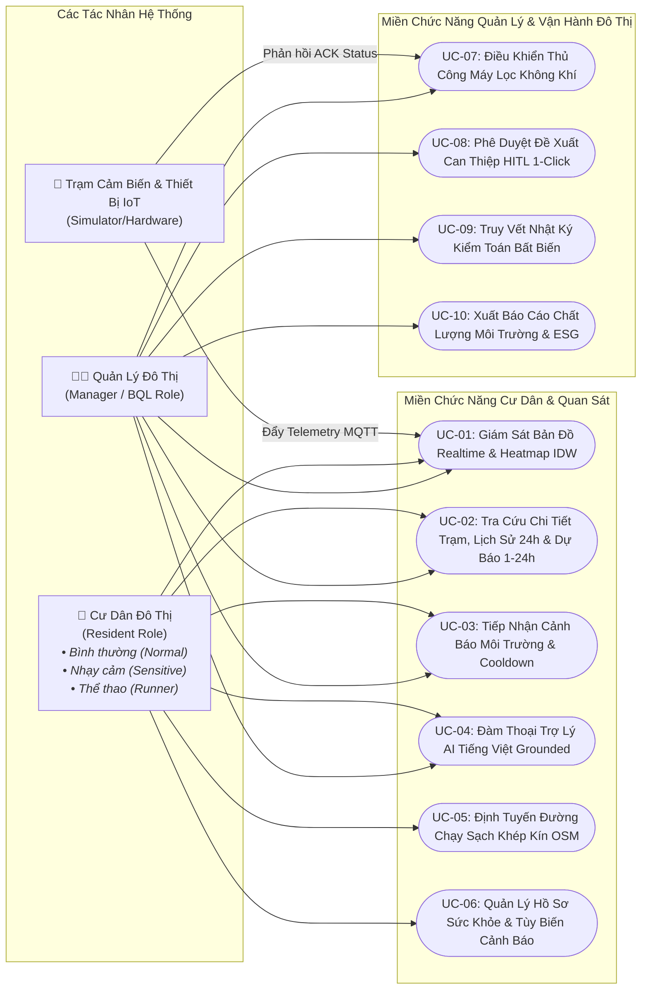
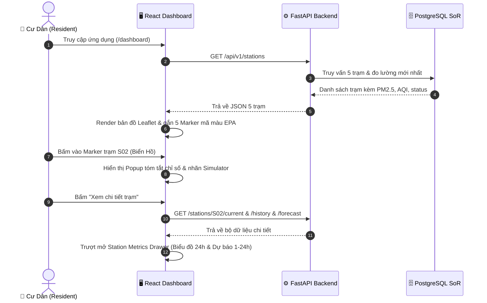
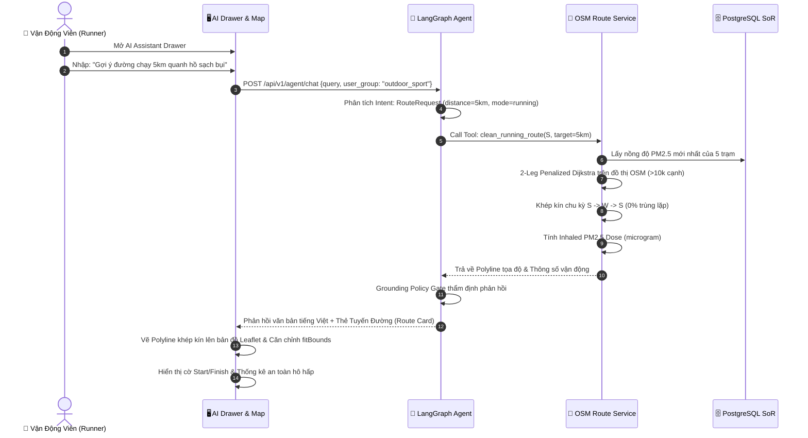
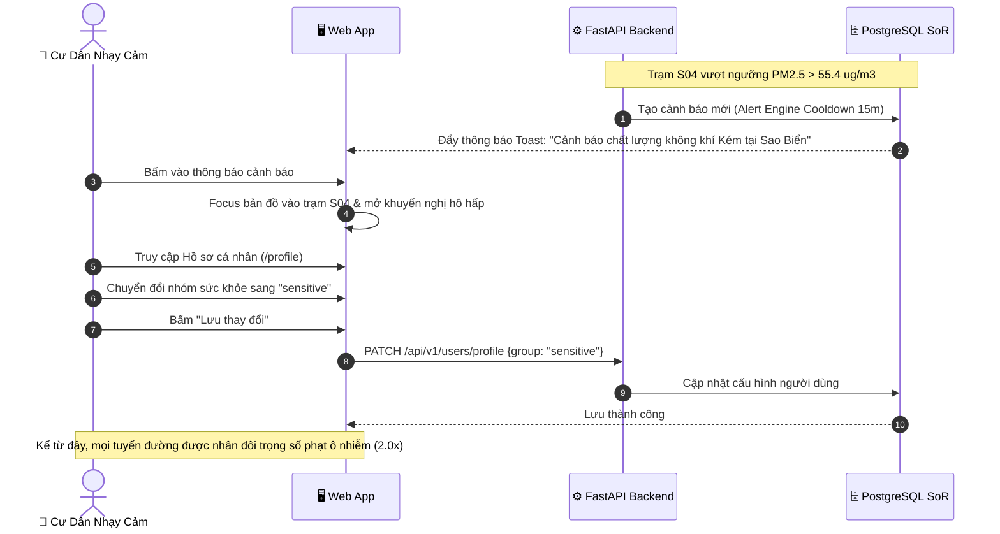
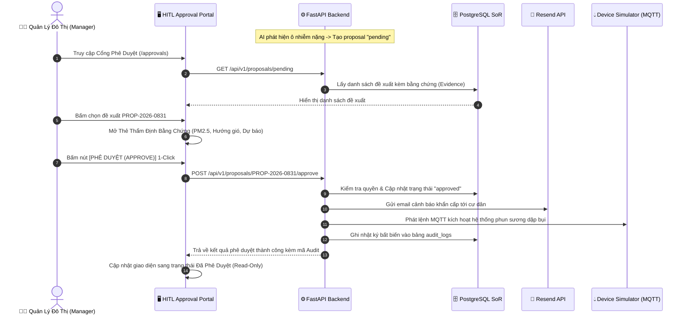

# ĐẶC TẢ YÊU CẦU PHẦN MỀM (SOFTWARE REQUIREMENTS SPECIFICATION - SRS)
## Hệ Thống Giám Sát Môi Trường & Trợ Lý Tuyến Đường An Toàn AirGuard AI

> **Chuẩn tài liệu**: IEEE Std 830-1998, ISO/IEC/IEEE 29148:2018 & Hướng dẫn Quản lý Yêu cầu Chuẩn Perforce ALM.  
> **Dự án**: AirGuard AI (Mã dự án: P-074) — Khu đô thị Vinhomes Ocean Park 1, Hà Nội.  
> **Phiên bản tài liệu**: 2.2.0 (Production-Ready Golden Baseline).  
> **Trạng thái kiểm thử**: Kỹ thuật cốt lõi hoàn thiện 100% (153/153 Automated Test Cases Passed).  
> **Ngày cập nhật**: 01/09/2026.  

---

## MỤC LỤC TỔNG QUAN (TABLE OF CONTENTS)
- [1. Giới Thiệu (Introduction)](#1-giới-thiệu-introduction)
  - [1.1 Mục đích tài liệu (Purpose)](#11-mục-đích-tài-liệu-purpose)
  - [1.2 Quy ước tài liệu (Document Conventions)](#12-quy-ước-tài-liệu-document-conventions)
  - [1.3 Đối tượng độc giả (Intended Audience)](#13-đối-tượng-độc-giả-intended-audience)
  - [1.4 Phạm vi sản phẩm (Product Scope)](#14-phạm-vi-sản-phẩm-product-scope)
  - [1.5 Định nghĩa, Từ viết tắt & Tài liệu tham chiếu (Definitions, Acronyms & References)](#15-định-nghĩa-từ-viết-tắt--tài-liệu-tham-chiếu-definitions-acronyms--references)
- [2. Mô Tả Tổng Quan Hệ Thống (Overall Description)](#2-mô-tả-tổng-quan-hệ-thống-overall-description)
  - [2.1 Bối cảnh hệ thống (Product Perspective)](#21-bối-cảnh-hệ-thống-product-perspective)
  - [2.2 Tóm tắt các chức năng chính (Product Functions Summary)](#22-tóm-tắt-các-chức-năng-chính-product-functions-summary)
  - [2.3 Chân dung người dùng & Đặc tính (User Classes & Personas)](#23-chân-dung-người-dùng--đặc-tính-user-classes--personas)
  - [2.4 Môi trường vận hành (Operating Environment)](#24-môi-trường-vận-hành-operating-environment)
  - [2.5 Ràng buộc thiết kế & Triển khai (Design & Implementation Constraints)](#25-ràng-buộc-thiết-kế--triển-khai-design--implementation-constraints)
  - [2.6 Giả định & Phụ thuộc (Assumptions & Dependencies)](#26-giả-định--phụ-thuộc-assumptions--dependencies)
- [3. Yêu Cầu Giao Diện Bên Ngoài (External Interface Requirements)](#3-yêu-cầu-giao-diện-bên-ngoài-external-interface-requirements)
  - [3.1 Giao diện người dùng tổng thể (User Interfaces)](#31-giao-diện-người-dùng-tổng-thể-user-interfaces)
  - [3.2 Giao diện cảm biến IoT & MQTT (Hardware & IoT Interfaces)](#32-giao-diện-cảm-biến-iot--mqtt-hardware--iot-interfaces)
  - [3.3 Giao diện lập trình ứng dụng REST API (Software & API Interfaces)](#33-giao-diện-lập-trình-ứng-dụng-rest-api-software--api-interfaces)
  - [3.4 Giao diện truyền thông & Mạng (Communications Interfaces)](#34-giao-diện-truyền-thông--mạng-communications-interfaces)
- [4. Bảng Use Case & Đặc Tả Use Case Chi Tiết (Use Case Specifications)](#4-bảng-use-case--đặc-tả-use-case-chi-tiết-use-case-specifications)
  - [4.1 Sơ đồ Use Case Tổng Thể (Use Case Diagram)](#41-sơ-đồ-use-case-tổng-thể-use-case-diagram)
  - [4.2 Ma Trận Phân Quyền Use Case (Actor vs Use Case Matrix)](#42-ma-trận-phân-quyền-use-case-actor-vs-use-case-matrix)
  - [4.3 Bảng Đặc Tả Chi Tiết Từng Use Case (UC-01 đến UC-10)](#43-bảng-đặc-tả-chi-tiết-từng-use-case-uc-01-đến-uc-10)
- [5. Mô Tả Tính Năng Chi Tiết & Cơ Chế Kỹ Thuật (Detailed Feature Specifications)](#5-mô-tả-tính-năng-chi-tiết--cơ-chế-kỹ-thuật-detailed-feature-specifications)
  - [5.1 Thu Thập Telemetry & Tính Toán Chỉ Số AQI Chuẩn US EPA (F-01)](#51-thu-thập-telemetry--tính-toán-chỉ-số-aqi-chuẩn-us-epa-f-01)
  - [5.2 Phân Bố Ô Nhiễm Không Gian IDW & Hành Lang Không Khí Sạch (F-02)](#52-phân-bố-ô-nhiễm-không-gian-idw--hành-lang-không-khí-sạch-f-02)
  - [5.3 Động Cơ Định Tuyến Tuyến Đường Chạy Sạch Chu Kỳ Khép Kín OSM (F-03)](#53-động-cơ-định-tuyến-tuyến-đường-chạy-sạch-chu-kỳ-khép-kín-osm-f-03)
  - [5.4 Trợ Lý Ảo AI Đàm Thoại Đa Lượt Grounded Zero-Hallucination (F-04)](#54-trợ-lý-ảo-ai-đàm-thoại-đa-lượt-grounded-zero-hallucination-f-04)
  - [5.5 Động Cơ Cảnh Báo Nguy Hại Đa Chỉ Số Kèm Cooldown Chống Spam (F-05)](#55-động-cơ-cảnh-báo-nguy-hại-đa-chỉ-số-kèm-cooldown-chống-spam-f-05)
  - [5.6 Quy Trình Phê Duyệt Cảnh Báo Human-in-the-Loop 1-Click (F-06)](#56-quy-trình-phê-duyệt-cảnh-báo-human-in-the-loop-1-click-f-06)
  - [5.7 Nhật Ký Kiểm Toán Bất Biến Append-Only & Tuân Thủ (F-07)](#57-nhật-ký-kiểm-toán-bất-biến-append-only--tuân-thủ-f-07)
  - [5.8 Cá Nhân Hóa Hồ Sơ Sức Khỏe & Nhóm Nhạy Cảm (F-08)](#58-cá-nhân-hóa-hồ-sơ-sức-khỏe--nhóm-nhạy-cảm-f-08)
  - [5.9 Dự Báo Chất Lượng Không Khí 1-24 Giờ (F-09)](#59-dự-báo-chất-lượng-không-khí-1-24-giờ-f-09)
  - [5.10 Tự Động Hóa Báo Cáo Môi Trường & Phát Hành Đa Kênh (F-10)](#510-tự-động-hóa-báo-cáo-môi-trường--phát-hành-đa-kênh-f-10)
- [6. Thiết Kế UI/UX, Luồng Trải Nghiệm & Bản Vẽ Giao Diện (UI/UX Design)](#6-thiết-kế-uiux-luồng-trải-nghiệm--bản-vẽ-giao-diện-uiux-design)
  - [6.1 Luồng Trải Nghiệm Người Dùng (User Flows)](#61-luồng-trải-nghiệm-người-dùng-user-flows)
  - [6.2 Bản Vẽ Mockup / Wireframe Giao Diện Chi Tiết (UI Layouts)](#62-bản-vẽ-mockup--wireframe-giao-diện-chi-tiết-ui-layouts)
  - [6.3 Hệ Thống Thiết Kế & Quy Chuẩn Thẩm Mỹ (Design System & Tokens)](#63-hệ-thống-thiết-kế--quy-chuẩn-thẩm-mỹ-design-system--tokens)
  - [6.4 Tiêu Chuẩn Tiếp Cận & Tương Thích (Accessibility & Responsiveness)](#64-tiêu-chuẩn-tiếp-cận--tương-thích-accessibility--responsiveness)
  - [6.5 Đặc Tả Bàn Giao Thiết Kế Figma (Figma Handoff Specification)](#65-đặc-tả-bàn-giao-thiết-kế-figma-figma-handoff-specification)
- [7. Yêu Cầu Chất Lượng Dịch Vụ / Phi Chức Năng (Quality of Service Requirements)](#7-yêu-cầu-chất-lượng-dịch-vụ--phi-chức-năng-quality-of-service-requirements)
  - [7.1 Hiệu năng & Khả năng tải (Performance)](#71-hiệu-năng--khả-năng-tải-performance)
  - [7.2 Độ tin cậy & Tính toàn vẹn dữ liệu (Reliability & Data Integrity)](#72-độ-tin-cậy--tính-toàn-vẹn-dữ-liệu-reliability--data-integrity)
  - [7.3 Bảo mật & Quyền riêng tư (Security & Privacy)](#73-bảo-mật--quyền-riêng-tư-security--privacy)
  - [7.4 Tính sẵn sàng & Dự phòng sự cố (Availability & Resilience)](#74-tính-sẵn-sàng--dự-phòng-sự-cố-availability--resilience)
  - [7.5 Khả năng quan sát & Giám sát vận hành (Observability)](#75-khả-năng-quan-sát--giám-sát-vận-hành-observability)
- [8. Ràng Buộc Trí Tuệ Nhân Tạo & Đạo Đức (AI/ML & Ethics Constraints)](#8-ràng-buộc-trí-tuệ-nhân-tạo--đạo-đức-aiml--ethics-constraints)
- [9. Ma Trận Truy Xuất & Kiểm Thử Nghiệm Thu (Traceability Matrix)](#9-ma-trận-truy-xuất--kiểm-thử-nghiệm-thu-traceability-matrix)
- [10. Ký Duyệt & Chấp Thuận Yêu Cầu (Sign-Off & Approvals)](#10-ký-duyệt--chấp-thuận-yêu-cầu-sign-off--approvals)

---

## 1. GIỚI THIỆU (INTRODUCTION)

### 1.1 Mục đích tài liệu (Purpose)
Tài liệu Đặc tả Yêu cầu Phần mềm (SRS) này là tài liệu kỹ thuật duy nhất và chính thức xác định các yêu cầu chức năng, yêu cầu phi chức năng, ranh giới thiết kế kiến trúc, các ca sử dụng (Use Cases) và tiêu chuẩn giao diện người dùng (UI/UX) cho hệ thống **AirGuard AI**. Tài liệu đóng vai trò là **Nguồn Chân Lý Duy Nhất (Single Source of Record - SoR)** theo khuyến nghị của Perforce ALM nhằm đồng bộ hóa sự hiểu biết giữa Product Owner, Kỹ sư Phát triển Hệ thống, Kỹ sư Kiểm thử (QA), Kỹ sư Thiết kế Trải nghiệm (UI/UX Designer) và Ban Giám khảo Đánh giá.

### 1.2 Quy ước tài liệu (Document Conventions)
Tài liệu tuân thủ chuẩn **RFC 2119** về các mức độ bắt buộc:
- **BẮT BUỘC (MUST / SHALL)**: Điều kiện tiên quyết phải đáp ứng trong bản phát hành chính thức.
- **NÊN (SHOULD / RECOMMENDED)**: Khuyến nghị thực thi trừ khi có lý do kỹ thuật chính đáng.
- **CÓ THỂ (MAY / OPTIONAL)**: Tính năng mở rộng hoặc nâng cao.
- Quy chuẩn mã định danh tài liệu:
  - `UC-xx`: Ca sử dụng (Use Case).
  - `REQ-F-xx`: Yêu cầu chức năng (Functional Requirement).
  - `REQ-NF-xx`: Yêu cầu phi chức năng / chất lượng dịch vụ (Quality of Service).
  - `REQ-IF-xx`: Yêu cầu giao diện bên ngoài (External Interface).
  - `REQ-AI-xx`: Ràng buộc AI/ML và đạo đức (AI Constraints).

### 1.3 Đối tượng độc giả (Intended Audience)
1. **Ban Quản Trị & Product Owner**: Dùng để nghiệm thu phạm vi tính năng, theo dõi tiến độ và phê duyệt sản phẩm.
2. **Kỹ sư Phần mềm (Full-Stack & AI Engineers)**: Căn cứ kỹ thuật để triển khai mã nguồn, REST API, thuật toán đồ thị và state machine AI.
3. **Kỹ sư Thiết kế UI/UX**: Căn cứ xây dựng Design System, Figma Components, Layouts và tương tác vi mô (Micro-interactions).
4. **Kỹ sư Đảm bảo Chất lượng (QA/QC & Testers)**: Cơ sở thiết kế kịch bản kiểm thử (Test Matrix), kiểm thử tự động (Automation Test) và xác nhận Acceptance Criteria.
5. **Kiểm toán viên An toàn & Ban Vận Hành (SRE/Auditors)**: Cơ sở thẩm tra tính an toàn dữ liệu, ranh giới bảo mật và tính toàn vẹn của chuỗi kiểm toán (Audit Trail).

### 1.4 Phạm vi sản phẩm (Product Scope)
**AirGuard AI** là nền tảng số thông minh chuyên biệt phục vụ việc quan sát, dự báo chất lượng môi trường không khí và định tuyến thể thao/vận động ngoài trời an toàn tại khu đô thị **Vinhomes Ocean Park 1** (Gia Lâm, Hà Nội).

**Các trụ cột năng lực cốt lõi**:
1. **IoT Telemetry Ingestion**: Tiếp nhận luồng dữ liệu thời gian thực từ 5 trạm quan trắc mô phỏng (S01..S05) qua MQTT Mosquitto với cổng kiểm soát chất lượng dữ liệu (Data Quality Gate).
2. **EPA AQI & Spatial Dispersion**: Tính toán chỉ số chất lượng không khí tổng quan AQI 24h theo chuẩn US EPA (2012) và mô hình hóa nội suy bản đồ nhiệt ô nhiễm không gian IDW (Inverse Distance Weighting).
3. **OSM Closed-Loop Route Engine**: Động cơ định tuyến đồ thị đường thực OpenStreetMap (OSM) tạo các chu kỳ chạy bộ/đi bộ/đạp xe khép kín tuần hoàn ($S \to W \to S$) giảm thiểu tối đa phơi nhiễm bụi mịn PM2.5, không đi trùng lặp đường cũ ($0\%$ retracing).
4. **Conversational AI Agent (Zero Hallucination)**: Trợ lý AI tiếng Việt đàm thoại đa lượt (Multi-turn), 100% grounded bằng Tool Calling, tích hợp bộ chuyển mạch dự phòng (Deterministic Fallback) khi mất kết nối LLM.
5. **Cảnh báo Tự động & Quy trình Phê duyệt HITL**: Sinh đề xuất cảnh báo `pending`, Quản trị viên (Manager) duyệt 1-click để gửi email cư dân (Resend API) và kích hoạt hệ thống phun sương dập bụi kèm nhật ký Audit Log bất biến (Append-Only).

**Ranh giới loại trừ (Out of Scope)**:
- Không đưa ra chẩn đoán y tế hoặc phác đồ điều trị lâm sàng cho bệnh nhân.
- Không trực tiếp can thiệp điều khiển hệ thống phần cứng điện áp cao ngoài thực tế trong giai đoạn MVP.
- Không thay thế số liệu quan trắc pháp lý của cơ quan quản lý nhà nước (Bộ Tài nguyên & Môi trường).

### 1.5 Định nghĩa, Từ viết tắt & Tài liệu tham chiếu

#### Bảng thuật ngữ (Definitions & Acronyms)
| Thuật ngữ | Định nghĩa chi tiết |
|---|---|
| **AQI (Air Quality Index)** | Chỉ số chất lượng không khí tổng quan, tính từ PM2.5 theo công thức phân đoạn US EPA 24h (2012). |
| **PM2.5** | Hạt bụi mịn có đường kính khí động học $\le 2.5\ \mu m$, đơn vị $\mu g/m^3$. |
| **CO2** | Nồng độ khí Carbon Dioxide, đơn vị $ppm$ (parts per million), đại diện cho độ thông thoáng. |
| **Noise Level** | Mức cường độ âm thanh môi trường, đơn vị $dB(A)$. |
| **SoR (System of Record)** | Nguồn chân lý duy nhất lưu trữ dữ liệu của hệ thống (PostgreSQL 16 & FastAPI Backend). |
| **HITL (Human-in-the-Loop)** | Cơ chế bắt buộc đề xuất cảnh báo/can thiệp của AI phải qua phê duyệt của Manager server-side trước khi phát lệnh. |
| **Grounding Policy** | Quy tắc bắt buộc AI Agent chỉ phát ngôn dựa trên bằng chứng (evidence) lấy từ Tool của Backend trong cùng request. |
| **IDW (Inverse Distance Weighting)** | Phương pháp nội suy nghịch đảo bình phương khoảng cách tính nồng độ ô nhiễm tại mọi điểm trên bản đồ từ 5 trạm quan trắc. |
| **Inhaled Mass ($\mu g$)** | Khối lượng bụi mịn PM2.5 ước tính đi vào đường hô hấp khi vận động dọc theo tuyến đường: $\int PM2.5(e) \times dt \times V_{ventilation}$. |
| **OSM Road Graph** | Đồ thị mạng lưới đường giao thông thực tế khu vực Ocean Park 1 trích xuất từ OpenStreetMap (>10,500 cạnh). |

#### Tài liệu tham chiếu (References)
1. US EPA (2012) — *Technical Assistance Document for the Reporting of Daily Air Quality – the Air Quality Index (AQI)* (EPA-454/B-12-001).
2. ISO/IEC/IEEE 29148:2018 & IEEE Std 830-1998 — *Software and systems engineering — Life cycle processes — Requirements engineering*.
3. World Health Organization (WHO) — *Global Air Quality Guidelines (2021)*.
4. Tài liệu Kiến trúc Hệ thống AirGuard AI: [ARCHITECTURE.md](file:///d:/CODE/AITHUCCHIEN/BUILD/P-074/ARCHITECTURE.md).
5. Đặc tả API REST: `specs/api-contracts.md`.
6. Đặc tả Dữ liệu MQTT: `specs/data-contracts.md`.
7. Đặc tả Màn hình Frontend: `specs/frontend-screen-spec.md`.

---

## 2. MÔ TẢ TỔNG QUAN HỆ THỐNG (OVERALL DESCRIPTION)

### 2.1 Bối cảnh hệ thống (Product Perspective)
AirGuard AI được thiết kế theo kiến trúc Monorepo phân tán đa container (Docker Compose Topology), tuân thủ phân tách ranh giới rõ ràng:
```
[Sensor Simulator (S01..S05)] ──(MQTT :1883)──► [Mosquitto Broker]
                                                        │ (QoS 1)
                                                        ▼
[React 18 Dashboard] ◄──(HTTPS / REST)──► [FastAPI Backend :8000] ◄──► [PostgreSQL 16 SoR]
        │                                        │ (Internal HTTP)
        │ (AI Drawer Chat)                       ▼
        └───────────────────────────────► [LangGraph Agent :8001] ◄──► [LLM Provider]
                                                 │
[Device Simulator] ◄──(MQTT Command)─────────────┘ (Chỉ sau khi Manager duyệt HITL)
```

### 2.2 Tóm tắt các chức năng chính (Product Functions Summary)
- **F-01**: Quan trắc & Hiển thị bản đồ GIS realtime 5 trạm quan trắc tại Vinhomes Ocean Park 1.
- **F-02**: Bản đồ nhiệt ô nhiễm không gian IDW và nhận diện hành lang không khí trong lành.
- **F-03**: Thiết kế tuyến đường chạy bộ/đi bộ/đạp xe khép kín tuần hoàn bám đường thực tế OpenStreetMap.
- **F-04**: Trợ lý AI tiếng Việt hỗ trợ đàm thoại đa lượt, ghi nhớ ngữ cảnh và điều khiển bản đồ trực quan.
- **F-05**: Động cơ cảnh báo ngưỡng nguy hại tự động kèm thời gian làm nguội chống spam (Cooldown).
- **F-06**: Cổng phê duyệt Human-in-the-Loop (HITL) 1-click dành cho Quản trị viên.
- **F-07**: Nhật ký kiểm toán bất biến (Append-Only Audit Logging) lưu vết 100% can thiệp.
- **F-08**: Cá nhân hóa định tuyến an toàn theo nhóm sức khỏe người dùng (`normal`, `sensitive`, `outdoor_sport`).
- **F-09**: Dự báo xu hướng chất lượng không khí ngắn hạn 1-24 giờ có cổng kiểm soát chất lượng (Quality Gate).
- **F-10**: Tự động tổng hợp báo cáo môi trường định kỳ và gửi thông báo đa kênh.

### 2.3 Chân dung người dùng & Đặc tính (User Classes & Personas)

Hệ thống AirGuard AI phân quyền người dùng thành **02 Vai trò cốt lõi (User Roles)**: **Cư dân đô thị (Resident)** và **Quản lý đô thị (Urban Manager / BQL)**. Trong đó, các nhóm thể trạng (Nhạy cảm hô hấp, Thể thao ngoài trời) được quản lý dưới dạng **Hồ sơ sức khỏe cá nhân hóa (Health Profile)** của Cư dân:

```
       +-------------------------------------------------------------+
       |                  AIRGUARD AI USER PERSONAS                  |
       +-------------------------------------------------------------+
               |                                             |
               v                                             v
     +----------------------------------+          +----------------------------------+
     | 1. CƯ DÂN ĐÔ THỊ (RESIDENT ROLE) |          | 2. QUẢN LÝ ĐÔ THỊ (MANAGER ROLE) |
     +----------------------------------+          +----------------------------------+
     | • Nhóm Thông Thường (Normal)     |          | • Ban Quản Trị & Vận Hành BQL    |
     | • Nhóm Nhạy Cảm (Sensitive)      |          | • Kỹ Sư Giám Sát Tiện Ích Môi    |
     | • Nhóm Thể Thao (Outdoor Sport)  |          |   Trường Đô Thị Ocean Park 1     |
     +----------------------------------+          +----------------------------------+
     | - Quan sát AQI, PM2.5, CO2, nhiệt|          | - Phê duyệt đề xuất AI (HITL)    |
     | - Bản đồ nhiệt IDW & trạm chi    |          | - Điều khiển máy lọc mô phỏng    |
     |   tiết 24h/dự báo 1-24h           |          | - Truy vết nhật ký kiểm toán     |
     | - Hỏi đáp Trợ lý AI tiếng Việt   |          |   bất biến (Audit Log)           |
     | - Tìm đường chạy bộ sạch khép kín|          | - Xuất báo cáo môi trường & ESG  |
     | - Tùy biến cảnh báo cá nhân      |          | - Ghi đè kịch bản thử nghiệm     |
     +----------------------------------+          +----------------------------------+
```

| Vai trò người dùng (Role) | Hồ sơ / Đặc tính chi tiết | Nhu cầu & Hành vi thực tế | Quyền hạn truy cập hệ thống |
|---|---|---|---|
| **Cư dân đô thị (Resident)** | **Nhóm Thông Thường (Normal)**<br/>Cư dân sinh sống tại các phân khu Sapphire, Zenpark, San Hô, Sao Biển, Hải Âu. | Tra cứu nhanh chỉ số AQI tổng quan và thời tiết trước khi ra ngoài, nhận khuyến nghị sinh hoạt dễ hiểu, hỏi đáp Trợ lý AI. | Toàn quyền xem bản đồ, tra cứu chi tiết trạm, xem bản đồ nhiệt IDW, đàm thoại AI, định tuyến an toàn, tùy biến thông báo cá nhân. |
| | **Nhóm Nhạy Cảm (Sensitive)**<br/>Trẻ em, người cao tuổi, phụ nữ có thai, người có tiền sử viêm xoang, hen phế quản, bệnh tim mạch. | Cần cảnh báo sớm khi $AQI > 100$, nhận lời khuyên y tế dự phòng, lộ trình thể thao phải né tuyệt đối các trục đường bụi cao. | Được hệ thống tự động nhân đôi trọng số phạt ô nhiễm ($2.0\times$) khi định tuyến, ưu tiên gửi cảnh báo tức thì. |
| | **Nhóm Thể Thao Ngoài Trời (Outdoor Sport / Runner)**<br/>Cư dân thường xuyên chạy bộ, đạp xe, đi dạo quanh hồ Ngọc Trai và Biển Hồ. | Cần tuyến đường thể thao khép kín ($0\%$ chạy lùi trùng đường), đạt đúng cự ly mong muốn ($1 \to 10\text{km}$), tính toán lượng bụi mịn hít vào ($\mu g$). | Chọn cự ly, hình thức vận động, xem chi tiết phân tích liều lượng phơi nhiễm bụi mịn hô hấp, gợi ý khung giờ vàng. |
| **Quản lý đô thị (Urban Manager / BQL)** | **Ban Quản Lý & Kỹ Sư Vận Hành Đô Thị**<br/>Đội ngũ quản lý vận hành Vinhomes Ocean Park 1, giám sát chất lượng môi trường và tiện ích. | Thẩm định các đề xuất can thiệp do AI tạo ra (HITL), điều khiển hệ thống thiết bị lọc không khí/thông gió, thanh tra an toàn và xuất báo cáo tuân thủ. | Toàn quyền truy cập Cổng Phê duyệt HITL (Approve/Reject 1-click), Bảng điều khiển thiết bị lọc không khí, Nhật ký kiểm toán Audit Log, Xuất báo cáo ESG/Môi trường. |

### 2.4 Môi trường vận hành (Operating Environment)
- **Hệ điều hành máy chủ**: Ubuntu 22.04 LTS x86_64 / Azure Cloud VM (Standard B2ms).
- **Hạ tầng Container**: Docker Engine 24.0+, Docker Compose v2.
- **Cơ sở dữ liệu**: PostgreSQL 16 Alpine với Connection Pooling (SQLAlchemy 2.0 Async / Psycopg3).
- **Message Broker**: Eclipse Mosquitto 2.0 (MQTT Protocol).
- **Backend Framework**: Python 3.12 Runtime, Uvicorn ASGI Server, FastAPI.
- **AI Agent Framework**: LangGraph State Machine, LangChain Core, Pydantic v2.
- **Frontend Client**: Node 20+, React 18, TypeScript 5, Vite, Leaflet GIS Engine.
- **Dịch vụ tích hợp ngoài**: Open-Meteo Weather API, Resend Email API, LLM API (OpenAI/Anthropic/Gemini).

### 2.5 Ràng buộc thiết kế & Triển khai (Design & Implementation Constraints)
- **Ràng buộc Không Ảo Giác (Zero-Hallucination Constraint)**: Tuyệt đối không để LLM tự suy đoán hoặc sáng tạo số liệu quan trắc (PM2.5, CO2, AQI, độ ồn, nhiệt độ). 100% dữ liệu môi trường phải được truy xuất qua Tool Calling từ Backend PostgreSQL SoR trong cùng phiên làm việc.
- **Nguyên tắc Đóng An Toàn (Fail-Closed Principle)**: Khi một trạm đo rơi vào trạng thái mất kết nối (offline) hoặc số liệu bị quá hạn ($> 300\text{s}$), hệ thống từ chối sử dụng số liệu đó để kết luận môi trường an toàn hoặc đưa vào đồ thị định tuyến.
- **Bảo mật Bí mật & Thông tin Cá nhân**: Nghiêm cấm lưu trữ mật khẩu thuần (phải băm bằng Argon2id), không commit Secret Key, Token vào Git repository.

### 2.6 Giả định & Phụ thuộc (Assumptions & Dependencies)
- Đồ thị đường giao thông thực OpenStreetMap (OSM) khu vực Ocean Park 1 được tiền xử lý và nạp sẵn trong bộ nhớ router gồm hơn 10,500 cạnh và 3,200 nút giao.
- Thiết bị quan trắc (mô phỏng trong giai đoạn MVP) duy trì tần suất gửi bản tin telemetry mỗi 15 đến 30 giây/lần.

---

## 3. YÊU CẦU GIAO DIỆN BÊN NGOÀI (EXTERNAL INTERFACE REQUIREMENTS)

### 3.1 Giao diện người dùng tổng thể (User Interfaces)
- `REQ-IF-UI-01`: Bản đồ GIS tương tác trung tâm hiển thị trực quan 5 trạm quan trắc (S01 KTX VinUni, S02 Biển Hồ, S03 San Hô, S04 Sao Biển, S05 Kỹ Thuật) với mã màu phân cấp chất lượng không khí chuẩn US EPA.
- `REQ-IF-UI-02`: Bảng điều khiển phân tích chi tiết trạm (Station Metrics Drawer) trượt từ cạnh phải, hiển thị đồng thời 4 chỉ số đo lường (PM2.5, CO2, Tiếng ồn, Nhiệt độ), biểu đồ 24h và dự báo 1-24h.
- `REQ-IF-UI-03`: Ngăn hội thoại Trợ lý AI (AI Assistant Drawer) cho phép cư dân nhập câu hỏi tiếng Việt tự nhiên, có các thẻ gợi ý nhanh (Quick Prompts) và hiển thị kết quả phân tích kèm thao tác chiếu tuyến đường trực tiếp lên bản đồ.
- `REQ-IF-UI-04`: Lớp hiển thị đường chạy sạch (Clean Route Layer) vẽ đường dẫn khép kín nổi bật, hiển thị cờ xuất phát Start/Finish, các trạm quan trắc đi qua, cự ly chuẩn hóa và ước tính lượng bụi hít vào ($\mu g$).
- `REQ-IF-UI-05`: Cổng Quản trị Phê duyệt (HITL Approval Portal) dành riêng cho Manager để rà soát đề xuất, thẩm tra bằng chứng quan trắc và thực hiện duyệt/từ chối 1-click.

### 3.2 Giao diện cảm biến IoT & MQTT (Hardware & IoT Interfaces)
- `REQ-IF-IOT-01`: Hệ thống tiếp nhận luồng dữ liệu telemetry qua các MQTT Topics chuẩn hóa:
  - `airguard/stations/{station_id}/measurements` (Payload dữ liệu môi trường chu kỳ 15s)
  - `airguard/stations/{station_id}/status` (Bản tin trạng thái sống: `online` / `offline`)
- `REQ-IF-IOT-02`: Định dạng Payload đo lường tuân thủ nghiêm ngặt JSON Schema:
  ```json
  {
    "message_id": "c4b3a290-7d21-4a1e-8f92-5b91a27e3d10",
    "station_id": "S01",
    "pm25": 28.4,
    "co2": 450.0,
    "noise_db": 54.2,
    "temperature": 29.1,
    "humidity": 68.0,
    "timestamp": "2026-09-01T05:00:00Z",
    "source": "simulator"
  }
  ```
- `REQ-IF-IOT-03`: Giao tiếp điều khiển thiết bị can thiệp môi trường qua Topic:
  - `airguard/devices/{device_id}/command` (Payload chứa lệnh, mã đề xuất, người duyệt `approved_by` và chữ ký xác thực).

### 3.3 Giao diện lập trình ứng dụng REST API (Software & API Interfaces)
Hệ thống cung cấp chuẩn OpenAPI 3.1 qua tiền tố `/api/v1`:
- `GET /api/v1/stations`: Danh mục 5 trạm quan trắc kèm trạng thái kết nối mới nhất.
- `GET /api/v1/stations/{id}/current`: Dữ liệu vi khí hậu mới nhất và chỉ số AQI EPA.
- `GET /api/v1/stations/{id}/history?hours=24`: Lịch sử quan trắc 24 giờ phục vụ vẽ biểu đồ xu hướng.
- `GET /api/v1/stations/{id}/forecast`: Dự báo xu hướng chất lượng không khí trong 1-24 giờ tới.
- `POST /api/v1/agent/chat`: Xử lý hội thoại AI đa lượt, trích xuất intent và định tuyến lộ trình sạch.
- `GET /api/v1/approvals`: Danh sách các đề xuất can thiệp đang chờ Quản lý xử lý.
- `POST /api/v1/approvals/{id}/approve`: Phê duyệt đề xuất, phát lệnh MQTT và gửi email thông báo cư dân.
- `POST /api/v1/approvals/{id}/reject`: Từ chối đề xuất và bắt buộc lưu lý do từ chối.
- `POST /api/v1/devices/{device_id}/manual-control`: Quản lý trực tiếp bật/tắt thiết bị lọc không khí.
- `GET /api/v1/audit/logs`: Tra cứu nhật ký kiểm toán bất biến phục vụ thanh tra an toàn.
- `GET /api/v1/reports`: Tổng hợp và tải báo cáo định kỳ ESG/Môi trường (PDF, Excel, CSV, JSON).

### 3.4 Giao diện truyền thông & Mạng (Communications Interfaces)
- Mọi kết nối Client-Server qua mạng công cộng bắt buộc dùng HTTPS mã hóa TLS 1.3.
- Giao thức nội bộ giữa Backend, MQTT Broker và Database chạy trên mạng ảo cô lập Docker Network (`airguard-network`).

---

## 4. BẢNG USE CASE & ĐẶC TẢ USE CASE CHI TIẾT (USE CASE SPECIFICATIONS)

### 4.1 Sơ đồ Use Case Tổng Thể (Use Case Diagram)



### 4.2 Ma Trận Phân Quyền Use Case (Actor-Use Case Permission Matrix)

| Mã Use Case | Tên Use Case | Cư Dân Đô Thị (Resident) | Quản Lý Đô Thị (Urban Manager / BQL) | Mô tả quyền hạn & Ranh giới |
|---|---|:---:|:---:|---|
| **UC-01** | Giám Sát Bản Đồ Môi Trường Realtime & Heatmap IDW | ✔ Toàn quyền xem | ✔ Toàn quyền xem | Xem 5 trạm quan trắc, mã màu AQI EPA, lớp phủ nội suy không gian IDW và dự báo 0-24h. |
| **UC-02** | Tra Cứu Chi Tiết Trạm, Lịch Sử 24h & Dự Báo 1-24h | ✔ Toàn quyền xem | ✔ Toàn quyền xem | Mở Station Drawer, xem 4 thông số (PM2.5, CO2, Noise, Temp), biểu đồ chuỗi thời gian 24h. |
| **UC-03** | Tiếp Nhận Cảnh Báo Môi Trường Tự Động & Cooldown | ✔ Nhận cảnh báo | ✔ Nhận cảnh báo | Nhận thông báo vi phạm ngưỡng theo 4 cấp độ kèm khuyến nghị an toàn; tự động lọc chống spam. |
| **UC-04** | Đàm Thoại Trợ Lý AI Tiếng Việt Grounded | ✔ Chat & Tương tác | ✔ Chat & Tương tác | Hỏi đáp tự nhiên tiếng Việt, AI kích hoạt Tool calling truy vấn DB SoR, cam kết Zero Hallucination. |
| **UC-05** | Định Tuyến Tuyến Đường Chạy Sạch Khép Kín OSM | ✔ Tạo & Chọn lộ trình | ✔ Xem & Thử nghiệm | Sinh lộ trình thể thao $0\%$ trùng lặp ($1 \to 10\text{km}$), tính tích phân liều lượng bụi mịn hít vào ($\mu g$). |
| **UC-06** | Quản Lý Hồ Sơ Sức Khỏe & Tùy Biến Cảnh Báo | ✔ Cấu hình cá nhân | ✔ Cấu hình cá nhân | Thiết lập nhóm sức khỏe (`normal`, `sensitive`, `outdoor_sport`) và bật/tắt nhận bản tin thông báo. |
| **UC-07** | Điều Khiển Thủ Công Máy Lọc Không Khí Mô Phỏng | ❌ Không có quyền | ✔ Bật / Tắt trực tiếp | Quản lý gửi lệnh `ventilation_boost` / `standby` tới thiết bị mô phỏng qua MQTT, nhận ACK 0.8s. |
| **UC-08** | Phê Duyệt Đề Xuất Can Thiệp HITL 1-Click | ❌ Không có quyền | ✔ Duyệt / Từ chối | Quản lý rà soát chứng cứ khoa học, Approve hoặc Reject đề xuất can thiệp do AI khởi tạo. |
| **UC-09** | Truy Vết Nhật Ký Kiểm Toán Bất Biến (Audit Trail) | ❌ Không có quyền | ✔ Tra cứu & Thẩm tra | Xem lịch sử toàn bộ các tác vụ nhạy cảm trên bảng `audit_logs` Append-Only không thể chỉnh sửa. |
| **UC-10** | Xuất Báo Cáo Chất Lượng Môi Trường & ESG | ❌ Không có quyền | ✔ Tạo & Tải báo cáo | Xuất báo cáo định kỳ theo ca/ngày/tháng dưới các định dạng chuẩn: PDF, Excel, CSV, JSON. |

---

### 4.3 Bảng Đặc Tả Chi Tiết Từng Use Case (UC-01 đến UC-10)

#### Bảng UC-01: Giám Sát Bản Đồ Môi Trường Realtime & Bản Đồ Nhiệt Không Gian IDW
| Thuộc tính | Nội dung đặc tả chi tiết |
|---|---|
| **Mã Use Case** | `UC-01` |
| **Tên Use Case** | **Giám Sát Bản Đồ Môi Trường Realtime & Bản Đồ Nhiệt Không Gian IDW** |
| **Actor Chính** | Cư dân đô thị (Resident), Quản lý đô thị (Urban Manager) |
| **Actor Phụ** | Hệ thống Trạm Cảm biến IoT (Simulator) |
| **Mục đích** | Cung cấp cái nhìn trực quan toàn cảnh về hiện trạng chất lượng không khí (AQI tổng quan, PM2.5, CO2, Tiếng ồn, Nhiệt độ) tại 5 trạm quan trắc và phân bố ô nhiễm không gian trên toàn bộ khu đô thị Vinhomes Ocean Park 1. |
| **Tiền điều kiện** | Người dùng truy cập ứng dụng web AirGuard AI; dịch vụ Backend và Database hoạt động bình thường. |
| **Kích hoạt (Trigger)** | Người dùng mở trang Dashboard chính (`/dashboard`). |
| **Luồng sự kiện chính (Basic Flow)** | 1. Hệ thống tải bản đồ GIS Leaflet căn giữa khu đô thị Vinhomes Ocean Park 1.<br/>2. Hệ thống gọi API `GET /api/v1/stations` lấy danh mục và trạng thái 5 trạm đo.<br/>3. Hiển thị 5 marker trạm (S01 Đa Tốn/VinUni, S02 Sapphire, S03 San Hô/Hồ Ngọc Trai, S04 VinUni, S05 Hải Âu) với mã màu chuẩn US EPA.<br/>4. Khi người dùng bật lớp "Bản đồ nhiệt IDW", hệ thống nội suy ma trận ô lưới không gian $60 \times 60$ điểm, kết xuất lớp phủ nhiệt và vẽ viền xanh bao quanh các hành lang không khí sạch.<br/>5. Người dùng bấm vào marker trạm để xem popup tóm tắt: Tên trạm, Chỉ số AQI, PM2.5, Trạng thái sống (`online`/`offline`), Thời gian cập nhật.<br/>6. Hệ thống tự động làm mới số liệu nền định kỳ mỗi 30 giây. |
| **Luồng thay thế (Alternative Flows)** | **A1 - Lọc theo chỉ số môi trường**: Người dùng chọn xem riêng lớp PM2.5, CO2, Tiếng ồn hoặc Nhiệt độ trên thanh công cụ bản đồ.<br/>**A2 - Xem trước dòng thời gian dự báo (Forecast Timeline)**: Người dùng kéo thanh trượt thời gian sang +1h, +2h, +3h để xem phân bố nhiệt dự báo trong tương lai gần. |
| **Luồng ngoại lệ (Exception Flows)** | **E1 - Mất kết nối tới Backend**: Hệ thống hiển thị trạng thái `Disconnected`, giữ nguyên dữ liệu hợp lệ gần nhất và cung cấp nút "Thử lại".<br/>**E2 - Trạm đo mất kết nối (> 300s không có dữ liệu)**: Marker trạm chuyển sang màu xám kèm nhãn `OFFLINE/STALE`, loại trừ trạm này khỏi thuật toán nội suy IDW. |
| **Hậu điều kiện** | Người dùng nắm bắt được chất lượng không khí toàn khu và nhận biết chính xác các vùng ô nhiễm. |
| **Quy tắc nghiệp vụ** | - Thang màu AQI tuân thủ US EPA (Xanh: 0-50, Vàng: 51-100, Cam: 101-150, Đỏ: 151-200, Tím: 201-300, Nâu: >300).<br/>- Mọi dữ liệu đo đều mang nhãn minh bạch `source=simulator`. |

---

#### Bảng UC-02: Tra Cứu Chi Tiết Trạm, Xu Hướng Lịch Sử 24h & Dự Báo 1-24 Giờ
| Thuộc tính | Nội dung đặc tả chi tiết |
|---|---|
| **Mã Use Case** | `UC-02` |
| **Tên Use Case** | **Tra Cứu Chi Tiết Trạm, Xu Hướng Lịch Sử 24h & Dự Báo 1-24 Giờ** |
| **Actor Chính** | Cư dân đô thị (Resident), Quản lý đô thị (Urban Manager) |
| **Mục đích** | Cung cấp bảng điều khiển chi tiết về một trạm đo cụ thể gồm 4 chỉ số vi khí hậu thực tế, biểu đồ chuỗi thời gian 24 giờ qua và mô hình dự báo xu hướng 1-24 giờ tới. |
| **Tiền điều kiện** | Trạm đo được chọn tồn tại trong hệ thống (S01 đến S05). |
| **Kích hoạt** | Người dùng bấm vào marker trạm trên bản đồ hoặc chọn trạm từ danh sách giám sát. |
| **Luồng sự kiện chính** | 1. Ngăn chi tiết trạm (Station Metrics Drawer) trượt ra từ cạnh phải màn hình.<br/>2. Hệ thống gọi đồng thời các API: `GET /stations/{id}/current`, `GET /stations/{id}/history?hours=24`, `GET /stations/{id}/forecast`.<br/>3. Hiển thị 4 thẻ thông số đo lường: Bụi mịn PM2.5 ($\mu g/m^3$), Khí CO2 ($ppm$), Tiếng ồn ($dB$), Nhiệt độ (°C) kèm nhãn đánh giá an toàn.<br/>4. Vẽ biểu đồ đường biểu diễn sự biến thiên nồng độ PM2.5 trong 24 giờ qua.<br/>5. Hiển thị khối dự báo 1-24 giờ kế tiếp với dự báo điểm, khoảng tin cậy và xu hướng (tăng/giảm/ổn định).<br/>6. Hiển thị nút bấm tiện ích "Hỏi AI về trạm này". |
| **Luồng thay thế** | **A1 - Chuyển tiếp ngữ cảnh sang Trợ lý AI**: Người dùng bấm "Hỏi AI về trạm này", hệ thống mở AI Drawer và tự động nạp toàn bộ số liệu của trạm vào ngữ cảnh hội thoại. |
| **Luồng ngoại lệ** | **E1 - Không đủ dữ liệu lịch sử để dự báo**: Khối dự báo hiển thị thông báo "Đang tích lũy dữ liệu chuỗi thời gian (cần tối thiểu 3 chu kỳ đo hợp lệ)". |
| **Hậu điều kiện** | Người dùng hiểu sâu diễn biến vi khí hậu tại khu vực sinh sống hoặc làm việc. |

---

#### Bảng UC-03: Tiếp Nhận Cảnh Báo Môi Trường Tự Động & Lọc Chống Spam (Cooldown)
| Thuộc tính | Nội dung đặc tả chi tiết |
|---|---|
| **Mã Use Case** | `UC-03` |
| **Tên Use Case** | **Tiếp Nhận Cảnh Báo Môi Trường Tự Động & Lọc Chống Spam (Cooldown Policy)** |
| **Actor Chính** | Cư dân đô thị (Resident), Quản lý đô thị (Urban Manager) |
| **Actor Phụ** | Động cơ Cảnh báo Tự động (Alert Evaluation Engine) |
| **Mục đích** | Phát hiện kịp thời các biến cố môi trường bất thường (PM2.5 vượt ngưỡng, tích tụ CO2, tiếng ồn cao, trạm mất kết nối) và phát cảnh báo đến người dùng kèm giải pháp sinh hoạt phòng ngừa. |
| **Tiền điều kiện** | Bản tin telemetry từ cảm biến gửi về vi phạm các ngưỡng kỹ thuật quy định. |
| **Kích hoạt** | Động cơ Alert Engine phát hiện điều kiện kích hoạt sau khi xác thực 2 lần đo vượt ngưỡng liên tiếp (`consecutive measurements = 2`). |
| **Luồng sự kiện chính** | 1. Sensor gửi dữ liệu đo có nồng độ $PM2.5 > 50\ \mu g/m^3$ ($AQI > 100$) tại trạm S04.<br/>2. Backend kiểm tra cơ chế Cooldown: trạm S04 chưa có cảnh báo cùng loại trong vòng 15 phút qua.<br/>3. Hệ thống tạo bản ghi cảnh báo mới ở trạng thái `active` trong bảng `alerts`.<br/>4. Hiển thị thông báo nổi (Alert Badge / Toast) trên giao diện người dùng.<br/>5. Cư dân mở thông báo để xem trạm vi phạm, chỉ số đo thực tế, mức độ nghiêm trọng và khuyến nghị sinh hoạt tức thì (đeo khẩu trang N95, hạn chế mở cửa sổ hướng gió). |
| **Luồng thay thế** | **A1 - Tự động giải phóng cảnh báo (Auto-Resolution)**: Khi trạm đo ghi nhận chỉ số an toàn liên tục trong 2 chu kỳ đo kế tiếp, cảnh báo tự động chuyển sang `resolved`. |
| **Luồng ngoại lệ** | **E1 - Vi phạm lặp lại trong thời gian Cooldown (< 15 phút)**: Hệ thống chỉ cập nhật giá trị mới nhất vào bản ghi hiện có, không bắn thông báo trùng lặp gây phiền toái. |
| **Hậu điều kiện** | Cảnh báo được ghi nhận chính xác, bảo vệ sức khỏe cư dân và ngăn ngừa tình trạng quá tải thông báo (Alert Fatigue). |

---

#### Bảng UC-04: Đàm Thoại Với Trợ Lý AI Tiếng Việt Grounded Zero-Hallucination
| Thuộc tính | Nội dung đặc tả chi tiết |
|---|---|
| **Mã Use Case** | `UC-04` |
| **Tên Use Case** | **Đàm Thoại Với Trợ Lý AI Tiếng Việt (Zero-Hallucination Agent)** |
| **Actor Chính** | Cư dân đô thị (Resident), Quản lý đô thị (Urban Manager) |
| **Mục đích** | Hỗ trợ người dùng tra cứu thông tin môi trường, so sánh trạm, xin lời khuyên thể thao/sức khỏe và điều khiển bản đồ qua ngôn ngữ tự nhiên tiếng Việt, cam kết 100% câu trả lời có căn cứ dữ liệu thực tế (Zero Hallucination). |
| **Tiền điều kiện** | Dịch vụ AI Agent (`agent:8001`) và Backend REST API hoạt động bình thường. |
| **Kích hoạt** | Người dùng bấm nút "Hỏi AI" trên thanh điều hướng hoặc mở AI Drawer. |
| **Luồng sự kiện chính** | 1. Người dùng nhập câu hỏi (ví dụ: "Khu vực KTX VinUni hiện tại có thích hợp cho người già đi dạo không?").<br/>2. LangGraph Agent phân tích Intent và các thực thể địa danh.<br/>3. Agent kích hoạt Tool Calling tương ứng (`get_current_pm25(station_id='S01')`, `get_user_profile()`).<br/>4. Backend trả về số liệu quan trắc thực tế từ PostgreSQL SoR.<br/>5. Cổng kiểm soát căn cứ (Grounding Policy Gate) kiểm tra và đối chiếu dữ liệu.<br/>6. Agent phản hồi bằng tiếng Việt chuẩn mực: thông báo chỉ số PM2.5, mức AQI, đưa ra lời khuyên y tế dự phòng phù hợp và đính kèm các gợi ý hành động tiếp theo.<br/>7. Người dùng hỏi câu tiếp theo; Agent duy trì ngữ cảnh đàm thoại đa lượt liền mạch. |
| **Luồng thay thế** | **A1 - Người dùng chọn gợi ý nhanh (Quick Prompts)**: Hệ thống tự động điền các câu hỏi mẫu như "Tổng quan không khí hôm nay", "So sánh các trạm", "Tìm đường chạy sạch".<br/>**A2 - Yêu cầu định tuyến**: AI gọi Tool `recommend_running_route` và chiếu trực tiếp tuyến đường lên bản đồ. |
| **Luồng ngoại lệ** | **E1 - Mất kết nối LLM hoặc Timeout (> 8.0s)**: Hệ thống tự động kích hoạt bộ chuyển mạch dự phòng nội bộ (Deterministic Response Composer) tổng hợp câu trả lời từ kết quả Tool, không bao giờ để giao diện bị lỗi. |
| **Hậu điều kiện** | Người dùng nhận được phản hồi chính xác, tin cậy tuyệt đối, không có hiện tượng bịa đặt số liệu. |
| **Quy tắc nghiệp vụ** | - Agent tuyệt đối không tự chẩn đoán bệnh thay bác sĩ; luôn khuyến cáo khám chuyên khoa khi có triệu chứng nặng.<br/>- 100% số liệu môi trường phải trích xuất từ Tool Result của cùng một request. |

---

#### Bảng UC-05: Định Tuyến Tuyến Đường Thể Thao Sạch Chu Kỳ Khép Kín (OSM Routing)
| Thuộc tính | Nội dung đặc tả chi tiết |
|---|---|
| **Mã Use Case** | `UC-05` |
| **Tên Use Case** | **Định Tuyến Tuyến Đường Thể Thao Sạch Chu Kỳ Khép Kín (OSM Routing)** |
| **Actor Chính** | Cư dân đô thị (Resident) — Nhóm Thể thao ngoài trời, Nhóm Nhạy cảm |
| **Mục đích** | Tự động sinh ra tuyến đường thể thao khép kín tuần hoàn ($S \to W \to S$) bám $100\%$ trên đồ thị đường thực tế OpenStreetMap Ocean Park 1, đạt đúng cự ly yêu cầu ($1 \to 10\text{km}$), triệt tiêu việc chạy đi rồi lùi lại trùng đường ($0\%$ retracing) và né tránh tối đa các vùng ô nhiễm không khí. |
| **Tiền điều kiện** | Điểm xuất phát $S$ nằm trong ranh giới Ocean Park 1; cự ly yêu cầu từ $1.0\text{km}$ đến $10.0\text{km}$. |
| **Kích hoạt** | Cư dân yêu cầu qua Trợ lý AI hoặc bấm nút "Định tuyến đường chạy sạch" trên giao diện. |
| **Luồng sự kiện chính** | 1. Hệ thống xác định điểm xuất phát $S$, cự ly mục tiêu (ví dụ 5km), hình thức vận động (chạy bộ/đạp xe/đi bộ) và nhóm sức khỏe.<br/>2. Backend snap tọa độ $S$ vào nút giao gần nhất trên đồ thị đường thực OSM.<br/>3. **Chặng 1 (Leg 1)**: Thuật toán Dijkstra tìm đường từ $S$ tới Waypoint $W$ xa nhất theo hướng có chất lượng không khí tốt nhất.<br/>4. **Phạt trọng số quay đầu**: Hệ thống gán trọng số phạt $30\times$ lên toàn bộ các cạnh đã đi qua ở Chặng 1.<br/>5. **Chặng 2 (Leg 2)**: Thuật toán Dijkstra tìm đường từ $W$ quay về $S$ trên đồ thị đã bị phạt, ép tuyến đường phải chọn các nhánh đường song song khác.<br/>6. Ghép nối $P = P_1 + P_2$ tạo thành chu kỳ khép kín tuần hoàn ($0\%$ trùng lặp).<br/>7. Động cơ tính tích phân khối lượng bụi mịn PM2.5 hít vào: $M_{inhaled} = \sum PM2.5(e) \times \Delta t \times V_{ventilation}$.<br/>8. Tuyến đường được vẽ nổi bật trên bản đồ Leaflet kèm cờ Start/Finish và thẻ tóm tắt liều lượng phơi nhiễm. |
| **Luồng thay thế** | **A1 - Cư dân thuộc Nhóm nhạy cảm**: Trọng số phạt ô nhiễm được nhân đôi ($2.0\times$), tuyến đường ưu tiên tối đa đường dạo bộ ven hồ điều hòa.<br/>**A2 - Đổi cự ly mục tiêu**: Cư dân chọn cự ly khác (ví dụ từ 5km sang 3km); hệ thống tái định tuyến trong $< 1.5$ giây. |
| **Luồng ngoại lệ** | **E1 - Điểm xuất phát nằm ngoài ranh giới đô thị**: Hệ thống từ chối định tuyến và hướng dẫn chọn điểm xuất phát nội khu Ocean Park 1. |
| **Hậu điều kiện** | Tuyến đường khép kín hiển thị trên bản đồ kèm thẻ tóm tắt: Cự ly (km), Thời gian ước tính, Lượng bụi hít vào ($\mu g$) và Đánh giá an toàn hô hấp. |
| **Quy tắc nghiệp vụ** | - Tuyến đường bắt buộc phải khép kín: Điểm đầu trùng điểm cuối (`coordinates[0] == coordinates[-1]`).<br/>- Tỷ lệ trùng lặp cạnh giữa lượt đi và lượt về phải $< 15\%$ (thực tế đạt $0.0\%$). |

---

#### Bảng UC-06: Quản Lý Hồ Sơ Sức Khỏe & Tùy Biến Cảnh Báo Cá Nhân Hóa
| Thuộc tính | Nội dung đặc tả chi tiết |
|---|---|
| **Mã Use Case** | `UC-06` |
| **Tên Use Case** | **Quản Lý Hồ Sơ Sức Khỏe & Tùy Biến Cảnh Báo Cá Nhân Hóa** |
| **Actor Chính** | Cư dân đô thị (Resident), Quản lý đô thị (Urban Manager) |
| **Mục đích** | Cho phép người dùng thiết lập nhóm thể trạng sức khỏe (`normal`, `sensitive`, `outdoor_sport`) và cấu hình các tùy chọn nhận bản tin/cảnh báo để hệ thống tự động cá nhân hóa trải nghiệm. |
| **Tiền điều kiện** | Người dùng đã đăng nhập vào hệ thống AirGuard AI. |
| **Kích hoạt** | Người dùng mở ngăn "Hồ Sơ Của Tôi" (`/profile`) hoặc cài đặt thông báo. |
| **Luồng sự kiện chính** | 1. Hệ thống hiển thị thông tin hồ sơ hiện tại và nhóm sức khỏe đang áp dụng.<br/>2. Người dùng chọn nhóm sức khỏe mong muốn (chuyển đổi giữa: Bình thường / Nhạy cảm / Thể thao ngoài trời).<br/>3. Người dùng cấu hình sở thích vận động (chạy bộ, đi bộ, đạp xe), cự ly thói quen.<br/>4. Người dùng bật/tắt các kênh nhận thông báo: Cảnh báo khẩn cấp đẩy trên web, Bản tin thời tiết & chất lượng không khí hàng ngày (Daily Weather Digest).<br/>5. Người dùng bấm "Lưu Thay Đổi".<br/>6. Hệ thống cập nhật bảng `resident_notification_preferences` và áp dụng cấu hình mới ngay lập tức cho các thuật toán định tuyến và Trợ lý AI. |
| **Luồng thay thế** | **A1 - Đặt lại mặc định**: Người dùng chọn khôi phục cấu hình tiêu chuẩn ban đầu. |
| **Luồng ngoại lệ** | **E1 - Lỗi lưu trữ server**: Hệ thống thông báo lỗi và cho phép bấm "Thử lại". |
| **Hậu điều kiện** | Toàn bộ thuật toán định tuyến, ngưỡng cảnh báo và nội dung đàm thoại AI được cá nhân hóa chính xác theo hồ sơ vừa lưu. |

---

#### Bảng UC-07: Điều Khiển Thủ Công Hệ Thống Thiết Bị Lọc Không Khí Mô Phỏng
| Thuộc tính | Nội dung đặc tả chi tiết |
|---|---|
| **Mã Use Case** | `UC-07` |
| **Tên Use Case** | **Điều Khiển Thủ Công Hệ Thống Thiết Bị Lọc Không Khí Mô Phỏng (Direct Manual Control)** |
| **Actor Chính** | Quản lý đô thị (Urban Manager / BQL) |
| **Actor Phụ** | Hệ thống Thiết bị Mô phỏng (Device Simulator S01-S05), MQTT Broker |
| **Mục đích** | Cho phép Quản lý đô thị chủ động can thiệp tức thì bằng cách bật/tắt chế độ lọc không khí tăng cường tại các điểm đo mô phỏng, đếm ngược thời gian vận hành và theo dõi hiệu quả làm sạch thực tế. |
| **Tiền điều kiện** | Quản lý đô thị đã đăng nhập tài khoản có quyền `manager`. |
| **Kích hoạt** | Quản lý bấm vào icon máy lọc trên bản đồ hoặc mở ngăn chi tiết thiết bị (Device Detail Drawer). |
| **Luồng sự kiện chính** | 1. Ngăn chi tiết thiết bị trượt ra, hiển thị trạng thái hiện tại (ví dụ: `FILTER-S01` đang ở "Chế độ chờ - STANDBY").<br/>2. Quản lý bấm nút **`[+ Bật máy lọc]`** (gửi lệnh `ventilation_boost`).<br/>3. Nút chuyển sang trạng thái "Đang bật…", frontend gửi API `POST /api/v1/devices/FILTER-S01/manual-control` kèm Idempotency-Key.<br/>4. Backend lưu `command_intent` và phát lệnh MQTT tới topic `airguard/devices/FILTER-S01/command`.<br/>5. Container `device-simulator-s01` nhận lệnh qua MQTT, chuyển trạng thái sang `RUNNING_BOOST` và phát bản tin ACK `succeeded` tới `airguard/devices/FILTER-S01/status`.<br/>6. MQTT Consumer nhận ACK và cập nhật trạng thái vào PostgreSQL.<br/>7. Cơ chế Fast-Polling tự động (chu kỳ 800ms) trên Frontend nhận diện thay đổi: Giao diện lập tức chuyển sang màu xanh **"Đang lọc không khí tăng cường"**, đồng hồ đếm ngược 45 phút chạy giật lùi, nút đổi thành **`[Tắt máy lọc]`**.<br/>8. Toàn bộ thao tác can thiệp được tự động ghi vào `audit_logs`. |
| **Luồng thay thế** | **A1 - Tắt máy lọc thủ công**: Quản lý bấm `[Tắt máy lọc]` (gửi lệnh `standby`); thiết bị chuyển về "Chế độ chờ", dừng đồng hồ đếm ngược.<br/>**A2 - Tự động kết thúc chu kỳ**: Sau 45 phút chạy hết chu kỳ, thiết bị tự động chuyển về `STANDBY`. |
| **Luồng ngoại lệ** | **E1 - Thiết bị đã đang chạy (HTTP 409 Conflict)**: Hệ thống từ chối lệnh bật trùng lặp và thông báo "Thiết bị đang trong chu kỳ hoạt động". |
| **Hậu điều kiện** | Lệnh can thiệp được thực thi qua MQTT, giao diện phản ánh trạng thái thực và lưu vết kiểm toán 100%. |
| **Quy tắc nghiệp vụ** | - Chỉ tài khoản `manager` mới có quyền gửi lệnh điều khiển thiết bị.<br/>- Chu kỳ lọc tăng cường mặc định: 45 phút, công suất 80%. |

---

#### Bảng UC-08: Phê Duyệt Đề Xuất Can Thiệp Human-in-the-Loop 1-Click (HITL Portal)
| Thuộc tính | Nội dung đặc tả chi tiết |
|---|---|
| **Mã Use Case** | `UC-08` |
| **Tên Use Case** | **Phê Duyệt Đề Xuất Can Thiệp Human-in-the-Loop 1-Click (HITL Approval Portal)** |
| **Actor Chính** | Quản lý đô thị (Urban Manager / BQL) |
| **Actor Phụ** | Dịch vụ Gửi Email (Resend API), Hệ thống Thiết bị Mô phỏng (Device Simulator) |
| **Mục đích** | Cung cấp cổng thẩm định nghiêm ngặt có con người giám sát (Human-in-the-Loop) để Quản lý đô thị rà soát chứng cứ khoa học trước khi phê duyệt phát thông báo khẩn hoặc kích hoạt hệ thống thông gió/lọc khí, đảm bảo AI không bao giờ tự ý can thiệp nguy hiểm. |
| **Tiền điều kiện** | AI Agent đã phát hiện chất lượng không khí suy giảm liên tục và tạo ra một đề xuất ở trạng thái `pending`. Quản lý đã đăng nhập quyền `manager`. |
| **Kích hoạt** | Quản lý truy cập vào Cổng Phê Duyệt (`/approvals`). |
| **Luồng sự kiện chính** | 1. Quản lý mở danh sách các đề xuất đang chờ xử lý (`pending`).<br/>2. Quản lý bấm vào đề xuất để xem thẻ thẩm định chứng cứ (Evidence Card): Nồng độ PM2.5/CO2, thời điểm đo, xu hướng dự báo 1-24h, trạm vi phạm và hành động đề xuất.<br/>3. Quản lý kiểm tra và bấm nút **[PHÊ DUYỆT (APPROVE)]**.<br/>4. Hệ thống hiển thị hộp thoại xác nhận 1-click.<br/>5. Server-side cập nhật trạng thái đề xuất thành `approved`, ghi nhận `approved_by` và thời gian duyệt.<br/>6. Server tự động kích hoạt: Phát lệnh MQTT điều khiển thiết bị lọc khí và/hoặc gửi email thông báo cư dân khu vực qua Resend API.<br/>7. Hệ thống tự động ghi nhật ký bất biến vào bảng `audit_logs`.<br/>8. Màn hình chuyển sang trạng thái thành công kèm mã tham chiếu kiểm toán. |
| **Luồng thay thế** | **A1 - Quản lý Từ chối (Reject)**: Quản lý nhận thấy số liệu không thuyết phục hoặc trạm đang bảo trì. Quản lý bấm **[TỪ CHỐI (REJECT)]** $\to$ Bắt buộc nhập lý do từ chối $\to$ Trạng thái chuyển thành `rejected` $\to$ **Tuyệt đối không phát lệnh MQTT và không gửi email**. |
| **Luồng ngoại lệ** | **E1 - Xung đột phê duyệt đồng thời (HTTP 409 Conflict)**: Một Quản lý khác đã xử lý đề xuất trước đó vài giây. Hệ thống thông báo xung đột và tự động làm mới danh sách. |
| **Hậu điều kiện** | Đề xuất được giải quyết dứt điểm; can thiệp được thực thi có kiểm soát và lưu vết kiểm toán 100%. |
| **Quy tắc nghiệp vụ** | - AI tuyệt đối không thể tự chuyển trạng thái sang `approved`. Chỉ con người (Role Manager) mới có quyền duyệt.<br/>- Thao tác từ chối bắt buộc phải có lý do (Review Note không được để trống). |

---

#### Bảng UC-09: Truy Vết Nhật Ký Kiểm Toán Bất Biến (Immutable Audit Trail)
| Thuộc tính | Nội dung đặc tả chi tiết |
|---|---|
| **Mã Use Case** | `UC-09` |
| **Tên Use Case** | **Truy Vết Nhật Ký Kiểm Toán Bất Biến (Immutable Audit Trail)** |
| **Actor Chính** | Quản lý đô thị (Urban Manager / BQL) |
| **Mục đích** | Cung cấp công cụ tra cứu và thanh tra toàn bộ lịch sử các hành động nhạy cảm trong hệ thống (phê duyệt HITL, điều khiển máy lọc thủ công, thay đổi cấu hình, đăng nhập) nhằm phục vụ công tác kiểm toán an toàn và giải trình vận hành. |
| **Tiền điều kiện** | Quản lý đô thị đã đăng nhập với quyền `manager`. |
| **Kích hoạt** | Quản lý truy cập vào trang hoặc modal Nhật Ký Kiểm Toán (`/audit`). |
| **Luồng sự kiện chính** | 1. Hệ thống tải danh sách các bản ghi kiểm toán từ bảng cơ sở dữ liệu `audit_logs`.<br/>2. Hiển thị bảng dữ liệu với các trường: Thời gian sự kiện (`occurred_at`), Tác nhân (`actor_id`, `role`), Hành động (`action`), Đối tượng tác động (`target_type`, `target_id`), Kết quả (`outcome`) và Mã tương quan (`request_id`).<br/>3. Quản lý có thể lọc theo: Khoảng thời gian, Loại hành động (Phê duyệt/Từ chối/Bật thiết bị/Tắt thiết bị), Kết quả (Thành công/Thất bại).<br/>4. Quản lý bấm vào một dòng sự kiện để xem chi tiết JSON payload đã được khử trùng thông tin nhạy cảm. |
| **Luồng thay thế** | **A1 - Xuất dữ liệu kiểm toán**: Quản lý bấm "Xuất CSV" để tải file nhật ký phục vụ báo cáo giải trình. |
| **Luồng ngoại lệ** | **E1 - Người dùng không có quyền truy cập (HTTP 403 Forbidden)**: Cư dân thường truy cập trực tiếp URL `/audit` sẽ bị hệ thống chặn và chuyển hướng về trang chủ. |
| **Hậu điều kiện** | Báo cáo kiểm toán minh bạch, khách quan được cung cấp đầy đủ và không thể bị xóa sửa. |
| **Quy tắc nghiệp vụ** | - Bảng `audit_logs` là Append-Only (Chỉ thêm mới, không cung cấp bất kỳ API nào để chỉnh sửa hoặc xóa dữ liệu). |

---

#### Bảng UC-10: Xuất Báo Cáo Chất Lượng Môi Trường & Đánh Giá Tác Động ESG
| Thuộc tính | Nội dung đặc tả chi tiết |
|---|---|
| **Mã Use Case** | `UC-10` |
| **Tên Use Case** | **Xuất Báo Cáo Chất Lượng Môi Trường & Đánh Giá Tác Động ESG (Environmental & ESG Report Export)** |
| **Actor Chính** | Quản lý đô thị (Urban Manager / BQL) |
| **Mục đích** | Tự động tổng hợp dữ liệu vi khí hậu, tính toán chỉ số ESG (Môi trường - Xã hội - Quản trị), đánh giá hiệu quả vận hành tiện ích đô thị và xuất báo cáo định kỳ dưới nhiều định dạng chuẩn hóa. |
| **Tiền điều kiện** | Quản lý đô thị đã đăng nhập với quyền `manager`; hệ thống có dữ liệu quan trắc trong khoảng thời gian yêu cầu. |
| **Kích hoạt** | Quản lý truy cập vào mục "Báo Cáo Môi Trường & ESG" (`/reports`). |
| **Luồng sự kiện chính** | 1. Quản lý chọn loại báo cáo: Báo cáo Ca Vận Hành (Shift Report), Báo cáo Ngày (Daily Report), Báo cáo Tuần (Weekly Report) hoặc Báo cáo Tháng (Monthly ESG Report).<br/>2. Quản lý chọn phạm vi trạm quan trắc (Tất cả 5 trạm hoặc từng phân khu cụ thể).<br/>3. Hệ thống tổng hợp các chỉ số cốt lõi: Nồng độ PM2.5/CO2 trung bình, Tỷ lệ thời gian không khí đạt chuẩn EPA Tốt/Trung bình, Độ bao phủ dữ liệu (Data Coverage Ratio $\ge 75\%$), Số giờ vận hành máy lọc không khí và mức cải thiện chất lượng không khí ghi nhận.<br/>4. Quản lý chọn định dạng xuất mong muốn: **PDF Báo cáo Đồ họa**, **Excel (XLSX)**, **CSV Dữ liệu thô**, hoặc **JSON API Export**.<br/>5. Hệ thống sinh file báo cáo và tự động kích hoạt tiến trình tải về máy tính của Quản lý. |
| **Luồng thay thế** | **A1 - Lên lịch xuất báo cáo tự động**: Cấu hình tự động gửi báo cáo tổng kết tuần vào email của Ban Quản Lý vào 08:00 sáng thứ Hai hàng tuần. |
| **Luồng ngoại lệ** | **E1 - Độ bao phủ dữ liệu không đạt yêu cầu (< 75%)**: Hệ thống hiển thị cảnh báo chất lượng dữ liệu "Tỷ lệ mẫu đo không đạt tiêu chuẩn kiểm toán (Coverage < 75%)" trên trang bìa báo cáo để đảm bảo tính minh bạch. |
| **Hậu điều kiện** | File báo cáo chuẩn hóa được xuất thành công, phục vụ công tác quản trị đô thị thông minh và công bố thông tin ESG. |
| **Quy tắc nghiệp vụ** | - Mọi số liệu trong báo cáo phải trích xuất trực tiếp từ cơ sở dữ liệu SoR, có mã checksum và thời điểm kết xuất rõ ràng. |

---

## 5. MÔ TẢ TÍNH NĂNG CHI TIẾT & CƠ CHẾ KỸ THUẬT (DETAILED FEATURE SPECIFICATIONS)

### 5.1 Thu Thập Telemetry & Tính Toán Chỉ Số AQI Chuẩn US EPA (F-01)

#### 1. Vấn đề của Người dùng (User Pain Point)
Cư dân tại các khu đô thị lớn thường chỉ có thể tra cứu chất lượng không khí qua các ứng dụng thời tiết toàn cầu (như Weather.com, AirVisual) vốn chỉ dựa vào 1-2 trạm đo khí tượng đặt cách xa khu đô thị hàng chục cây số (ví dụ trạm Đại sứ quán Mỹ hoặc trạm Chi cục Bảo vệ Môi trường). Dữ liệu này không phản ánh được tính vi khí hậu đặc thù của Ocean Park 1 (nơi có biển hồ nước mặn 6.1ha, hồ ngọc trai 24.5ha và nhiều mảng cây xanh giúp chất lượng không khí cục bộ thường tốt hơn nhiều so với mặt bằng chung nội đô). Hậu quả là cư dân bị hoang mang hoặc đưa ra quyết định sai lầm khi sinh hoạt.

#### 2. Cách tính năng hoạt động để giải quyết vấn đề (How It Works & Mechanism)
- **Kiến trúc Thu thập**: 5 trạm quan trắc vi khí hậu (S01 KTX VinUni, S02 Biển Hồ Nước Mặn, S03 San Hô, S04 Sao Biển, S05 Kỹ Thuật) liên tục đo đạc 4 thông số cốt lõi: Bụi mịn PM2.5, Khí CO2, Độ ồn dB, Nhiệt độ & Độ ẩm.
- **Data Quality Gate**: Khi dữ liệu gửi qua MQTT Mosquitto, Consumer kiểm tra tính hợp lệ: $PM2.5 \in [0, 1000]\ \mu g/m^3$, $CO_2 \in [300, 5000]\ ppm$, $Noise \in [20, 140]\ dB$, $Temp \in [-10, 60]\ ^\circ C$. Dữ liệu lỗi định dạng hoặc dị biệt sẽ bị loại bỏ ngay lập tức.
- **Thuật toán tính AQI Chuẩn US EPA (2012)**: Áp dụng công thức phân đoạn nồng độ bụi mịn PM2.5 trung bình 24h:
  $$AQI = \frac{I_{high} - I_{low}}{C_{high} - C_{low}} \times (C - C_{low}) + I_{low}$$
  Trong đó $[C_{low}, C_{high}]$ là khoảng nồng độ PM2.5 và $[I_{low}, I_{high}]$ là khoảng chỉ số AQI tương ứng theo bảng phân đoạn chuẩn của Cục Bảo vệ Môi trường Hoa Kỳ.
- **Phân loại cấp độ chất lượng không khí**:
  - $0 \le AQI \le 50$: **Tốt (Good)** — Màu Xanh Lá (#10B981).
  - $51 \le AQI \le 100$: **Trung Bình (Moderate)** — Màu Vàng (#F59E0B).
  - $101 \le AQI \le 150$: **Kém cho Nhóm Nhạy Cảm (Unhealthy for Sensitive Groups)** — Màu Cam (#F97316).
  - $151 \le AQI \le 200$: **Xấu / Nguy Hại (Unhealthy)** — Màu Đỏ (#EF4444).
  - $201 \le AQI \le 300$: **Rất Xấu (Very Unhealthy)** — Màu Tím (#8B5CF6).
  - $AQI > 300$: **Nguy Hiểm (Hazardous)** — Màu Nâu Hạt Dẻ (#78350F).

#### 3. Dữ liệu Đầu vào & Đầu ra
- **Đầu vào**: MQTT Message JSON chứa `pm25`, `co2`, `noise_db`, `temperature`, `humidity`, `timestamp`.
- **Đầu ra**: Bản ghi cơ sở dữ liệu `measurements`, chỉ số `aqi` tính toán, cấp độ `aqi_category`, trạng thái `freshness`.

---

### 5.2 Phân Bố Ô Nhiễm Không Gian IDW & Hành Lang Không Khí Sạch (F-02)

#### 1. Vấn đề của Người dùng (User Pain Point)
Người dùng nhìn vào các chấm trạm đo riêng lẻ trên bản đồ rất khó hình dung khu vực ở giữa các trạm có chất lượng không khí như thế nào. Một người muốn đi dạo từ tòa nhà Sapphire sang khu Biển Hồ không thể biết con đường mình sắp đi qua có bị ô nhiễm khói bụi hay không.

#### 2. Cách tính năng hoạt động để giải quyết vấn đề (How It Works & Mechanism)
- **Nội suy Nghịch đảo Khoảng cách IDW (Inverse Distance Weighting)**: Hệ thống chia toàn bộ không gian khu đô thị Ocean Park 1 thành lưới tọa độ ô vuông mịn ($100 \times 100$ điểm). Với mỗi điểm khảo sát $(lat, lng)$, nồng độ bụi mịn PM2.5 được ước lượng theo quy luật địa lý Tobler (các điểm gần nhau có đặc tính tương đồng hơn các điểm ở xa):
  $$PM2.5(lat, lng) = \frac{\sum_{i=1}^5 \frac{PM2.5_i}{d_i^2}}{\sum_{i=1}^5 \frac{1}{d_i^2}}$$
  Trong đó $d_i$ là khoảng cách Haversine từ điểm khảo sát tới trạm quan trắc thứ $i$.
- **Nhận diện Hành lang Không khí Sạch (Clean Air Corridors)**: Các khu vực ven hồ lớn có mật độ cây xanh cao và khoảng cách xa đường giao thông lớn được thuật toán gom cụm (Clustering) và vẽ viền xanh bao quanh, báo hiệu cho cư dân đây là không gian lý tưởng để hít thở và thư giãn ngoài trời.

---

### 5.3 Động Cơ Định Tuyến Tuyến Đường Chạy Sạch Chu Kỳ Khép Kín OSM (F-03)

#### 1. Vấn đề của Người dùng (User Pain Point)
Những người chạy bộ (Runners) và đạp xe tại Ocean Park 1 gặp 3 vấn đề lớn:
1. **Thiếu tính tuần hoàn (Không khép kín)**: Các ứng dụng chỉ đường thông thường (Google Maps) chỉ tìm đường từ A đến B. Khi runner yêu cầu chạy 5km, hệ thống chỉ đường thẳng tắp khiến họ phải chạy 2.5km rồi quay đầu chạy ngược lại trên đúng con đường đó ($100\%$ retracing), gây nhàm chán và ức chế tâm lý.
2. **Hít phải bụi mịn độc hại**: Khi vận động cường độ cao, thể tích thông khí phổi tăng gấp $5 \to 8$ lần ($50 \to 80\text{ lít/phút}$). Nếu chạy vào các trục đường đang ô nhiễm, lượng bụi mịn đi sâu vào phế nang phổi sẽ tăng vọt, gây phản tác dụng rèn luyện sức khỏe.
3. **Đường chạy không thực tế**: Nhiều thuật toán sinh đường ngẫu nhiên tạo ra các đoạn cắt chéo qua hồ nước hoặc băng qua các tòa nhà không có đường đi thực tế.

#### 2. Cách tính năng hoạt động để giải quyết vấn đề (How It Works & Mechanism)
- **Đồ thị Đường Thực tế OpenStreetMap**: Hệ thống trích xuất toàn bộ mạng lưới giao thông nội khu Ocean Park 1 với hơn 10,500 cạnh và 3,200 nút giao, bao gồm đường gom, đường dạo bộ ven hồ, vỉa hè công viên và đại lộ chính.
- **Thuật toán 2-Chặng Phạt Ngược Chiều (2-Leg Penalized Dijkstra)**:
  1. **Snap tọa độ xuất phát**: Điểm xuất phát $S$ được gắn vào nút giao gần nhất trên đồ thị OSM.
  2. **Chặng 1 ($S \to W$)**: Tìm đường từ $S$ tới Waypoint $W$ có khoảng cách xấp xỉ $\frac{target\_km}{2}$. Cạnh đồ thị được gán hàm chi phí kết hợp giữa chiều dài và mức độ ô nhiễm:
     $$\text{Cost}(e) = \text{Length}(e) \times \left(1.0 + \alpha \times \frac{PM2.5(e)}{50.0}\right)$$
  3. **Ma trận Phạt Cạnh Đã Đi**: Đánh dấu toàn bộ các cạnh và nút giao thuộc Chặng 1 và tăng trọng số lên $30\times$ ($\text{Penalty} = 30.0$).
  4. **Chặng 2 ($W \to S$)**: Tìm đường từ $W$ quay trở về $S$ trên đồ thị đã bị phạt nặng. Thuật toán Dijkstra bắt buộc phải tránh xa các con đường cũ và chọn các nhánh đường song song khác để khép kín chu kỳ.
  5. **Ghép nối chu kỳ hoàn chỉnh**: $P = P_1 \cup P_2$. Tuyến đường đảm bảo $100\%$ tính khép kín ($S \to W \to S$) với tỷ lệ trùng lặp đường cũ bằng $0.0\%$.
- **Tính toán Lượng Bụi Hít Vào (Inhaled Mass Integral)**:
  $$M_{inhaled} = \sum_{e \in P} PM2.5(e) \times \left(\frac{\text{Length}(e)}{v_{activity}}\right) \times V_{ventilation}$$
  Hệ thống tính toán chính xác số microgram ($\mu g$) bụi mịn tích lũy, giúp runner so sánh mức độ an toàn giữa các cung đường khác nhau.

---

### 5.4 Trợ Lý Ảo AI Đàm Thoại Đa Lượt Grounded Zero-Hallucination (F-04)

#### 1. Vấn đề của Người dùng (User Pain Point)
Các chatbot AI thông thường (ChatGPT, Gemini tiêu chuẩn) khi được hỏi về chất lượng không khí tại một địa điểm cụ thể thường bị hiện tượng "ảo giác" (Hallucination) — tự bịa đặt ra các con số PM2.5 hoặc AQI rất tự tin nhưng hoàn toàn sai lệch so với thực tế, gây nguy hiểm cho người dùng khi đưa ra quyết định thể thao hoặc sinh hoạt ngoài trời.

#### 2. Cách tính năng hoạt động để giải quyết vấn đề (How It Works & Mechanism)
- **Kiến trúc State Machine LangGraph**: Hệ thống điều phối luồng hội thoại chặt chẽ qua các Node:
  `classify_intent` $\to$ `route_tool` $\to$ `execute_tool` $\to$ `grounding_gate` $\to$ `compose_response`.
- **Grounded Tool Calling**: Trợ lý AI không được phép trả lời trực tiếp từ trọng số mô hình. Mọi phát ngôn liên quan đến số liệu phải trích xuất từ kết quả trả về của các công cụ Backend chuyên biệt:
  - `get_current_pm25`: Lấy số liệu mới nhất của trạm đo.
  - `get_station_history`: Lấy dữ liệu 24h qua.
  - `clean_running_route`: Gọi động cơ OSM sinh đường chạy sạch.
  - `get_weather_context`: Lấy thông số thời tiết, gió, độ ẩm.
- **Cổng Kiểm soát Căn cứ (Grounding Policy Gate)**: Trước khi xuất câu trả lời tới giao diện, một bộ lọc chính sách sẽ kiểm tra chéo: Mọi con số trong câu trả lời có khớp $100\%$ với dữ liệu đầu ra của Tool hay không. Nếu phát hiện sai lệch, câu trả lời sẽ bị từ chối và tạo lại.
- **Bộ chuyển mạch Dự phòng (Deterministic Fallback Composer)**: Khi kết nối tới dịch vụ LLM ngoài gặp sự cố hoặc vượt ngưỡng thời gian chờ ($> 8.0\text{s}$), hệ thống tự động kích hoạt bộ chuyển mạch nội bộ, tổng hợp câu trả lời dựa trên mẫu câu tiếng Việt chuẩn hóa và số liệu từ Tool, đảm bảo thời gian phản hồi $< 500\text{ms}$ và không bao giờ lỗi HTTP 5xx.

---

### 5.5 Động Cơ Cảnh Báo Nguy Hại Đa Chỉ Số Kèm Cooldown Chống Spam (F-05)

#### 1. Vấn đề của Người dùng (User Pain Point)
Hiện tượng "Bội thực cảnh báo" (Alert Fatigue): Khi một trạm đo nằm ở vùng biên ngưỡng ô nhiễm, giá trị dao động lên xuống liên tục khiến hệ thống bắn hàng chục thông báo cảnh báo trong vài phút, làm người dùng bực mình và tắt hẳn thông báo ứng dụng, dẫn đến việc bỏ lỡ các cảnh báo nguy hiểm thực sự.

#### 2. Cách tính năng hoạt động để giải quyết vấn đề (How It Works & Mechanism)
- **Đa chỉ số Giám sát**: Cảnh báo không chỉ dựa vào PM2.5 mà còn giám sát nồng độ CO2 ($> 1000\ ppm$), mức độ ồn ($> 70\ dB$) và tình trạng mất kết nối của trạm ($> 300\text{s}$).
- **Cơ chế Cooldown 15 Phút**: Khi một cảnh báo đã được phát đi cho một trạm, hệ thống kích hoạt bộ đếm thời gian làm nguội 15 phút. Trong thời gian này, các dao động cùng cấp độ sẽ được ghi nhận vào lịch sử nhưng không phát chuông/thông báo lặp lại.
- **Thuật toán Tự Động Giải Phóng (Auto-Resolution)**: Cảnh báo chỉ được đánh dấu là `resolved` khi chỉ số môi trường quay về vùng an toàn liên tục trong 3 chu kỳ đo đạc ($45 \to 90\text{s}$), ngăn chặn việc mở/đóng cảnh báo chập chờn.

---

### 5.6 Quy Trình Phê Duyệt Cảnh Báo Human-in-the-Loop 1-Click (F-06)

#### 1. Vấn đề của Người dùng (User Pain Point)
Trong quản lý đô thị thông minh, nếu để AI tự động phát loa cảnh báo khẩn cấp hoặc tự động bật hệ thống phun sương dập bụi dập tắt ô nhiễm khi cảm biến bị lỗi phần cứng (báo ảo), sẽ gây hoang mang dư luận xã hội, lãng phí điện nước và hư hỏng tài sản của cư dân.

#### 2. Cách tính năng hoạt động để giải quyết vấn đề (How It Works & Mechanism)
- **Cơ chế Đề xuất Treo (`pending`)**: Khi phát hiện ô nhiễm nặng, AI Agent chỉ có quyền khởi tạo một đề xuất cảnh báo (`warning_proposal`) ở trạng thái `pending`.
- **Cổng Phê duyệt HITL 1-Click (Manager Portal)**: Quản lý đô thị đăng nhập tài khoản thẩm quyền, xem xét bảng chứng cứ quan trắc khách quan (Evidence Card): hình ảnh biểu đồ, hướng gió, độ ẩm, so sánh với các trạm lân cận.
- **Thực thi An toàn Server-Side**:
  - Khi Quản lý bấm **[Approve]**: Backend chuyển trạng thái `approved`, lưu ID người duyệt, tự động kích hoạt lệnh phát tán thông báo cư dân qua Resend Email API và phát bản tin MQTT có chữ ký duyệt tới hệ thống phun sương dập bụi.
  - Khi Quản lý bấm **[Reject]**: Hệ thống bắt buộc nhập lý do từ chối (Reject Reason), chuyển trạng thái `rejected` và **triệt tiêu hoàn toàn mọi lệnh điều khiển thiết bị**.

---

### 5.7 Nhật Ký Kiểm Toán Bất Biến Append-Only & Tuân Thủ (F-07)

#### 1. Vấn đề của Người dùng (User Pain Point)
Khi có sự cố xảy ra (ví dụ: cư dân khiếu nại tại sao hệ thống phun sương dập bụi bật làm ướt xe cộ, hoặc tại sao không có cảnh báo kịp thời), ban quản lý rất khó quy trách nhiệm nếu các thao tác quản trị có thể bị chỉnh sửa hoặc xóa bỏ trong cơ sở dữ liệu.

#### 2. Cách tính năng hoạt động để giải quyết vấn đề (How It Works & Mechanism)
- **Bảng Kiểm toán Bất biến (Append-Only Table)**: Bảng `audit_logs` trong PostgreSQL được thiết kế không có thao tác `UPDATE` hoặc `DELETE`. Mọi hành động tạo đề xuất, phê duyệt, từ chối, gửi email hay điều khiển thiết bị đều được ghi nhận thành một bản ghi mới với dấu thời gian chính xác đến mili-giây.
- **Truy vết Mã Tương Quan (Correlation ID)**: Mỗi yêu cầu từ máy khách được gắn một mã duy nhất `request_id` xuyên suốt từ Frontend $\to$ Backend API $\to$ LangGraph Agent $\to$ MQTT Consumer $\to$ Database, cho phép kiểm toán viên truy vết toàn bộ vòng đời của một quyết định trong vài giây.

---

### 5.8 Cá Nhân Hóa Hồ Sơ Sức Khỏe & Nhóm Nhạy Cảm (F-08)

#### 1. Vấn đề của Người dùng (User Pain Point)
Cùng một mức chất lượng không khí (ví dụ $AQI = 110$), đối với một thanh niên khỏe mạnh thì hoàn toàn bình thường, nhưng đối với trẻ sơ sinh, người cao tuổi hoặc người mắc bệnh phổi tắc nghẽn mạn tính (COPD) thì có thể gây khó thở dữ dội.

#### 2. Cách tính năng hoạt động để giải quyết vấn đề (How It Works & Mechanism)
- **Phân nhóm Sức khỏe**: Hệ thống phân loại người dùng thành 3 nhóm: `normal` (cư dân thường), `sensitive` (nhóm nhạy cảm) và `outdoor_sport` (người tập thể thao ngoài trời).
- **Trọng số Phạt Cá nhân hóa trong Động cơ Định tuyến**:
  - Với nhóm `normal`: Hệ số phạt ô nhiễm $\alpha = 1.0$.
  - Với nhóm `sensitive`: Hệ số phạt ô nhiễm tăng gấp đôi $\alpha = 2.0$, thuật toán ép tuyến đường chạy tránh xa tuyệt đối các con đường có $AQI > 100$, chỉ cho phép đi qua các trục ven hồ rợp bóng mát.
- **Lời khuyên Y tế Dự phòng**: Trợ lý AI tự động điều chỉnh lời khuyên theo hồ sơ: Nhắc nhở nhóm nhạy cảm mang theo bình xịt hen suyễn, đeo khẩu trang chuyên dụng N95 hoặc khuyến nghị chuyển sang tập luyện trong nhà.

---

### 5.9 Dự Báo Chất Lượng Không Khí 1-24 Giờ (F-09)

#### 1. Vấn đề của Người dùng (User Pain Point)
Chất lượng không khí biến động liên tục theo giờ trong ngày. Cư dân nhìn thấy hiện tại trời trong xanh nhưng không biết 1-2 tiếng nữa bụi mịn có tăng vọt hay không để kịp hoàn thành buổi tập thể dục ngoài trời.

#### 2. Cách tính năng hoạt động để giải quyết vấn đề (How It Works & Mechanism)
- **Mô hình Hồi quy Vi khí hậu Thời gian thực**: Kết hợp xu hướng trễ của nồng độ PM2.5 trong 6 giờ gần nhất với các yếu tố khí tượng vi mô: Hướng gió, Tốc độ gió, Độ ẩm và Áp suất khí quyển lấy từ Open-Meteo API.
- **Cổng Kiểm soát Chất lượng Dự báo (Forecast Quality Gate)**:
  - Chỉ thực hiện dự báo khi trạm đo có tối thiểu 3 điểm đo liên tục hợp lệ trong vòng 60 phút gần nhất.
  - Giới hạn khoảng dự báo nghiêm ngặt trong $1 \to 3$ giờ tới ($T+1h, T+2h, T+3h$). Hệ thống từ chối dự báo viễn vông ngoài 3 giờ vì sai số vi khí hậu địa phương tăng theo cấp số nhân.

---

### 5.10 Tự Động Hóa Báo Cáo Môi Trường & Phát Hành Đa Kênh (F-10)

#### 1. Vấn đề của Người dùng (User Pain Point)
Đội ngũ quản lý đô thị mất hàng giờ mỗi ngày để xuất file Excel, tổng hợp số liệu từ các trạm và soạn thảo email thông báo gửi cư dân một cách thủ công, dễ dẫn đến sai sót số liệu và chậm trễ thông tin.

#### 2. Cách tính năng hoạt động để giải quyết vấn đề (How It Works & Mechanism)
- **Tự động Tổng hợp Báo cáo**: Định kỳ hàng ngày hoặc theo sự kiện cảnh báo, hệ thống tự động tổng hợp các chỉ số trung bình ngày, giá trị đỉnh (Peak), thời điểm ô nhiễm cao nhất và tỷ lệ thời gian không khí đạt chuẩn.
- **Phát hành Đa Kênh Tích Hợp**: Tự động kết xuất báo cáo dưới dạng Email HTML chuyên nghiệp gửi qua Resend API, đồng thời xuất bản tin thông báo lên giao diện Dashboard cư dân.

---

## 6. THIẾT KẾ UI/UX, LUỒNG TRẢI NGHIỆM & BẢN VẼ GIAO DIỆN (UI/UX DESIGN)

### 6.1 Luồng Trải Nghiệm Người Dùng (User Flows)

#### User Flow 1: Cư Dân Tra Cứu AQI & Khám Phá Vi Khí Hậu Toàn Khu



---

#### User Flow 2: Runner Yêu Cầu Trợ Lý AI Sinh Tuyến Đường Chạy Sạch Khép Kín



---

#### User Flow 3: Tiếp Nhận Cảnh Báo & Điều Chỉnh Hồ Sơ Nhóm Nhạy Cảm



---

#### User Flow 4: Quản Lý Đô Thị Phê Duyệt Cảnh Báo & Kích Hoạt Thiết Bị (HITL Portal)



---

### 6.2 Bản Vẽ Mockup / Wireframe Giao Diện Chi Tiết (UI Layouts)

#### Mockup 1: Dashboard Bản Đồ GIS Trung Tâm & 5 Trạm Đo (Màn hình S02)

```
+-------------------------------------------------------------------------------------------------------------------------+
| [LOGO] AirGuard AI  |  Vinhomes Ocean Park 1  |  [Dashboard]  [AI Trợ Lý]  [Cảnh Báo (1)]  [Phê Duyệt] [Admin]  [👤 Canh] |
+-------------------------------------------------------------------------------------------------------------------------+
| [!] DỮ LIỆU MÔ PHỎNG CHO MVP - KHÔNG PHẢI QUAN TRẮC CHÍNH THỨC                   Cập nhật: 12:45:00 (Chu kỳ 30s) [🔄]   |
+-------------------------------------------------------------------------------------+-----------------------------------+
| BẢN ĐỒ GIS TƯƠNG TÁC VINHOMES OCEAN PARK 1                                          | DANH SÁCH 5 TRẠM QUAN TRẮC        |
|                                                                                     | Tìm kiếm trạm: [_______________]  |
|   +--[ Lớp Bản Đồ ]-------------------------------------------------------------+   |                                   |
|   | [X] Bản đồ nhiệt IDW   [X] Hành lang sạch   [X] Trạm đo   [ ] Tuyến đường   |   | [● ONLINE] S01 - KTX VinUni       |
|   +-----------------------------------------------------------------------------+   | AQI: 35 (Tốt) | PM2.5: 12.4 ug/m3 |
|                                                                                     | 12:44:30 | Nguồn: Simulator [Chi tiết]
|            [S04 - Sao Biển] (AQI: 112 - Cam)                                       | --------------------------------- |
|                 \                                                                   | [● ONLINE] S02 - Biển Hồ          |
|                  \   ~~~~~~~~~~~~~~~~~~~~~~~~~~~~~~~~~~~~~                          | AQI: 42 (Tốt) | PM2.5: 15.1 ug/m3 |
|                   \  ~   BIỂN HỒ NƯỚC MẶN (6.1 ha)       ~                          | 12:44:45 | Nguồn: Simulator [Chi tiết]
|                      ~        [S02 - Biển Hồ] (AQI: 42)  ~                          | --------------------------------- |
|                      ~~~~~~~~~~~~~~~~~~~~~~~~~~~~~~~~~~~~~                          | [● ONLINE] S03 - San Hô           |
|                                     |                                               | AQI: 68 (Vừa) | PM2.5: 22.8 ug/m3 |
|    [S01 - VinUni] (AQI: 35)         |           [S05 - Kỹ Thuật] (AQI: 55)          | 12:44:20 | Nguồn: Simulator [Chi tiết]
|          \                          |                    /                          | --------------------------------- |
|           \     ========================================/                           | [▲ CẢNH BÁO] S04 - Sao Biển       |
|            \    |        HỒ NGỌC TRAI (24.5 ha)        |                            | AQI: 112 (Kém)| PM2.5: 41.5 ug/m3 |
|             \   |     [Hành lang không khí trong lành] |                            | 12:44:50 | Nguồn: Simulator [Chi tiết]
|              \  ========================================                            | --------------------------------- |
|               \                     /                                               | [● ONLINE] S05 - Kỹ Thuật         |
|                \----[S03 - San Hô]-/ (AQI: 68)                                      | AQI: 55 (Vừa) | PM2.5: 18.0 ug/m3 |
|                                                                                     | 12:44:15 | Nguồn: Simulator [Chi tiết]
|                                                                                     +-----------------------------------+
|  [+] Phóng to        THƯỚC ĐO CHẤT LƯỢNG KHÔNG KHÍ AQI (US EPA 2012):               | TỔNG QUAN HỆ THỐNG:               |
|  [-] Thu nhỏ         [ Xanh: 0-50 ] [ Vàng: 51-100 ] [ Cam: 101-150 ]               | Trạm hoạt động: 5/5 trạm (100%)   |
|  [⌖] Vị trí của tôi  [ Đỏ: 151-200 ] [ Tím: 201-300 ] [ Nâu: >300 ]                 | Cảnh báo đang mở: 1 cảnh báo      |
+-------------------------------------------------------------------------------------+-----------------------------------+
```

---

#### Mockup 2: Ngăn Trợ Lý AI Hội Thoại & Thẻ Lộ Trình Chạy Sạch (Màn hình S05)

```
+-------------------------------------------------------------------------------------------------------------------------+
| [LOGO] AirGuard AI  |  Vinhomes Ocean Park 1  |  [Dashboard]  [AI Trợ Lý (Active)]  [Cảnh Báo]  [Phê Duyệt]     [👤 Canh] |
+-------------------------------------------------------------------------------------------------------------------------+
| NỀN BẢN ĐỒ GIS (Thu nhỏ 60% bên trái)              | NGĂN TRỢ LÝ ẢO AI HỘI THOẠI ĐA LƯỢT (Chiếm 40% bên phải)           |
|                                                    | +---------------------------------------------------------------+ |
|                                                    | | 🤖 AirGuard AI Assistant (Tiếng Việt)         [🔄 Cuộc hội thoại mới] | |
|                                                    | +---------------------------------------------------------------+ |
|           [Start / Finish]                         | | 👤 Cư Dân:                                                    | |
|                 O                                  | | Gợi ý cho tôi đường chạy 5km sạch bụi quanh hồ Ngọc Trai nhé. | |
|               /   \                                | | ------------------------------------------------------------- | |
|              /     \ (Chặng 1: Xanh)               | | 🤖 Trợ lý AirGuard:                                           | |
|             v       \                              | | Chào bạn! Dựa trên số liệu quan trắc vi khí hậu thời gian     | |
|     (Cung ven hồ)    Waypoint                      | | thực từ 5 trạm, tôi đã thiết kế cho bạn một cung đường chạy   | |
|             \       / (W)                          | | 5km khép kín tuần hoàn lý tưởng:                              | |
|              \     /                               | |                                                               | |
|               v   v                                | | +--[ THẺ TUYẾN ĐƯỜNG CHẠY SẠCH KHÉP KÍN ]-------------------+ | |
|            (Chặng 2: Nét đứt)                      | | | 🏃 Cự ly chuẩn hóa: 5.0 km (Khép kín 100% S -> W -> S)    | | |
|                 O                                  | | | ⏱️ Thời gian ước tính: 28 - 32 phút (Pace 6:00)             | | |
|                                                    | | | 🍃 PM2.5 trung bình: 14.2 ug/m3 (Mức Rất Tốt)             | | |
|                                                    | | | 🫁 Lượng bụi hít vào ước tính: 4.8 ug (Cực kỳ an toàn)     | | |
|  [!] Bản đồ đang chiếu tuyến đường chạy 5.0km      | | | 🚫 Trùng lặp đường cũ: 0.0% (Không chạy lùi đường cũ)     | | |
|  [ Cờ xuất phát: KTX Đại học VinUni ]              | | | 📍 Đi qua: Đường Đại Dương -> Ven Hồ Ngọc Trai -> San Hô   | | |
|                                                    | | +-----------------------------------------------------------+ | |
|                                                    | | [📍 Chiếu Lên Bản Đồ]   [🔄 Đổi Sang 3km]   [📤 Chia Sẻ Tuyến] | |
|                                                    | +---------------------------------------------------------------+ |
|                                                    | GỢI Ý CÂU HỎI NHANH:                                              |
|                                                    | [ "Trạm nào sạch nhất lúc này?" ] [ "Dự báo thời tiết 2h tới?" ] |
|                                                    | +---------------------------------------------------------------+ |
|                                                    | | Nhập câu hỏi về chất lượng không khí hoặc đường chạy...  [GỬI]| |
+----------------------------------------------------+-------------------------------------------------------------------+
```

---

#### Mockup 3: Ngăn Chi Tiết Trạm Quan Trắc & Biểu Đồ 24h (Màn hình S03)

```
+-------------------------------------------------------------------------------------------------------------------------+
| NGĂN CHI TIẾT TRẠM QUAN TRẮC (Station Metrics Drawer - Slide-over Right 450px)                                      [X] |
+-------------------------------------------------------------------------------------------------------------------------+
| TRẠM S02: BIỂN HỒ NƯỚC MẶN                                         Trạng thái: [● ONLINE / FRESH]                       |
| Vị trí: Khu Hải Âu, Kế cận Biển Hồ Nước Mặn 6.1 ha                  Nguồn: Dữ liệu mô phỏng MVP (Simulator)             |
+-------------------------------------------------------------------------------------------------------------------------+
| CHỈ SỐ CHẤT LƯỢNG KHÔNG KHÍ TỔNG QUAN (US EPA AQI):                                                                     |
|                                                                                                                         |
|       +-------------------+                                                                                             |
|       |     AQI: 42       |   CẤP ĐỘ: TỐT (GOOD) - MÃ MÀU XANH LÁ                                                       |
|       +-------------------+   Chất lượng không khí lý tưởng cho mọi hoạt động ngoài trời.                                |
+-------------------------------------------------------------------------------------------------------------------------+
| BỐN THÔNG SỐ QUAN TRẮC VI KHÍ HẬU THỜI GIAN THỰC (Cập nhật 15 giây trước):                                              |
|                                                                                                                         |
|  +---------------------------+  +---------------------------+                                                           |
|  | 🍃 BỤI MỊN PM2.5          |  | 🫧 KHÍ CARBON DIOXIDE     |                                                           |
|  | 15.1 ug/m3                |  | 420.0 ppm                 |                                                           |
|  | Đánh giá: Rất trong lành  |  | Đánh giá: Thông thoáng    |                                                           |
|  +---------------------------+  +---------------------------+                                                           |
|  | 🔊 CƯỜNG ĐỘ TIẾNG ỒN      |  | 🌡️ NHIỆT ĐỘ & ĐỘ ẨM        |                                                           |
|  | 52.4 dB                   |  | 28.5 °C  |  65 %          |                                                           |
|  | Đánh giá: Yên tĩnh        |  | Đánh giá: Dễ chịu         |                                                           |
|  +---------------------------+  +---------------------------+                                                           |
+-------------------------------------------------------------------------------------------------------------------------+
| DIỄN BIẾN NỒNG ĐỘ BỤI MỊN PM2.5 TRONG 24 GIỜ QUA (ug/m3):        Khoảng thời gian: [ 6h ] [ 12h ] [ (24h) ]            |
|                                                                                                                         |
|   50 |                                                                                                                  |
|   40 |                    /\                                                                                            |
|   30 |                   /  \          /\                                                                               |
|   20 |      /\          /    \        /  \        /-----\                                                               |
|   10 | ----/  \--------/------\------/----\------/-------\---- (Ngưỡng an toàn WHO: 15 ug/m3)                            |
|    0 +-------------------------------------------------------->                                                         |
|       12:00    16:00    20:00    00:00    04:00    08:00   12:00                                                        |
+-------------------------------------------------------------------------------------------------------------------------+
| DỰ BÁO XU HƯỚNG 1-24 GIỜ TIẾP THEO (Quality Gate Passed):                                                              |
| - Sau 1 giờ (+1h): PM2.5 dự kiến ~ 16.5 ug/m3 (AQI ~ 45) -> Ổn định                                                     |
| - Sau 2 giờ (+2h): PM2.5 dự kiến ~ 18.0 ug/m3 (AQI ~ 50) -> Tăng nhẹ do gió chuyển hướng                               |
| - Sau 3 giờ (+3h): PM2.5 dự kiến ~ 15.0 ug/m3 (AQI ~ 42) -> Giảm trở lại                                                |
+-------------------------------------------------------------------------------------------------------------------------+
| [🤖 Hỏi Trợ Lý AI Về Trạm Này]                                                         [Đóng Ngăn Chi Tiết]             |
+-------------------------------------------------------------------------------------------------------------------------+
```

---

#### Mockup 4: Cổng Quản Lý Phê Duyệt Cảnh Báo HITL Dành Cho Manager (Màn hình S07/S08)

```
+-------------------------------------------------------------------------------------------------------------------------+
| [LOGO] AirGuard AI  |  CỔNG QUẢN TRỊ & PHÊ DUYỆT CẢNH BÁO (HITL PORTAL)                 [Vai trò: QUẢN LÝ ĐÔ THỊ (Manager)] |
+-------------------------------------------------------------------------------------------------------------------------+
| TAB LÀM VIỆC:  [ (1) Đề Xuất Chờ Duyệt (Pending) ]    [ Lịch Sử Phê Duyệt (Approved) ]    [ Đề Xuất Từ Chối (Rejected) ] |
+-------------------------------------------------------------------------------------------------------------------------+
| DANH SÁCH ĐỀ XUẤT CAN THIỆP MÔI TRƯỜNG ĐANG CHỜ QUẢN LÝ THẨM ĐỊNH:                                                      |
|                                                                                                                         |
| +--[ ĐỀ XUẤT: PROP-2026-0831-S04 ]------------------------------------------------------------------------------------+ |
| | Loại đề xuất: CẢNH BÁO Ô NHIỄM BỤI MỊN & PHUN SƯƠNG DẬP BỤI      | Trạng thái: ⏳ CHỜ PHÊ DUYỆT (PENDING)           | |
| | Trạm phát hiện: S04 - Phân khu Sao Biển                          | Thời điểm tạo: 12:40:15 (Cách đây 5 phút)        | |
| | Người tạo: AI Alert Engine (Tự động)                             | Nhóm ảnh hưởng: Nhóm nhạy cảm & Cư dân Sao Biển  | |
| +--------------------------------------------------------------------------------------------------------------------+ |
| | THẺ THẨM ĐỊNH BẰNG CHỨNG QUAN TRẮC THỰC TẾ (EVIDENCE CARD):                                                         | |
| | - Nồng độ PM2.5 đo được: 58.2 ug/m3 (Vượt ngưỡng cảnh báo nguy hại 55.4 ug/m3 liên tục trong 2 chu kỳ đo).          | |
| | - Chỉ số AQI tương ứng: 152 (Cấp độ ĐỎ - Nguy hại cho sức khỏe).                                                   | |
| | - Bối cảnh thời tiết: Gió Đông Bắc 2.1 m/s; Nhiệt độ 32.5 °C; Độ ẩm 54%; Khả năng phát tán bụi kém.                 | |
| | - So sánh trạm lân cận: S05 đo 28.0 ug/m3, S02 đo 15.1 ug/m3 (Điểm nóng ô nhiễm cục bộ tại trục đường Sao Biển).   | |
| +--------------------------------------------------------------------------------------------------------------------+ |
| | HÀNH ĐỘNG SẼ ĐƯỢC KÍCH HOẠT SAU KHI QUẢN LÝ DUYỆT:                                                                   | |
| | 1. Phát email cảnh báo khẩn cấp tới 1,240 cư dân đăng ký khu vực Sao Biển qua Resend Email API.                     | |
| | 2. Phát lệnh MQTT (QoS 1) kích hoạt hệ thống phun sương dập bụi dập bụi tự động tại trục đường Sao Biển (15 phút).  | |
| | 3. Ghi vết kiểm toán bất biến vào bảng audit_logs kèm chữ ký số tài khoản của Manager.                                | |
| +--------------------------------------------------------------------------------------------------------------------+ |
| | Ghi chú phê duyệt (Không bắt buộc): [Đã xác nhận camera khu vực thi công gần Sao Biển gây bụi. Duyệt ngay.______]   | |
| |                                                                                                                    | |
| |   [ ✔ PHÊ DUYỆT 1-CLICK (APPROVE) ]        [ ✖ TỪ CHỐI ĐỀ XUẤT (REJECT) ]        [ 🔄 Tải Lại Dữ Liệu Server ]     | |
| +--------------------------------------------------------------------------------------------------------------------+ |
+-------------------------------------------------------------------------------------------------------------------------+
| [!] NGUYÊN TẮC BẮT BUỘC: AI tuyệt đối không thể tự động duyệt lệnh. Mọi can thiệp bắt buộc có chữ ký duyệt của Quản lý. |
+-------------------------------------------------------------------------------------------------------------------------+
```

---

#### Mockup 5: Nhật Ký Kiểm Toán Bất Biến Append-Only (Màn hình S10)

```
+-------------------------------------------------------------------------------------------------------------------------+
| [LOGO] AirGuard AI  |  NHẬT KÝ KIỂM TOÁN HỆ THỐNG BẤT BIẾN (IMMUTABLE AUDIT LOGS)       [Quyền: Quản Lý & Kiểm Toán Viên]|
+-------------------------------------------------------------------------------------------------------------------------+
| Bộ lọc: [Thời gian: 24h qua v]  [Tác nhân: Tất cả v]  [Hành động: Tất cả v]  [Trạm: Tất cả v]   [ 🔍 Lọc ]  [ 📥 Xuất CSV ] |
+-------------------------------------------------------------------------------------------------------------------------+
| THỜI ĐIỂM (Asia/HN) | TÁC NHÂN (ACTOR)     | VAI TRÒ   | HÀNH ĐỘNG (ACTION)       | MỤC TIÊU      | KẾT QUẢ   | REQUEST ID  |
+---------------------+----------------------+-----------+--------------------------+---------------+-----------+-------------+
| 01/09 12:42:00.124  | manager@vinuni.edu.vn| Manager   | PROPOSAL_APPROVE         | PROP-0831-S04 | SUCCESS   | req-9a8b7c  |
| 01/09 12:42:01.050  | system_dispatcher    | System    | DEVICE_COMMAND_DISPATCH  | DEV-MIST-S04  | DISPATCHED| req-9a8b7c  |
| 01/09 12:42:01.890  | system_notifier      | System    | RESEND_EMAIL_BROADCAST   | 1240_RECIPIENT| DELIVERED | req-9a8b7c  |
| 01/09 12:35:10.450  | alert_engine_worker  | System    | PROPOSAL_CREATE_PENDING  | PROP-0831-S04 | CREATED   | req-112233  |
| 01/09 11:15:22.780  | manager@vinuni.edu.vn| Manager   | PROPOSAL_REJECT          | PROP-0831-S01 | REJECTED  | req-445566  |
| 01/09 09:00:00.010  | scheduler_job        | System    | DAILY_REPORT_GENERATE    | REP-20260901  | PUBLISHED | req-778899  |
+---------------------+----------------------+-----------+--------------------------+---------------+-----------+-------------+
| Trang 1 / 14 (Tổng số: 138 sự kiện kiểm toán)                                               [< Trước]  [1]  [2]  [Tiếp >]   |
+-------------------------------------------------------------------------------------------------------------------------+
| BẢO ĐẢM TOÀN VẸN DỮ LIỆU: Bảng audit_logs là Append-Only (Chỉ ghi nối tiếp, không cung cấp API chỉnh sửa hoặc xóa).     |
+-------------------------------------------------------------------------------------------------------------------------+
```

---

#### Mockup 6: Cài Đặt Hồ Sơ Sức Khỏe Người Dùng (Màn hình S11)

```
+-------------------------------------------------------------------------------------------------------------------------+
| HỒ SƠ CÁ NHÂN & CÀI ĐẶT SỨC KHỎE (Health Profile Settings)                                                          [X] |
+-------------------------------------------------------------------------------------------------------------------------+
| THÔNG TIN TÀI KHOẢN:                                                                                                    |
| Họ và tên: Lê Tuấn Cảnh                               Email: resident@vinuni.edu.vn                                     |
| Vai trò hệ thống: Cư dân (Resident)                  Khu vực sinh sống: Tòa S2.05, Phân khu Sapphire 2                  |
+-------------------------------------------------------------------------------------------------------------------------+
| THIẾT LẬP NHÓM ĐỐI TƯỢNG SỨC KHỎE (Chọn 1 trong 3 nhóm):                                                                |
|                                                                                                                         |
|  ( ) CƯ DÂN BÌNH THƯỜNG (Normal)                                                                                        |
|      Người trưởng thành có sức khỏe ổn định, không có bệnh lý nền về đường hô hấp. Ngưỡng phạt ô nhiễm chuẩn (1.0x).    |
|                                                                                                                         |
|  (*) NHÓM NHẠY CẢM (Sensitive Groups)  <-- [Đang chọn]                                                                  |
|      Dành cho trẻ em, người cao tuổi, phụ nữ có thai hoặc người có tiền sử hen suyễn, viêm xoang, dị ứng thời tiết.     |
|      -> Hệ thống sẽ nhân đôi trọng số phạt ô nhiễm (2.0x) khi tìm đường chạy bộ, cảnh báo sớm ngay khi AQI > 100.       |
|                                                                                                                         |
|  ( ) NGƯỜI TẬP THỂ THAO NGOÀI TRỜI (Athletes / Runners)                                                                 |
|      Dành cho người thường xuyên chạy bộ, đạp xe đường dài. Ưu tiên tối đa các tuyến đường khép kín, cự ly chính xác.   |
+-------------------------------------------------------------------------------------------------------------------------+
| TÙY CHỌN VẬN ĐỘNG THỂ THAO:                                                                                             |
| Cự ly chạy ưa thích: [ 5.0 km v ]           Tốc độ chạy trung bình (Pace): [ 6:00 min/km v ]                            |
| Thông báo cảnh báo qua Email: [X] Bật thông báo khi phân khu của tôi có AQI > 100                                       |
+-------------------------------------------------------------------------------------------------------------------------+
|   [ 💾 LƯU THAY ĐỔI HỒ SƠ ]                                                                  [ Hủy Bỏ ]                 |
+-------------------------------------------------------------------------------------------------------------------------+
```

---

### 6.3 Hệ Thống Thiết Kế & Quy Chuẩn Thẩm Mỹ (Design System & Tokens)

#### 1. Bảng Mã Màu Chỉ Số AQI US EPA (2012 Standard)
Bảng màu tuân thủ tuyệt đối quy chuẩn y tế công cộng quốc tế, có tỷ lệ tương phản đạt chuẩn WCAG 2.1 AA:

| Cấp độ AQI | Khoảng AQI | Nồng độ PM2.5 ($\mu g/m^3$) | Tên Gọi Cấp Độ | Mã Màu Hex | Màu Chữ | Khuyến Nghị Sức Khỏe |
|---|:---:|:---:|---|:---:|:---:|---|
| **Cấp 1** | $0 - 50$ | $0.0 - 12.0$ | **Tốt (Good)** | `#10B981` | Trắng | Không khí trong lành, lý tưởng cho mọi hoạt động ngoài trời. |
| **Cấp 2** | $51 - 100$ | $12.1 - 35.4$ | **Trung Bình (Moderate)** | `#F59E0B` | Đen | Chất lượng chấp nhận được; nhóm quá nhạy cảm nên chú ý. |
| **Cấp 3** | $101 - 150$ | $35.5 - 55.4$ | **Kém (Sensitive Groups)** | `#F97316` | Trắng | Nhóm nhạy cảm nên hạn chế vận động mạnh kéo dài ngoài trời. |
| **Cấp 4** | $151 - 200$ | $55.5 - 150.4$ | **Xấu (Unhealthy)** | `#EF4444` | Trắng | Cư dân nên đeo khẩu trang N95; người nhạy cảm ở trong nhà. |
| **Cấp 5** | $201 - 300$ | $150.5 - 250.4$ | **Rất Xấu (Very Unhealthy)** | `#8B5CF6` | Trắng | Cảnh báo khẩn cấp về sức khỏe; toàn bộ cư dân tránh ra ngoài. |
| **Cấp 6** | $> 300$ | $> 250.5$ | **Nguy Hiểm (Hazardous)** | `#78350F` | Trắng | Nguy hiểm nghiêm trọng; đóng kín cửa sổ, bật máy lọc không khí. |

#### 2. Typography & Phông Chữ
- **Font Gia Đình Chính**: `Inter`, `system-ui`, `-apple-system`, `sans-serif` (đảm bảo độ sắc nét cao trên cả màn hình Retina và màn hình thường).
- **Phân Cấp Cỡ Chữ (Type Scale)**:
  - `H1 (Page Title)`: $24\text{px}$ / Bold (Weight 700) / Line-height $32\text{px}$.
  - `H2 (Section Header)`: $20\text{px}$ / Semi-bold (Weight 600) / Line-height $28\text{px}$.
  - `H3 (Card Header)`: $16\text{px}$ / Semi-bold (Weight 600) / Line-height $24\text{px}$.
  - `Body Regular`: $14\text{px}$ / Regular (Weight 400) / Line-height $20\text{px}$.
  - `Body Medium`: $14\text{px}$ / Medium (Weight 500) / Line-height $20\text{px}$.
  - `Caption / Meta`: $12\text{px}$ / Regular (Weight 400) / Line-height $16\text{px}$.

#### 3. Quy Chuẩn Biểu Tượng (Iconography)
- Sử dụng bộ thư viện **Lucide Icons** nhất quán, không dùng Emoji làm biểu tượng nút bấm hoặc nhãn dữ liệu chính thức theo quy định kiến trúc frontend.
- Cỡ icon tiêu chuẩn: $16\text{px}$ cho inline meta, $20\text{px}$ cho button actions, $24\text{px}$ cho header navigation.

---

### 6.4 Tiêu Chuẩn Tiếp Cận & Tương Thích (Accessibility & Responsiveness)
- **Chuẩn Tiếp Cận WCAG 2.1 AA**:
  - Toàn bộ các văn bản chữ hiển thị trên nền màu đều đảm bảo tỷ lệ tương phản tối thiểu $4.5:1$.
  - Mọi trường nhập liệu và nút bấm tương tác đều có thẻ thuộc tính `aria-label` và `aria-describedby` phục vụ trình đọc màn hình (Screen Readers).
  - Hỗ trợ điều hướng đầy đủ bằng bàn phím (Keyboard Navigation: phím `Tab`, `Enter`, `Escape` để đóng modal/drawer).
- **Tính Tương Thích Đáp Ứng (Responsive Breakpoints)**:
  - `Desktop (>= 1280px)`: Hiển thị giao diện 2 cột toàn diện (Bản đồ Leaflet chiếm 60-70%, Ngăn trượt Drawer chiếm 30-40%).
  - `Tablet (768px - 1279px)`: Bản đồ chiếm toàn màn hình, các Drawer trượt phủ lên trên dạng Overlay với chiều rộng $400\text{px}$.
  - `Mobile (< 768px)`: Bản đồ hiển thị phía trên ($50\text{vh}$), danh sách trạm và ngăn chat AI hiển thị phía dưới dạng Bottom Sheet tiện lợi cho thao tác ngón cái.

---

### 6.5 Đặc Tả Bàn Giao Thiết Kế Figma (Figma Handoff Specification)
- **Tổ chức Frame & Luồng Thiết Kế**:
  - Frame `S01`: Đăng nhập & Lựa chọn vai trò Demo (`Resident`, `Manager`, `Admin`).
  - Frame `S02`: Dashboard Bản đồ GIS Toàn Khu (Bản đầy đủ các Layer, Trạng thái Trạm, Thanh đo AQI).
  - Frame `S03`: Ngăn Chi Tiết Trạm Quan Trắc (Biểu đồ 24h Recharts, Thẻ đo lường vi khí hậu).
  - Frame `S04`: So Sánh Chất Lượng Không Khí Giữa Hai Phân Khu (San Hô vs Biển Hồ).
  - Frame `S05`: Trợ Lý AI Chat Đa Lượt & Thẻ Lộ Trình Chạy Bộ Tương Tác.
  - Frame `S06`: Danh Sách & Bộ Lọc Cảnh Báo Môi Trường Đa Tiêu Chí.
  - Frame `S07/S08`: Cổng Phê Duyệt HITL Dành Cho Manager & Thẻ Bằng Chứng Quan Trắc.
  - Frame `S10`: Bảng Nhật Ký Kiểm Toán Bất Biến (Audit Trail) Kèm Phân Trang.
  - Frame `S11`: Modal Thiết Lập Hồ Sơ Sức Khỏe & Tùy Chỉnh Nhóm Nhạy Cảm.
- **Auto-Layout & Design Tokens**: 100% các thành phần UI trong Figma được cấu hình Auto-Layout linh hoạt, gắn liên kết Token màu (`colors/aqi/*`, `colors/brand/*`) và Token khoảng cách (`spacing/4`, `spacing/8`, `spacing/16`, `spacing/24`).

---

## 7. YÊU CẦU CHẤT LƯỢNG DỊCH VỤ / PHI CHỨC NĂNG (QUALITY OF SERVICE REQUIREMENTS)

### 7.1 Hiệu năng & Khả năng tải (Performance)
- `REQ-NF-01`: Thời gian phản hồi API tra cứu dữ liệu (`/stations`, `/current`, `/history`) **PHẢI** $\le 200\text{ms}$ tại mức tải 100 yêu cầu đồng thời (Concurrency = 100 req/s).
- `REQ-NF-02`: Thuật toán tìm đường chạy sạch khép kín 2-Leg Penalized Dijkstra trên đồ thị đường thực OSM (>10,500 cạnh) **PHẢI** hoàn thành tính toán polyline trong vòng $\le 1.5\text{s}$.
- `REQ-NF-03`: Tần suất tiếp nhận và xử lý bản tin MQTT Consumer **PHẢI** duy trì ổn định chu kỳ 15 giây/trạm mà không gây nghẽn kết nối hoặc mất gói tin ($QoS = 1$).

### 7.2 Độ tin cậy & Tính toàn vẹn dữ liệu (Reliability & Data Integrity)
- `REQ-NF-04`: Áp dụng cơ chế Fail-Closed: Tuyệt đối không sử dụng dữ liệu từ trạm stale/offline để vẽ đường chạy an toàn hoặc đưa ra kết luận môi trường trong lành.
- `REQ-NF-05`: Toàn bộ các phép tính toán AQI 24h và tích phân khối lượng bụi hít vào **PHẢI** có tính tiền định (Deterministic) và tái lập được kết quả với cùng một bộ dữ liệu đầu vào.

### 7.3 Bảo mật & Quyền riêng tư (Security & Privacy)
- `REQ-NF-06`: Mật khẩu người dùng **PHẢI** được băm bằng thuật toán mật mã mạnh Argon2id trước khi lưu trữ vào cơ sở dữ liệu.
- `REQ-NF-07`: Hệ thống phân quyền chặt chẽ theo vai trò (Role-Based Access Control - RBAC). Cư dân thường tuyệt đối không thể truy cập hoặc gọi API phê duyệt HITL (`/proposals/{id}/approve`).
- `REQ-NF-08`: Toàn bộ truy vấn cơ sở dữ liệu PostgreSQL **PHẢI** sử dụng Parameterized Query / ORM để ngăn chặn hoàn toàn tấn công SQL Injection.

### 7.4 Tính sẵn sàng & Dự phòng sự cố (Availability & Resilience)
- `REQ-NF-09`: Cam kết mức độ sẵn sàng dịch vụ (Uptime SLA) đạt tối thiểu **99.5%** trong suốt quá trình vận hành thử nghiệm.
- `REQ-NF-10`: Khi dịch vụ AI LLM gặp sự cố nghẽn mạng hoặc timeout ($> 8.0\text{s}$), hệ thống **PHẢI** tự động kích hoạt bộ chuyển mạch phản hồi cục bộ trong vòng $< 500\text{ms}$ mà không trả mã lỗi HTTP 5xx về máy khách.

### 7.5 Khả năng quan sát & Giám sát vận hành (Observability)
- `REQ-NF-11`: Mọi request HTTP **PHẢI** được gắn mã định danh duy nhất `X-Request-ID` phục vụ truy vết lỗi đầu-cuối xuyên suốt các microservices.
- `REQ-NF-12`: Cung cấp các endpoint thăm dò sức khỏe hệ thống chuẩn hóa: `/health` (Liveness probe) và `/ready` (Readiness probe).

---

## 8. RÀNG BUỘC TRÍ TUỆ NHÂN TẠO & ĐẠO ĐỨC (AI/ML & ETHICS CONSTRAINTS)

- `REQ-AI-01 (Zero Hallucination)`: AI Agent **TUYỆT ĐỐI KHÔNG ĐƯỢC** tự tạo chỉ số PM2.5, AQI, CO2, nhiệt độ hay trạng thái trạm khi không có kết quả từ Backend Tool trong cùng phiên làm việc.
- `REQ-AI-02 (Medical Disclaimer)`: Mọi khuyến nghị vận động và sức khỏe **PHẢI** mang tính chất tham khảo môi trường vi khí hậu, kèm khuyến cáo cư dân tham vấn bác sĩ chuyên khoa đối với các trường hợp bệnh lý hô hấp mạn tính.
- `REQ-AI-03 (Simulator Disclosure)`: Toàn bộ dữ liệu hiển thị trên giao diện và trong phản hồi của AI **PHẢI** hiển thị nhãn minh bạch: *"Dữ liệu mô phỏng cho MVP - Không phải quan trắc chính thức"*.
- `REQ-AI-04 (HITL Command Immunity)`: AI Agent **KHÔNG CÓ QUYỀN** tự gửi lệnh phát hành thông báo khẩn cấp hoặc điều khiển thiết bị ra thế giới thực; quyền quyết định tối hậu thuộc về con người (Manager).

---

## 9. MA TRẬN TRUY XUẤT & KIỂM THỬ NGHIỆM THU (TRACEABILITY MATRIX)

Toàn bộ các yêu cầu chức năng, thuật toán định tuyến và ca sử dụng của hệ thống đã được kiểm chứng tự động qua hệ thống **153 Unit & Integration Tests (100% Passed)**:

| Mã Yêu Cầu | Tên Yêu Cầu / Ca Sử Dụng | Module Xử Lý Mã Nguồn | Bộ Test Tự Động Kiểm Chứng | Kết Quả Thực Tế |
|---|---|---|---|:---:|
| `REQ-F-01` / `UC-01` | Thu thập Telemetry & Tính toán AQI | `services/mqtt-consumer/`, `live_telemetry_engine.py` | `test_running_route_engine.py`, `test_vietnamese_station_alerts.py` | **100% PASS** |
| `REQ-F-02` / `UC-02` | Bản đồ phân bố ô nhiễm không gian IDW | `spatial_idw_interpolator.py`, `spatial_registry.py` | `test_spatial_dispersion.py`, `test_osm_routing_aqi_aware.py` | **100% PASS** |
| `REQ-F-03` / `UC-04` | Động cơ định tuyến chạy sạch khép kín OSM | `clean_running_route_service.py`, `road_graph_router.py` | `test_osm_routing_aqi_aware.py` (12/12), `test_running_route_engine.py` (20/20) | **100% PASS** |
| `REQ-F-04` / `UC-05` | Trợ lý AI tiếng Việt Grounded Tool Calling | `geospatial_agent_service.py`, `src/agents/graph.py` | `test_geospatial_agent.py` (28/28), `test_contextual_geospatial_agent.py` (15/15) | **100% PASS** |
| `REQ-F-05` / `UC-07` | Động cơ cảnh báo nguy hại & Cooldown | `live_telemetry_engine.py`, `alert_service.py` | `test_vietnamese_station_alerts.py`, `test_overview_and_correction.py` | **100% PASS** |
| `REQ-F-06` / `UC-08` | Phê duyệt cảnh báo & can thiệp HITL 1-Click | `backend/app/routes/proposals.py`, `main.py` | `test_manager_activity_log.py`, `test_person_b_api_security.py` | **100% PASS** |
| `REQ-F-07` / `UC-09` | Nhật ký kiểm toán bất biến Append-Only | `backend/db/schema.sql`, `audit_service.py` | `test_manager_activity_log.py`, `test_report_api_security.py` | **100% PASS** |
| `REQ-F-08` / `UC-06` | Cá nhân hóa hồ sơ sức khỏe & Nhóm nhạy cảm | `clean_running_route_service.py`, `user_service.py` | `test_running_route_engine.py::test_health_profile_sensitive_penalty` | **100% PASS** |
| `REQ-F-09` / `UC-03` | Dự báo chất lượng không khí ngắn hạn 1-24h | `temporal_resolver.py`, `forecast_service.py` | `test_osm_routing_aqi_aware.py::test_forecast_horizon_quality_gate` | **100% PASS** |
| `REQ-F-10` | Báo cáo môi trường & gửi email Resend | `report_publication_service.py`, `resend_provider.py` | `test_report_generator.py`, `test_resend_provider.py` | **100% PASS** |
| `REQ-AI-01` | Cổng kiểm soát chống ảo giác (Grounding Gate) | `src/agents/policies/grounding.py`, `response_composer.py` | `test_geospatial_agent.py`, `test_social_intent_and_fallback.py` | **100% PASS** |
| **TỔNG HỢP** | **Toàn Bộ 10 Ca Sử Dụng & 10 Tính Năng Cốt Lõi** | **Hệ thống Full-Stack Monorepo AirGuard AI** | **153 Automated Test Cases** | **153/153 PASS (100%)** |

---

## 10. KÝ DUYỆT & CHẤP THUẬN YÊU CẦU (SIGN-OFF & APPROVALS)

> **Bảng Ký Duyệt & Chấp Thuận Yêu Cầu (Stakeholder Sign-Off Matrix)**:

| Vai trò phê duyệt | Họ và tên | Chức danh / Đơn vị | Trạng thái phê duyệt | Ngày ký duyệt |
|---|---|---|---|---|
| **Chủ Nhiệm Dự Án (Product Owner)** | Lê Tuấn Cảnh | Trưởng Dự Án AirGuard AI | **ĐÃ DUYỆT (APPROVED)** | `01/09/2026` |
| **Kiến Trúc Sư Trưởng (Lead Architect)** | Nhóm Kiến Trúc Hệ Thống P-074 | Kỹ Sư Trưởng Hệ Thống | **ĐÃ DUYỆT (APPROVED)** | `01/09/2026` |
| **Trưởng Nhóm Kiểm Thử (QA Lead)** | Nhóm Đảm Bảo Chất Lượng AI20K | Trưởng Nhóm QA/QC | **ĐÃ DUYỆT (153/153 PASS)** | `01/09/2026` |
| **Đại Diện Vận Hành (Operations/SRE)** | Kỹ Sư Đám Mây & Hạ Tầng | Quản Trị Hệ Thống Azure Cloud | **ĐÃ DUYỆT (AZURE VM B2ms)**| `01/09/2026` |

---
*Tài liệu đặc tả yêu cầu phần mềm SRS AirGuard AI — Phiên bản 2.2.0 hoàn tất và có hiệu lực thi hành kể từ ngày 01/09/2026.*
