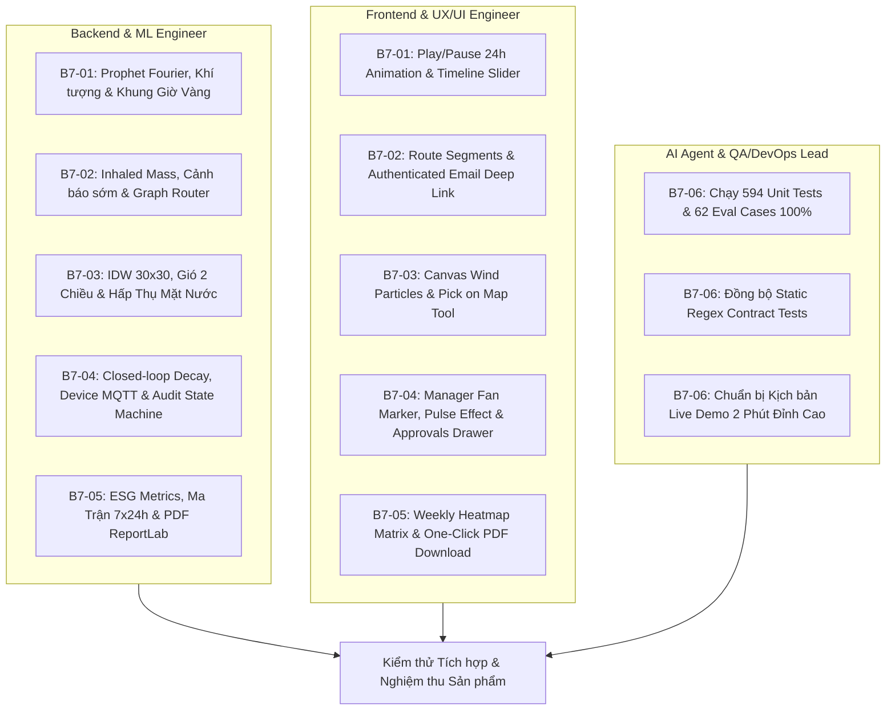

# Backlog 7 — Kế Hoạch Hoàn Thiện Toàn Diện 5 Chức Năng Nâng Cao (AirGuard AI)

> **Mục tiêu:** Kế hoạch hành động chi tiết phân chia công việc (Work Breakdown Structure - WBS) cho toàn bộ 5 chức năng nâng cao của hệ thống AirGuard AI trên cả 3 tầng: **Backend Core**, **Frontend UI/UX**, và **AI Agent / IoT Engine**, chuẩn bị cho đợt kiểm thử tích hợp cuối cùng và buổi bảo vệ sản phẩm.

---

## 📌 BẢNG TỔNG HỢP CÁC TASK TRONG BACKLOG 7 (PHIÊN BẢN NÂNG CẤP ĐỘT PHÁ)

| Mã Task | Tên Nhiệm Vụ & Điểm Nhấn Đột Phá | Phạm vi phụ trách | File hướng dẫn chi tiết |
|---|---|---|---|
| **B7-01** | **Dự báo ô nhiễm 1–24h Đa biến, Khung Giờ Vàng & Animation 24h** • Dự báo đa biến thời tiết, nghịch nhiệt đêm & giờ cao điểm • Tự động gợi ý Khung Giờ Vàng mở cửa sổ & chạy bộ • Nút Play Simulation tự động tua 24h trên bản đồ | Backend Prophet ML + Frontend Draggable Timeline Dock + Recharts | [`task1-forecast-prophet-timeline.md`](task1-forecast-prophet-timeline.md) |
| **B7-02** | **Cảnh báo sớm cá nhân hóa, Ước tính khối lượng bụi hít vào & Lộ trình ít phơi nhiễm** • Beat 15 phút chỉ gửi trong lead window 30–60 phút và revalidate trước gửi • Tính `estimated_inhaled_mass_ug` theo preset hoạt động, không diễn giải là hấp thụ/phép quy đổi y tế • Lộ trình trên graph snapshot có provenance + Email/deep link/checklist có authentication và opt-in | Backend Rule Engine + Resend Email API + Frontend Profile & Route Overlay | [`task2-personalized-alerts-email.md`](task2-personalized-alerts-email.md) |
| **B7-03** | **Bản đồ nhiệt lan truyền khí động học, Hấp thụ mặt nước & Hạt gió động** • Thuật toán IDW hiệu chỉnh vector gió & hấp thụ của Hồ Ngọc Trai/Biển Hồ • Hoạt ảnh luồng hạt gió động (Canvas Wind Streamlines) • Công cụ Pick on Map đo chất lượng tại từng ban công căn hộ | Backend Spatial IDW + Wind Vector + Frontend Canvas Leaflet Heatmap | [`task3-spatial-dispersion-heatmap.md`](task3-spatial-dispersion-heatmap.md) |
| **B7-04** | **Tự động điều tiết thông gió, Hiển thị thiết bị trên Map & HITL Audit Trail** • Layer thiết bị thông gió trên map dành riêng cho Ban Quản Lý • Icon quạt gió động: Xoay tròn & Pulse sáng khi BOOST, đếm ngược thời gian • Vòng lặp phản hồi môi trường: Bật quạt $\rightarrow$ PM2.5 giảm $\rightarrow$ Heatmap đổi màu • AI Agent hiểu thời gian chạy và tư vấn bật/tắt hợp lý | Backend Continuity Window + Approval Service + Device Simulator + Frontend Approvals & Map Layer | [`task4-auto-ventilation-hitl-audit.md`](task4-auto-ventilation-hitl-audit.md) |
| **B7-05** | **✅ Done — Báo cáo môi trường định hướng ESG, Ma trận 7x24h & AI Narrative xuất bản** • Ước tính bụi được lọc ($kg$) và điện năng tiết kiệm ($kWh$) khi đủ telemetry/hệ số thiết bị • Đối chiếu tham chiếu QCVN/WHO có coverage và disclaimer; không tuyên bố tuân thủ pháp lý từ simulator • Ma trận nhiệt $7\times 24\text{h}$ & Xuất file PDF giao diện xuất bản cao cấp | Celery Beat Daily/Weekly + Report Generator + PDF/HTML/Markdown Exporter | [`task5-periodic-reports-ai-narrative.md`](task5-periodic-reports-ai-narrative.md) |
| **B7-06** | **Kiểm thử tích hợp, Đồng bộ Contract & Kịch bản Demo 2 Phút** • Chạy toàn bộ 594 Unit tests + 62 Golden Agent cases • Đồng bộ hóa các test contract regex còn tồn đọng • Kịch bản Live Demo 120 giây gây ấn tượng mạnh với Ban Giám khảo | E2E Testing + Fix Test Contracts + Docker Topology + Live Demo Runbook | [`task6-integration-testing-demo.md`](task6-integration-testing-demo.md) |

---

## 🏗️ MA TRẬN PHÂN CHIA TRÁCH NHIỆM & CÔNG NGHỆ

---

## ⏱️ TIẾN ĐỘ THỰC HIỆN DỰ KIẾN

- **Ngày 1 (Sprint 1)**: Hoàn thiện **Task B7-01** (Dự báo & Khung giờ vàng) và **Task B7-03** (Bản đồ nhiệt & Hạt gió).
- **Ngày 2 (Sprint 2)**: Khởi động **Task B7-02** (ước tính bụi hít vào, lộ trình ít phơi nhiễm, predictive warning) và **Task B7-04**; B7-02 cần 2–3 ngày lịch nếu các tầng làm song song, không chốt completion trong một ngày.
- **Ngày 3 (Sprint 3)**: Khởi động **Task B7-05** (Báo cáo ESG & Ma trận 7x24h) và **Task B7-06**; B7-05 cần 5–6 person-days, khoảng 2–3 ngày lịch khi backend/frontend/publication làm song song.
- **Ngày 4 (Final Review)**: Chạy thử toàn bộ Docker Compose 8 containers, diễn tập Demo trước Hội đồng.
