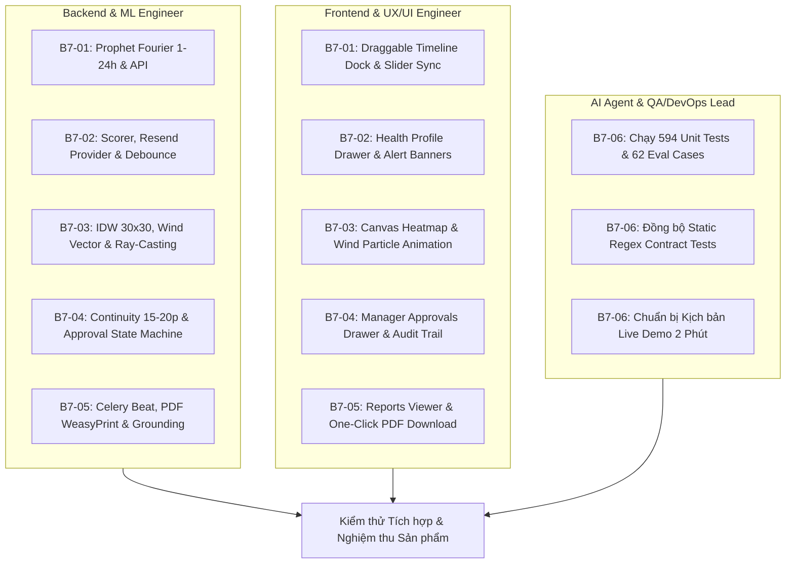

# Backlog 7 — Kế Hoạch Hoàn Thiện Toàn Diện 5 Chức Năng Nâng Cao (AirGuard AI)

> **Mục tiêu:** Kế hoạch hành động chi tiết phân chia công việc (Work Breakdown Structure - WBS) cho toàn bộ 5 chức năng nâng cao của hệ thống AirGuard AI trên cả 3 tầng: **Backend Core**, **Frontend UI/UX**, và **AI Agent / IoT Engine**, chuẩn bị cho đợt kiểm thử tích hợp cuối cùng và buổi bảo vệ sản phẩm.

---

## 📌 BẢNG TỔNG HỢP CÁC TASK TRONG BACKLOG 7

| Mã Task | Tên Nhiệm Vụ | Phạm vi phụ trách | File hướng dẫn chi tiết |
|---|---|---|---|
| **B7-01** | **Dự báo ô nhiễm 1–24h & Timeline Slider** | Backend Prophet ML + Frontend Timeline Slider + Recharts | [`task1-forecast-prophet-timeline.md`](task1-forecast-prophet-timeline.md) |
| **B7-02** | **Cảnh báo cá nhân hóa 3 nhóm sức khỏe & Email** | Backend Rule Engine + Resend Email API + Frontend Profile Drawer | [`task2-personalized-alerts-email.md`](task2-personalized-alerts-email.md) |
| **B7-03** | **Bản đồ nhiệt lan truyền IDW + Gió & Ranh giới** | Backend Spatial IDW + Wind Vector + Frontend Canvas Leaflet Heatmap | [`task3-spatial-dispersion-heatmap.md`](task3-spatial-dispersion-heatmap.md) |
| **B7-04** | **Tự động điều tiết thông gió & HITL Audit Trail** | Backend Continuity Window + Approval Service + Device Simulator + Frontend Approvals | [`task4-auto-ventilation-hitl-audit.md`](task4-auto-ventilation-hitl-audit.md) |
| **B7-05** | **Báo cáo môi trường định kỳ & AI Narrative** | Celery Beat Daily/Weekly + Report Generator + PDF/HTML/Markdown Exporter | [`task5-periodic-reports-ai-narrative.md`](task5-periodic-reports-ai-narrative.md) |
| **B7-06** | **Kiểm thử tích hợp, Đồng bộ Contract & Kịch bản Demo** | E2E Testing + Fix Test Contracts + Docker Topology + Live Demo Runbook | [`task6-integration-testing-demo.md`](task6-integration-testing-demo.md) |

---

## 🏗️ MA TRẬN PHÂN CHIA TRÁCH NHIỆM & CÔNG NGHỆ

---

## ⏱️ TIẾN ĐỘ THỰC HIỆN DỰ KIẾN

- **Ngày 1 (Sprint 1)**: Hoàn thiện **Task B7-01** (Dự báo 1-24h) và **Task B7-03** (Bản đồ nhiệt IDW & Gió).
- **Ngày 2 (Sprint 2)**: Hoàn thiện **Task B7-02** (Cá nhân hóa & Email) và **Task B7-04** (Tự động thông gió & HITL).
- **Ngày 3 (Sprint 3)**: Hoàn thiện **Task B7-05** (Báo cáo định kỳ & PDF) và **Task B7-06** (E2E Testing & Demo Script).
- **Ngày 4 (Final Review)**: Chạy thử toàn bộ Docker Compose, diễn tập Demo trước Hội đồng.
