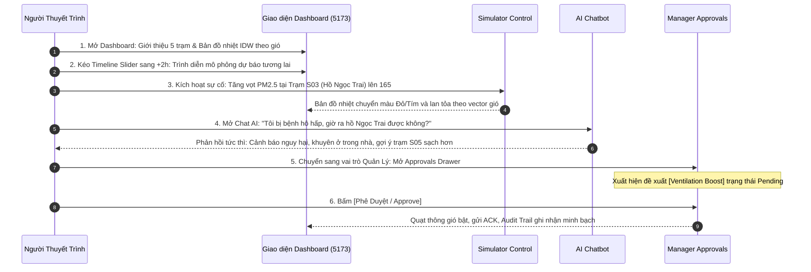

# Task B7-06: Kiểm Thử Tích Hợp Toàn Diện & Kịch Bản Demo Bảo Vệ

> **Người phụ trách:** QA Lead & Toàn bộ Đội ngũ Dự án  
> **Thời hạn dự kiến:** Ngày 3 - Ngày 4  
> **Mục tiêu:** Chạy kiểm thử toàn bộ hệ thống từ IoT Ingestion đến UI, đồng bộ các test contract regex, xác thực Docker Compose 8 containers, và chuẩn bị kịch bản Live Demo 2 phút kịch tính trước Hội đồng Ban Giám khảo.

---

## 1. PHẠM VI CÔNG VIỆC CHI TIẾT

### 1.1. Đồng bộ & Sửa các Contract Tests còn tồn đọng
- **Mục tiêu**: Đảm bảo 100% test case trong repository đều pass xanh (`pytest`).
- **Nhiệm vụ cụ thể**:
  1. Đồng bộ lại các chuỗi token trong `tests/test_frontend/` để khớp với kiến trúc UI component mới của React 18.
  2. Khắc phục lỗi `social.greeting` trong `tests/agent/eval_cases.json` để toàn bộ 62 Golden Cases và comprehensive test đạt 100%.

### 1.2. Kiểm tra Hạ tầng Docker Compose
- **File cấu hình**: [`docker-compose.yml`](file:///d:/CODE/AITHUCCHIEN/BUILD/P-074/docker-compose.yml)
- **Danh sách 8 containers cần kiểm tra khởi động đồng thời**:
  1. `mosquitto`: MQTT Broker cổng 1883.
  2. `postgres`: Database cổng 5432.
  3. `sensor-simulator`: Phát telemetry 5 trạm định kỳ 10s.
  4. `mqtt-consumer`: Validate và lưu dữ liệu vào Postgres.
  5. `backend`: FastAPI API cổng 8000.
  6. `agent`: LangGraph Agent cổng 8001.
  7. `device-simulator`: Nhận lệnh thông gió và phản hồi ACK.
  8. `frontend`: React/Vite dashboard cổng 5173.

---

## 2. KỊCH BẢN LIVE DEMO 2 PHÚT "ĂN ĐIỂM" TRƯỚC BAN GIÁM KHẢO

Kịch bản demo được thiết kế để **trình diễn trọn vẹn cả 5 tính năng nâng cao trong vòng 120 giây**:



---

## 3. LỆNH KIỂM THỬ TỔNG HỢP TRƯỚC KHI SUBMIT

```powershell
# 1. Chạy toàn bộ test suite Backend, Agent, IoT
& "d:\CODE\AITHUCCHIEN\BUILD\P-074\.venv\Scripts\pytest" tests/ -v

# 2. Chạy đánh giá Agent Golden Cases
& "d:\CODE\AITHUCCHIEN\BUILD\P-074\.venv\Scripts\python" eval/run_evaluation.py

# 3. Chạy đánh giá Forecast Benchmark
& "d:\CODE\AITHUCCHIEN\BUILD\P-074\.venv\Scripts\python" eval/run_prophet_benchmark.py

# 4. Build Frontend Production
npm --prefix frontend run build
```

---

## 4. TIÊU CHUẨN NGHIỆM THU CUỐI CÙNG (DEFINITION OF DONE)

1. ✅ 100% test cases pass xanh không lỗi.
2. ✅ Lệnh `docker compose up -d --build` khởi động trơn tru toàn bộ 8 services.
3. ✅ Kịch bản Live Demo chạy mượt mà không có bất kỳ trục trặc nào.
